# UD2. Modelo entidad-relación: diseño conceptual

**Módulo 0484 — Bases de Datos · 1.º DAW · IES Río Arba · Curso 2026-27 · 22 horas · 1.ª evaluación**

**Vinculación con el resultado de aprendizaje.** Esta unidad trabaja el **RA6**: *"Diseña modelos relacionales normalizados interpretando diagramas entidad/relación"* (RD 686/2010 en la redacción dada por el RD 405/2023), en su **parte de diseño conceptual (E/R)**. Conforme al desglose del módulo, el reparto entre UD2 y UD3 es el siguiente:

| CE | Qué exige (resumen) | Situación en esta unidad |
|---|---|---|
| RA6.a | Utilizar herramientas gráficas para representar el diseño lógico | **Se inicia aquí** (notaciones y herramienta de diagramado); se consolida y **evalúa definitivamente en UD3** |
| RA6.b-h | Tablas, campos, relaciones, claves, integridad, normalización y restricciones no plasmables | **Casa evaluable: UD3.** Esta unidad construye el diagrama E/R del que todo eso se deriva |

En consecuencia, la actividad evaluativa de esta unidad **prepara** los CE (así se etiqueta cada ejercicio) y su calificación se integra como evidencia del RA6, cuya evaluación por CE culmina en la UD3. Traducción sin burocracia: lo que diseñes aquí es la materia prima de todo el RA6 — un diagrama mal hecho en UD2 se paga con intereses en UD3.

**Al terminar esta unidad sabrás:** leer un enunciado real y extraer de él entidades, atributos y relaciones sin inventar ni olvidar nada; decidir y anotar cardinalidades máximas y mínimas defendiéndolas con frases del enunciado; reconocer cuándo una entidad es débil y cómo se identifica; aplicar generalización/especialización y agregación cuando el problema lo pide (y solo entonces); y producir diagramas E/R limpios con una herramienta gráfica y una notación consistente.

**Entorno de trabajo de la unidad.** Diagramaremos con **draw.io** (o la herramienta que se indique en Classroom) y, para diagramas dentro de estos apuntes, con notación de texto **Mermaid** — la verás renderizada en el sitio. No se necesita MySQL todavía: en esta unidad se piensa; en la UD5 se construye.

## Apartado 1. El diseño conceptual y sus herramientas

### Apartado 1.1. Por qué se diseña antes de construir

En la UD1 viste que los datos de la biblioteca acababan inconsistentes cuando se guardaban "como salía". El antídoto no es teclear tablas más deprisa: es **diseñar**. El diseño de una base de datos recorre tres niveles:

1. **Diseño conceptual**: representar la realidad del problema — qué cosas existen, qué se sabe de ellas, cómo se relacionan — sin pensar todavía en tablas ni en MySQL. Su lenguaje es el **modelo entidad-relación (E/R)**. Es el nivel de esta unidad.
2. **Diseño lógico**: traducir el modelo conceptual al modelo del gestor elegido — para nosotros, el **modelo relacional** (tablas, claves). Es la UD3.
3. **Diseño físico**: decidir cómo se almacena de verdad (tipos concretos, índices). Llega con la UD5 y se afina en la UD4 con la optimización.

La razón del orden es económica: un error de diseño detectado en el diagrama se corrige moviendo una línea; detectado en producción, se corrige migrando datos con la aplicación parada. El modelo E/R existe, además, como **lenguaje común con el cliente**: la bibliotecaria no leerá SQL jamás, pero puede mirar un diagrama y decir "no: un lector sí puede tener varias reservas a la vez" — y esa frase vale oro.

### Apartado 1.2. Notaciones y herramientas gráficas

El modelo E/R tiene varias notaciones, y en este módulo trabajarás **dos, cada una con su papel declarado**:

- **Notación clásica (Chen) — la notación de conceptos y de lectura.** Entidades en rectángulos, atributos en elipses, relaciones en rombos, cardinalidades como pares (mín, máx) junto a las líneas. Es la notación en la que razonaremos en clase y, sobre todo, la que **debes saber leer**: el RA6 exige interpretar diagramas E/R, y los enunciados académicos de otros centros y de las pruebas oficiales están escritos casi siempre en Chen. Además, es la única de las dos que **dibuja la taxonomía completa de los atributos** (apartado 2.2): elipses, elipses dobles, elipses punteadas y subrayados.
- **Notación pata de gallo (*crow's foot*) — la notación de herramienta y de entrega.** La habitual en las herramientas profesionales: las cardinalidades se dibujan en los extremos de las líneas (la "pata" es el lado muchos) y los atributos se listan dentro del rectángulo, sin distinción gráfica de su tipo. La usan draw.io, MySQL Workbench y Mermaid; tus entregas de diagramas con herramienta irán en ella.

**Convención de esta unidad — la etiqueta de tipo sobre el rombo.** Además de las parejas (mín, máx) en los extremos, cada relación lleva **sobre su rombo la etiqueta de su tipo**: 1:1, 1:N o N:M. La regla de derivación: **el tipo se forma con el máximo de cada extremo**. Ejemplo con *realiza*: LECTOR participa con (0,N) y PRESTAMO con (1,1) → máximos N y 1 → tipo **1:N** (las mínimas no intervienen en el tipo: informan de la obligatoriedad, no de la multiplicidad). Guárdate esta etiqueta con cariño: es exactamente **la regla con la que la UD3 decidirá cómo se traduce cada relación a tablas** — 1:N y 1:1 de una manera, N:M de otra.

Traducción práctica: **lees y razonas en Chen; construyes y entregas en pata de gallo** — y sabes pasar de una a otra, porque son el mismo modelo con dos ortografías. La regla profesional se mantiene: notación consistente **dentro de cada diagrama**; lo prohibido es mezclarlas en uno mismo, no dominar ambas.

En cuanto a herramientas (aquí arranca RA6.a): esta unidad usa **draw.io** (app.diagrams.net) para tus entregas, con su **biblioteca de formas Entidad-Relación** — si no aparece en el panel lateral, actívala desde "Más formas"; el detalle fino de manejo va en la práctica de la unidad y en la guía enlazada más abajo, no en estos apuntes. En la UD3 consolidarás la herramienta representando diseños lógicos completos, que es donde ese criterio se evalúa definitivamente.

!!! info "Cómo están hechos los diagramas de estos apuntes"
    Los diagramas en **pata de gallo** están escritos en Mermaid y el sitio los renderiza. Los diagramas en **Chen** son **imágenes SVG** alojadas en el repositorio del sitio (carpeta `img/`), porque Mermaid no dibuja notación de Chen: cuando veas una figura numerada, es una imagen; cuando veas un bloque de código renderizado, es Mermaid en pata de gallo.

### Apartado 1.3. Tabla de equivalencias y límites — tu chuleta para las entregas

Cada concepto de la unidad, en las dos notaciones, y **cómo se resuelve en tu entrega con draw.io cuando la pata de gallo no lo dibuja**. Vuelve a esta tabla en cada práctica:

| Concepto | En Chen | En pata de gallo | Cómo se entrega cuando no hay equivalente |
|---|---|---|---|
| Entidad | Rectángulo | Rectángulo con lista de atributos dentro | — |
| Clave primaria | Nombre subrayado en su elipse | Marca PK junto al atributo | — |
| Taxonomía de atributos (compuesto, multivalorado, derivado) | Elipses: con partes colgando, doble, punteada | **No se dibuja** (todos los atributos se listan igual) | Anotación textual junto al atributo ("multivalorado", "derivado: no almacenar") o en la documentación de la práctica |
| Relación y cardinalidades (mín, máx) | Rombo + parejas en los extremos | Línea + símbolos de pata en los extremos (solo la información de mín/máx que la pata codifica) | Si necesitas una mínima que el símbolo no capture, anótala como etiqueta de línea |
| Etiqueta de tipo (1:1, 1:N, N:M) | Sobre el rombo | Implícita en los símbolos de los extremos | Puedes añadirla como etiqueta de la línea (recomendado en esta unidad) |
| Atributo de relación | Elipse colgando del rombo | **No existe** (las líneas no llevan atributos) | Anotación en la línea o, mejor, adelanta la solución de la UD3: entidad asociativa con el atributo dentro |
| Reflexiva con roles | Rombo con la misma entidad en ambos extremos y roles en las líneas | Línea de la entidad a sí misma | Los roles, como etiquetas de línea |
| Entidad débil e identificativa | Trazos dobles + discriminante en subrayado discontinuo | Línea **continua** (identificativa) frente a **discontinua** (no identificativa); el discriminante, como parte de la clave | Marca el discriminante como "PK parcial" o anótalo textualmente |
| Jerarquía (total/parcial, exclusiva/solapada) | Triángulo con anotación | **No se dibuja** (a lo sumo, relaciones "es-un" aproximadas) | Triángulo con formas básicas de draw.io + anotación textual de las dos decisiones + constancia en la documentación |
| Agregación | Recuadro englobando la relación | **No existe** | Contenedor de draw.io alrededor del fragmento + nota; y documenta la decisión (en la UD3 verás su traducción natural) |
| Ternaria | Un rombo con tres patas | **No existe** (solo binarias) | Descomposición en binarias contra una entidad asociativa (ver la nota bajo la figura 7) |

Cómo hacerlo, paso a paso: [guía rápida de draw.io para las entregas de diagramas](../recursos/guia-drawio.md).

Un primer vistazo del caso hilo, en Mermaid (lo iremos construyendo pieza a pieza):

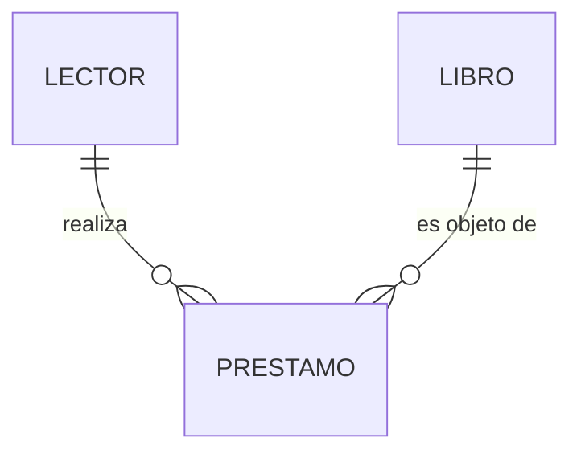

Se lee: un lector realiza cero o muchos préstamos; cada préstamo lo realiza exactamente un lector; un libro es objeto de cero o muchos préstamos. Al final de la unidad, esa lectura te saldrá sola — y sabrás defender cada símbolo.

**Ejercicios del apartado.**

- **E1.** Ordena y justifica: la biblioteca quiere "un programa de préstamos nuevo". Indica qué producto genera cada nivel de diseño (conceptual, lógico, físico) para ese encargo y qué persona (bibliotecaria, tú como desarrollador, el DBA del proveedor) valida cada uno.
- **E2.** Señala dos decisiones que **no** pertenecen al diseño conceptual y di a qué nivel pertenecen: (a) "el título se guardará como VARCHAR(200)"; (b) "un préstamo pertenece a un único lector"; (c) "crearemos un índice por fecha"; (d) "una reserva caduca a los 3 días" .
- **E3.** Traduce a una frase en castellano cada extremo del diagrama Mermaid del apartado 1.2 (cuatro frases: lector→préstamo, préstamo→lector, libro→préstamo, préstamo→libro), señalando en cada una si habla de máximos o de mínimos.

## Apartado 2. Entidades y atributos

### Apartado 2.1. Entidades

Una **entidad** es un objeto de la realidad, con existencia propia y distinguible de los demás, del que el sistema necesita guardar información: cada lector concreto, cada libro. El **tipo de entidad** (o conjunto de entidades) es la plantilla: LECTOR, LIBRO. En el diagrama se dibujan los tipos; en la base de datos vivirán las **ocurrencias** (Marta, El Quijote).

La prueba del algodón para decidir si algo es entidad: ¿tiene atributos propios que interesan **y** identidad propia en el problema? "Tauste" puede ser un simple atributo `localidad` del lector… o una entidad LOCALIDAD si el sistema comarcal guarda datos de cada villa (población, dirección de la biblioteca). **El enunciado manda**: no existe la respuesta universal, existe la respuesta para este problema.

### Apartado 2.2. Atributos y sus tipos

Los **atributos** son las propiedades que se guardan de cada entidad, cada uno con su **dominio** (conjunto de valores posibles: las fechas válidas, los textos de hasta 200 caracteres…). Clasificación que debes dominar:

| Tipo | Definición | Ejemplo en la biblioteca |
|---|---|---|
| Simple | No se descompone | `carne`, `titulo` |
| Compuesto | Se descompone en partes con significado propio | `direccion` (calle, número, localidad, CP) |
| Monovalorado | Un valor por ocurrencia | `fecha_nacimiento` |
| **Multivalorado** | Varios valores por ocurrencia | `telefonos` de un lector (fijo, móvil…) — se dibuja con elipse doble |
| **Derivado** | Se calcula a partir de otros; no se almacena | `edad` (deriva de `fecha_nacimiento`) — elipse punteada (discontinua) |
| **Identificador (clave)** | Identifica cada ocurrencia sin ambigüedad (apartado 2.3) | `carne` — nombre **subrayado** en su elipse |

La taxonomía completa, dibujada en Chen sobre la entidad del caso hilo:

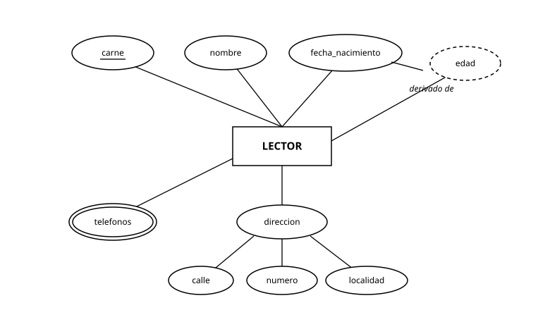

*Figura 1. La entidad LECTOR con los cinco tipos de atributo en notación de Chen: `carne` subrayado (identificador), `nombre` y `fecha_nacimiento` simples, `direccion` compuesto (con `calle`, `numero` y `localidad` colgando), `telefonos` en elipse doble (multivalorado) y `edad` en elipse punteada (derivado de `fecha_nacimiento`).*

La misma entidad en pata de gallo se escribe como un rectángulo con la lista de atributos dentro — y ahí está el matiz honesto de la doble notación: **la pata de gallo no distingue gráficamente esta taxonomía** (a lo sumo marca la clave), de modo que compuestos, multivalorados y derivados se anotan textualmente o se documentan aparte. Por eso Chen es la notación donde esta taxonomía **se lee y se evalúa**:

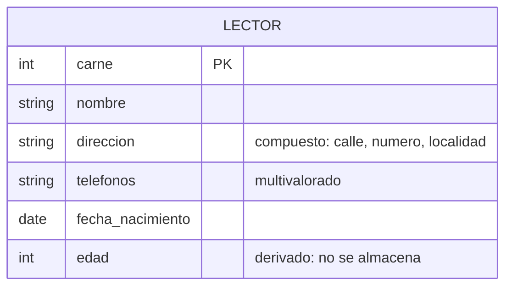

**Nota de entrega (draw.io):** la taxonomía que la pata de gallo no dibuja se resuelve en tus entregas con **anotación textual junto al atributo** ("multivalorado", "derivado: no se almacena", "compuesto: calle, numero, localidad") o en la documentación de la práctica — fila correspondiente de la tabla del apartado 1.3.

Los multivalorados y los derivados son señales de alarma bien conocidas: el multivalorado desaparecerá al pasar al modelo relacional (UD3) convertido en otra cosa, y el derivado no debe almacenarse (almacenarlo crea la inconsistencia de la UD1: edad guardada 17, fecha de nacimiento que dice 18).

### Apartado 2.3. Claves en el nivel conceptual

Un atributo (o conjunto mínimo de atributos) cuyos valores no se repiten entre ocurrencias es una **clave candidata**: identifica sin ambigüedad. De las candidatas se elige la **clave primaria** (se subraya en el diagrama); las demás quedan como alternativas. LECTOR: candidatas `carne` y `dni`; primaria razonable, `carne` (es del dominio del problema y no arrastra un dato personal fuerte donde no hace falta — la minimización de la UD1 también opina en el diseño).

Criterios de elección que se defienden en voz alta: valor **siempre conocido**, **estable** en el tiempo, y **mínimo**. "Nombre y apellidos" fracasa en los tres.

**Ejercicios del apartado.**

- **E4.** Del enunciado: "De cada libro se guarda su ISBN, título, autores, año y la edad recomendada calculada a partir de su clasificación". Clasifica cada atributo (simple/compuesto, mono/multivalorado, derivado) y elige clave primaria justificando con los tres criterios.
- **E5.** Un gimnasio guarda de cada socio: número de socio, DNI, nombre, teléfonos de contacto, cuota mensual y años de antigüedad. Dibuja la entidad con la notación clásica (elipses, doble elipse, discontinua, subrayado) — entrega foto o diagrama de herramienta.
- **E6.** Discute con el enunciado en la mano: en el sistema de la biblioteca municipal (una sola villa), ¿EDITORIAL debe ser entidad o atributo de LIBRO? Da la condición del enunciado que te haría cambiar de respuesta.
- **E7.** *(Lectura de Chen.)* Sobre la figura 1: (a) escribe, para cada atributo, su tipo completo justificado por su representación gráfica (qué te dice cada elipse, doble, punteada o subrayado); (b) explica qué información **pierde** la versión en pata de gallo del mismo diagrama y cómo debería compensarse en una entrega; (c) señala qué atributo no debe almacenarse y qué atributo lo sustituye como fuente.

## Apartado 3. Relaciones y cardinalidades

### Apartado 3.1. Relaciones, grado y roles

Una **relación** (interrelación) es una asociación entre entidades que el sistema necesita recordar: LECTOR *realiza* PRESTAMO. El **grado** es el número de entidades que participan: binarias (las habituales), **reflexivas** (una entidad consigo misma: un LECTOR *avala* a otro LECTOR — cada extremo lleva su **rol**: avalista/avalado) y **ternarias** (tres entidades a la vez; volveremos sobre ellas en el apartado 6).

Las relaciones pueden tener **atributos propios**: en LECTOR—*valora*—LIBRO, la `puntuacion` no es del lector ni del libro: es de la pareja. Es el sitio exacto donde principiantes cuelgan el atributo de la entidad equivocada — vigílalo.

### Apartado 3.2. Cardinalidad máxima

La **cardinalidad máxima** dice con cuántas ocurrencias de la otra entidad puede asociarse como mucho cada ocurrencia. Combinando ambos sentidos: **1:1**, **1:N**, **N:M**.

- LECTOR—PRESTAMO es **1:N**: un lector realiza muchos préstamos; cada préstamo es de un solo lector.
- LECTOR—LIBRO mediante *valora* es **N:M**: un lector valora muchos libros; un libro lo valoran muchos lectores.
- BIBLIOTECA—DIRECTOR sería **1:1**: cada biblioteca tiene un director y cada director dirige una biblioteca.

Los tres tipos, con la convención completa de la unidad (parejas en los extremos y etiqueta de tipo sobre el rombo), más los dos rasgos estructurales del apartado 3.1 — el atributo de relación y la reflexiva con roles — dibujados en Chen:

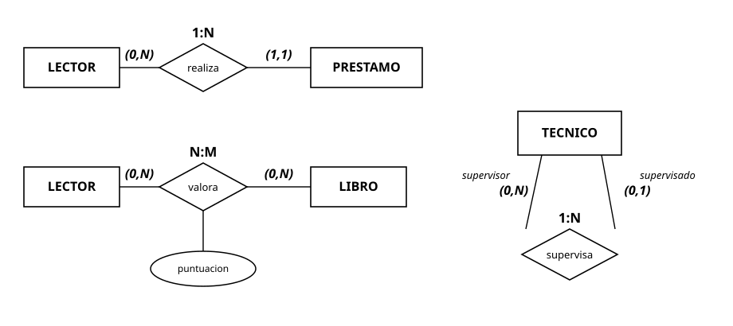

*Figura 2. Tres relaciones en Chen con la convención de la unidad: la etiqueta de tipo sobre el rombo se deriva de los máximos (0,N)-(1,1) → 1:N; el atributo `puntuacion` cuelga del rombo de `valora` (es de la pareja); la reflexiva `supervisa` lleva sus dos roles anotados en las líneas.*

Las mismas tres relaciones en pata de gallo:

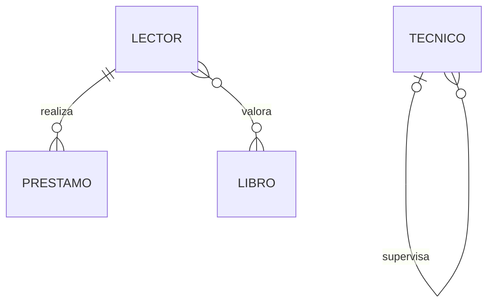

*Lectura comparada*: lo que en Chen son las parejas (0,N)-(1,1) aquí son los símbolos de los extremos (la "pata" es el lado muchos; el círculo, el cero opcional). **Nota de entrega (draw.io):** los **roles** de la reflexiva y el **atributo de relación** (`puntuacion`) no tienen dibujo en pata de gallo — los roles van como etiquetas de línea, y el atributo de relación se anota en la línea o, mejor, anticipa la entidad asociativa que la UD3 hará oficial.

El método fiable para no equivocarse: **fija una ocurrencia y pregunta por la otra entidad, en los dos sentidos, con frases completas**. "Dado UN préstamo, ¿cuántos lectores?" → uno. "Dado UN lector, ¿cuántos préstamos?" → muchos. Anota cada respuesta en el extremo **opuesto** a la entidad fijada (en notación clásica; la pata de gallo lo pone en el extremo propio — otra razón para no mezclar notaciones).

### Apartado 3.3. Cardinalidad mínima (participación)

La **cardinalidad mínima** (0 o 1) dice si la participación es **opcional u obligatoria**: se anota junto a la máxima como par (mín, máx). En LECTOR (0,N)—*realiza*—(1,1) PRESTAMO: un lector puede no tener préstamos (0,N — participación opcional); un préstamo exige exactamente un lector (1,1 — obligatoria). Las mínimas salen siempre de frases del enunciado ("todo préstamo pertenece a un lector"; "puede haber lectores sin préstamos") — si el enunciado calla, **se pregunta al cliente**, no se inventa: cada mínima es una regla de negocio que la base de datos hará cumplir.

En Mermaid, el caso hilo con valoraciones:

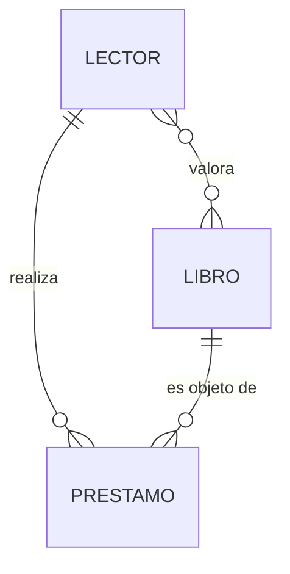

**Ejercicios del apartado.**

- **E8.** Para un centro de FP: MODULO—PROFESOR (*imparte*), ALUMNO—MODULO (*se matricula*), PROFESOR—GRUPO (*tutoriza*). Decide máximas y mínimas de las tres relaciones con el método de fijar-y-preguntar, escribiendo las frases que usas; señala qué suposición tuviste que hacer por silencio del enunciado.
- **E9.** Modela con una relación reflexiva: "cada técnico de una empresa puede supervisar a varios técnicos, y cada técnico tiene como mucho un supervisor; los recién llegados pueden no tener supervisor todavía". Indica roles y cardinalidades (mín, máx) en ambos extremos.
- **E10.** En LECTOR—*valora*—LIBRO, con `puntuacion` y `fecha_valoracion` como atributos de la relación: explica qué se rompe si `puntuacion` se coloca como atributo de LIBRO, y qué pregunta del negocio dejaría de poder responderse.

## Apartado 4. Entidades débiles

Hay entidades que no se sostienen solas. En la biblioteca comarcal, cada LIBRO (la obra: El Quijote) tiene varios **EJEMPLARES** físicos, numerados 1, 2, 3… **dentro de cada libro**. El "ejemplar 2" no identifica nada por sí mismo — ¿el 2 de qué obra? — y si la obra desaparece del catálogo, sus ejemplares dejan de tener sentido.

Eso es una **entidad débil**: depende de una entidad fuerte a través de una **relación identificativa**. La dependencia tiene dos caras que conviene distinguir:

- **En existencia**: la ocurrencia débil no puede existir sin la fuerte (sin obra no hay ejemplar).
- **En identificación**: la débil no tiene clave completa propia; se identifica con la clave de la fuerte **más** un **discriminante** propio (el `num_ejemplar` dentro de la obra). Toda dependencia en identificación implica dependencia en existencia; la inversa no.

Notación clásica: rectángulo doble para la entidad débil, rombo doble para la relación identificativa, discriminante subrayado con línea discontinua. La participación de la débil en su relación identificativa es siempre **(1,1)**: obligatoria y con una sola fuerte.

El caso completo, dibujado en Chen con toda la notación de debilidad:

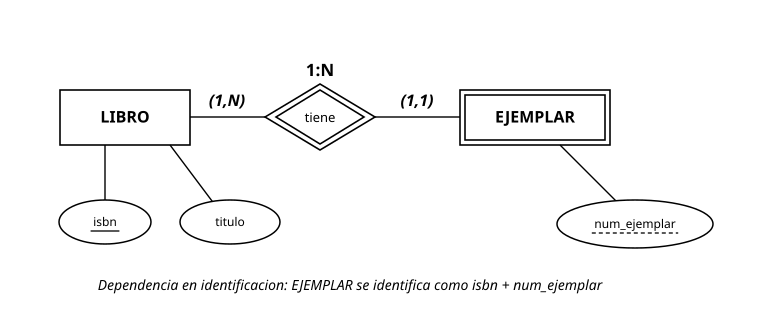

*Figura 3. Debilidad por identificación: los trazos dobles (rectángulo y rombo) y el subrayado discontinuo del discriminante son los tres delatores gráficos. Un ejemplar concreto se identifica como `isbn` + `num_ejemplar`.*

El mismo caso en pata de gallo:

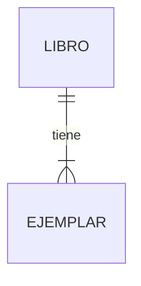

*Lectura comparada*: la pata de gallo sí distingue la relación **identificativa**: se dibuja con línea **continua** (frente a la discontinua de la no identificativa — compárala con el puente de la figura 4). **Nota de entrega (draw.io):** el discriminante no tiene símbolo propio: márcalo como parte de la clave ("PK parcial") o con anotación textual.

La confusión típica que debes evitar: no toda relación 1:N con participación obligatoria crea una entidad débil. PRESTAMO exige un lector (1,1) y sin embargo puede diseñarse con clave propia (`num_prestamo`): entonces es entidad **fuerte** con relación normal. La debilidad es una **decisión de identificación**: ¿quiero identificar esto por sí mismo o dentro de su padre? Ambas opciones pueden ser legítimas; lo que se evalúa es que sepas cuál has tomado y por qué. La figura gemela de la anterior muestra el contraste exacto:

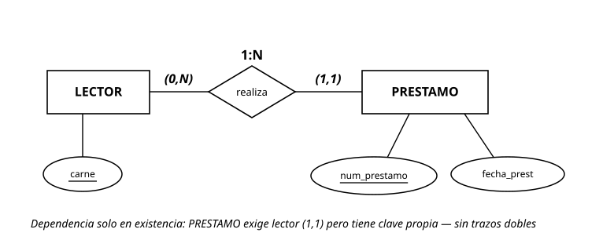

*Figura 4. Dependencia en existencia sin identificación: PRESTAMO no puede existir sin lector — su participación es (1,1) — pero se identifica por su clave propia `num_prestamo`, así que ni el rectángulo ni el rombo se doblan y no hay discriminante.*

El gemelo en pata de gallo:

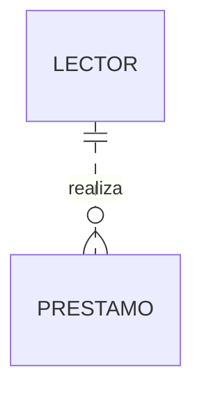

*Lectura comparada*: la línea **discontinua** declara la relación **no identificativa** — PRESTAMO tiene clave propia. El par de puentes de las figuras 3 y 4 es la traducción exacta de "trazos dobles frente a trazos simples" de Chen: continua frente a discontinua.

**Cómo se examina esto** (avisado queda): el enunciado típico te da una relación con (1,1) obligatorio y te pregunta si la entidad es débil. La respuesta nunca está en la obligatoriedad — está en la **identificación**: busca si la entidad tiene clave completa propia (figura 4: fuerte) o se identifica con la clave del padre más un discriminante (figura 3: débil). Los delatores gráficos, cuando te dan el diagrama hecho, son los trazos dobles y el subrayado discontinuo; cuando te dan el texto, la pregunta que resuelve es "¿cómo nombro sin ambigüedad una ocurrencia concreta?".

**Ejercicios del apartado.**

- **E11.** Partiendo del diagrama **dado** en la figura 3, amplíalo: añade la relación PRESTAMO—EJEMPLAR (se presta un ejemplar concreto, no la obra) con sus parejas de cardinalidad y su etiqueta de tipo, y justifica el cambio respecto al diagrama del apartado 3 (donde el préstamo era "de un libro"). Indica además, leyendo la figura 3, por qué PRESTAMO **no** debe llevar trazos dobles pese a su (1,1) — apóyate en la figura 4.
- **E12.** Decide razonadamente si son entidades débiles (y con qué discriminante) o fuertes: (a) las AULAS de un edificio, numeradas por planta; (b) las FACTURAS de una empresa, con numeración única anual legal; (c) las LÍNEAS de una factura.
- **E13.** La figura 4 muestra el patrón con PRESTAMO. Da un ejemplo **de otro dominio distinto de la biblioteca** con la misma estructura (dependencia en existencia sin dependencia en identificación) y explica por qué su diagrama tampoco lleva dobles trazos.
- **E14.** *(Lectura de Chen.)* La figura 8 muestra un diagrama en notación de Chen del circuito de préstamos de la biblioteca:

    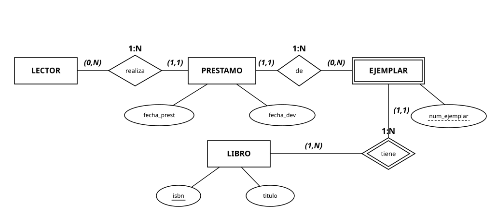

    *(a)* Escribe las **ocho frases de cardinalidad** (mínimo y máximo de cada extremo de las tres relaciones) y comprueba que la etiqueta de tipo de cada rombo se deriva de los máximos que has leído; *(b)* identifica la entidad débil, su relación identificativa y su discriminante, explicando por qué símbolo lo sabes; *(c)* di cómo se identifica completamente un ejemplar concreto; *(d)* señala una regla razonable del negocio que este diagrama **no** captura y que iría a la documentación del paso 7 del apartado 7.

## Apartado 5. El modelo E/R ampliado I: generalización y especialización

Cuando varios tipos de entidad comparten atributos y relaciones pero cada uno añade lo suyo, el E/R ampliado ofrece la jerarquía **supertipo-subtipos**. En la biblioteca comarcal, los USUARIOS del servicio comparten carné, nombre y contacto; pero los LECTORES INFANTILES añaden tutor legal y los CENTROS EDUCATIVOS (que retiran lotes) añaden CIF y persona de contacto.

- **Especialización** (arriba → abajo): partir del supertipo USUARIO y descubrir subtipos con rasgos propios.
- **Generalización** (abajo → arriba): tener LECTOR_INFANTIL y CENTRO y abstraer lo común en USUARIO.

El resultado se dibuja igual (triángulo "es-un" hacia los subtipos); lo que cambia es el camino mental. Los subtipos **heredan** todos los atributos y relaciones del supertipo — la herencia es la mitad del beneficio: el préstamo se relaciona con USUARIO una sola vez, no tres.

Toda jerarquía se anota con dos decisiones, siempre extraídas del enunciado:

| Decisión | Opciones | Pregunta que la decide |
|---|---|---|
| **Totalidad** | Total (todo supertipo es de algún subtipo) / Parcial (puede haber supertipos "a secas") | ¿Existe algún usuario que no sea ni infantil ni centro? |
| **Solapamiento** | Disjunta (a lo sumo un subtipo) / Solapada (puede ser varios a la vez) | ¿Puede alguien ser dos cosas a la vez? |

En la biblioteca: parcial (el adulto normal es USUARIO sin subtipo) y disjunta —también llamada **exclusiva**— (nadie es a la vez menor y centro educativo). El caso, dibujado con la convención del triángulo:

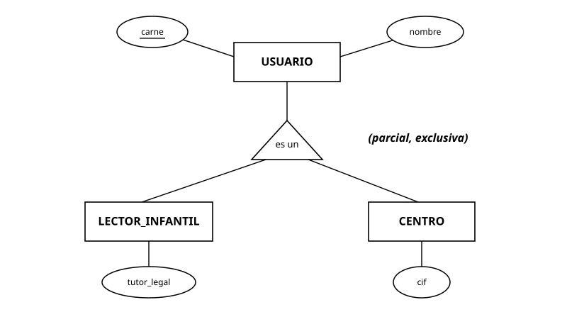

*Figura 5. La jerarquía de usuarios en la convención española del triángulo: los atributos comunes (`carne`, `nombre`) viven en el supertipo y se heredan; cada subtipo aporta lo suyo; la anotación (parcial, exclusiva) declara las dos decisiones del enunciado.*

La aproximación en pata de gallo, con su límite declarado:

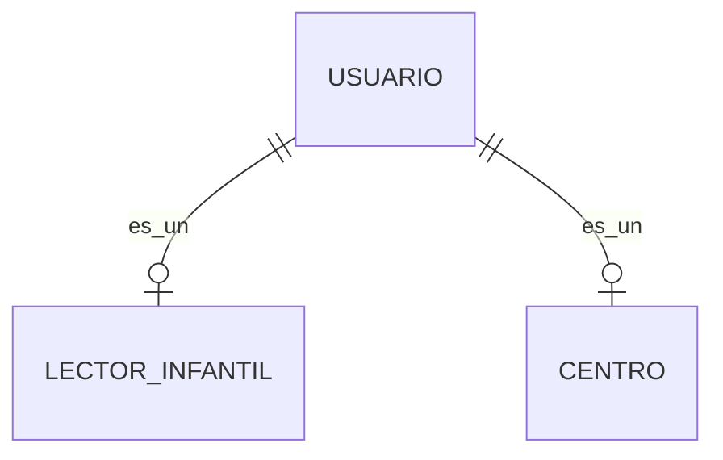

*Lectura comparada*: la pata de gallo **no tiene jerarquías** — esto es una aproximación con relaciones "es-un" que pierde precisamente lo importante: la totalidad y la exclusividad no están en ningún símbolo. **Nota de entrega (draw.io):** dibuja el triángulo con formas básicas, anota "(parcial, exclusiva)" como texto junto a él y deja constancia de las dos decisiones en la documentación de la práctica — fila correspondiente de la tabla del apartado 1.3.

Cuándo **no** especializar: si los subtipos no aportan atributos ni relaciones propias, basta un atributo `tipo` en la entidad. Especializar "por elegancia" añade complejidad que la UD3 te cobrará al traducir. La jerarquía se gana con diferencias reales, no con taxonomía decorativa.

**Ejercicios del apartado.**

- **E15.** Un polideportivo municipal tiene actividades dirigidas y alquiler de pistas. Sus USUARIOS: abonados (cuota mensual, fecha de alta) y usuarios puntuales (sin datos extra: pagan por uso). Además, algunos abonados son también monitores (titulación, cuenta bancaria). Modela la jerarquía o jerarquías, decidiendo y justificando totalidad y solapamiento en cada una.
- **E16.** Critica este diseño: VEHICULO especializado en COCHE_ROJO, COCHE_AZUL y MOTO. Señala qué regla del apartado incumple cada parte y propón el diseño correcto.
- **E17.** Sobre la figura 5: indica dos atributos y una relación que se colocan en el supertipo y un atributo que se coloca en cada subtipo, explicando el criterio general de colocación ("cada cosa en el nivel más alto donde es común a todos").

## Apartado 6. El modelo E/R ampliado II: agregación

Hay situaciones donde necesitas relacionar algo **con una relación**, y el E/R básico no lo permite: las relaciones solo unen entidades. La **agregación** resuelve el problema tratando una relación (con sus entidades participantes) como una entidad de orden superior — se dibuja un rectángulo englobando la relación agregada.

Caso comarcal: la relación BIBLIOTECA—*organiza*—ACTIVIDAD (cada biblioteca organiza actividades de un catálogo común: club de lectura, cuentacuentos). Ahora el ayuntamiento quiere registrar qué MONITOR conduce **cada actividad en cada biblioteca** — el monitor no se asigna a la actividad "club de lectura" en abstracto, ni a la biblioteca, sino a la **pareja concreta** organiza(biblioteca, actividad). Agregamos la relación *organiza* y la relacionamos con MONITOR:

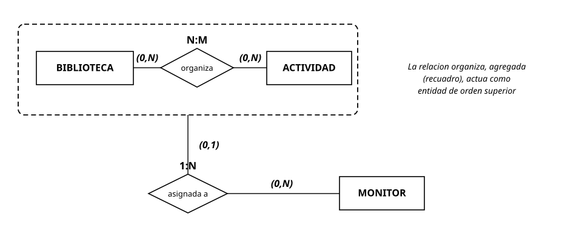

*Figura 6. La agregación dibujada de verdad — esta es la figura que Mermaid no puede producir, por eso es una imagen: el recuadro engloba la relación `organiza` con sus dos entidades, y ese conjunto, tratado como entidad de orden superior, se relaciona con MONITOR. La (0,1) del lado agregado dice que la pareja puede existir sin monitor asignado — la clave semántica frente a la ternaria.*

**Nota de entrega (draw.io):** la agregación **no existe en pata de gallo** y no se fuerza: en tu entrega, usa un contenedor de draw.io alrededor del fragmento agregado con una nota ("relación agregada"), y documenta la decisión en la memoria de la práctica. En la UD3 verás que la traducción a tablas la resuelve con naturalidad.

La alternativa que siempre debe considerarse es la **relación ternaria** BIBLIOTECA—ACTIVIDAD—MONITOR — su aspecto general, con otro ejemplo que ya conoces del ejercicio E18 en adelante:

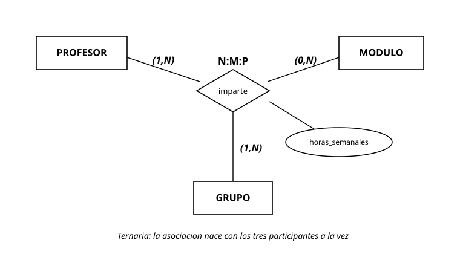

*Figura 7. Una ternaria genuina: un único rombo une a los tres participantes a la vez, y el atributo `horas_semanales` pertenece a la terna completa. Contrasta con la figura 6: aquí no hay pareja previa que exista por sí sola.* La diferencia semántica: la ternaria exige que las tres cosas aparezcan **a la vez** (no hay pareja biblioteca-actividad sin monitor); la agregación permite que la pareja exista primero (una biblioteca organiza la actividad, con o sin monitor asignado todavía) y algo se le asocie después. De nuevo: el enunciado decide — "las actividades se programan y el monitor se asigna más tarde" pide agregación.

**Nota de entrega (draw.io):** la ternaria tampoco existe en pata de gallo (solo hay binarias): se entrega **descompuesta** en binarias contra una entidad asociativa que representa la terna —

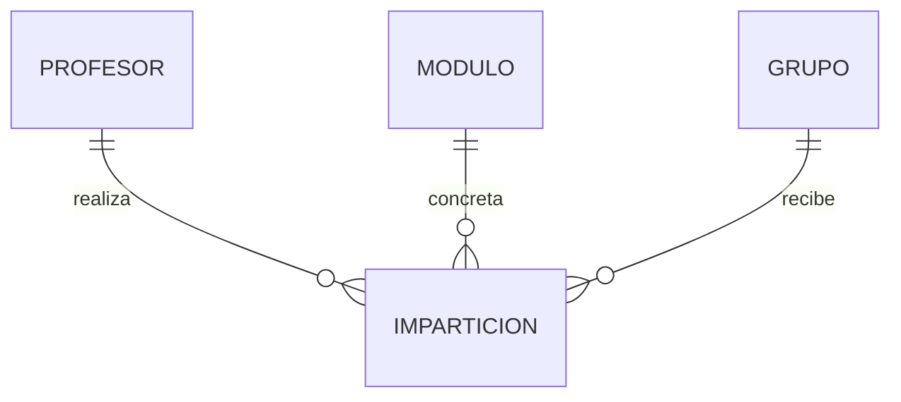

*Lectura comparada*: IMPARTICION representa cada terna concreta y aloja `horas_semanales`; las tres patas 1:N sustituyen al rombo triple. No es una traición al modelo: es exactamente lo que la UD3 hará al traducir la ternaria a tablas — aquí lo usas solo como formato de entrega, dejando constancia en la documentación de que el concepto modelado es una ternaria.

Regla de higiene: la agregación es el recurso **excepcional** del modelo, no un adorno. Si puedes modelar con entidades y relaciones simples sin perder semántica, hazlo: cada nivel de sofisticación del diagrama es complejidad que la UD3 traducirá y la UD5 implementará.

**Ejercicios del apartado.**

- **E18.** "Los profesores imparten módulos en grupos concretos; de cada asignación profesor-módulo-grupo se guarda el número de horas semanales." Modela con relación ternaria y justifica por qué aquí no procede la agregación (pista: ¿puede existir la pareja módulo-grupo sin profesor en este enunciado?).
- **E19.** Modifica el enunciado de E18 lo mínimo para que la agregación pase a ser el modelo correcto, y dibuja el resultado.
- **E20.** En el caso comarcal del apartado, añade la regla "cada asignación de monitor tiene fecha de inicio y fin". Indica dónde viven esos atributos y por qué no pueden ser de MONITOR ni de ACTIVIDAD.

## Apartado 7. Del texto al diagrama: método de trabajo

El examen y la vida profesional te darán **texto**, no diagramas. El procedimiento sistemático — practícalo hasta que sea reflejo:

1. **Lectura de sustantivos** → candidatos a entidad o atributo. Filtro: ¿tiene datos propios e identidad? (apartado 2.1).
2. **Lectura de verbos** → candidatos a relación. Filtro: ¿el sistema necesita **recordar** esa asociación?
3. **Atributos a su dueño**: cada dato, a su entidad — o a su relación, si es de la pareja (apartado 3.1).
4. **Cardinalidades con frases**: máximas y mínimas, en ambos sentidos, citando el enunciado; lo que el enunciado calla se apunta como **pregunta al cliente** (lista explícita en la entrega: preguntar es profesional, suponer en silencio no).
5. **Revisión de patrones**: ¿algún multivalorado que deba repensarse? ¿debilidades reales? ¿jerarquías con diferencias reales? ¿alguna relación sobre relación (agregación)?
6. **Pasada de calidad**: nombres en singular y consistentes, notación uniforme, ni entidades-isla (sin relaciones) ni atributos duplicados en dos sitios.
7. **Restricciones que el diagrama no captura**, documentadas aparte en lenguaje natural: "un lector con préstamos vencidos no puede llevarse más libros", "la fecha de devolución es posterior a la de préstamo". El diagrama no sabe decir eso; tu documentación sí debe. En la UD3 esta lista se convertirá en materia evaluable (RA6.h), así que acostúmbrate desde ya a entregarla junto al diagrama.

**Ejercicios del apartado.**

- **E21.** Aplica el método completo (los 7 pasos, entregando también la lista de preguntas al cliente y la de restricciones no capturadas) a: "La escuela municipal de música gestiona alumnos que se matriculan cada curso en una o varias asignaturas; cada asignatura la imparte un profesor en un aula con horario semanal; los instrumentos del almacén se prestan a alumnos por trimestres, y de cada préstamo importa el estado del instrumento a la entrega y a la devolución."
- **E22.** Intercambia tu diagrama de E21 con un compañero y audita el suyo solo con el paso 6 y el paso 7: entrega la lista de defectos de calidad y de restricciones que su documentación olvidó.
- **E23.** El enunciado de E21 calla tres cosas que cambian el diagrama según la respuesta. Identifica al menos dos, formula la pregunta al cliente y dibuja cómo queda cada alternativa (mini-diagramas del fragmento afectado).

## Apartado 8. Errores frecuentes

1. **Atributo donde va una entidad (y viceversa).** "Editorial" como texto repetido en cada libro cuando el sistema guarda datos de editoriales. Síntoma: el mismo literal escrito muchas veces. Filtro del apartado 2.1.
2. **Atributos multivalorados como "solución" de una relación N:M.** Guardar en LECTOR un atributo `libros_valorados`. Eso es esconder una relación dentro de una entidad; en UD3 explota. Si la asociación importa, es relación.
3. **Cardinalidades anotadas al revés.** El clásico absoluto. Antídoto: método de fijar-y-preguntar con frases escritas (apartado 3.2) y no mezclar notaciones — clásica y pata de gallo anotan en extremos opuestos.
4. **Mínimas inventadas.** Poner (1,1) "porque suena obligatorio" sin frase del enunciado. Cada mínima es una regla de negocio: cítala o pregúntala.
5. **Atributo de relación colgado de una entidad.** La `puntuacion` en LIBRO (¿la de quién?), las `horas_semanales` en PROFESOR (¿de qué grupo?). Pregunta: ¿este dato es de uno o de la pareja/terna?
6. **Debilidad y jerarquías por decoración.** Dobles trazos en cualquier 1:N obligatoria (apartado 4) y especializaciones sin diferencias reales (apartado 5). La sofisticación se justifica con el enunciado o no se usa.

## Apartado 9. La IA en esta unidad

Puedes apoyarte en un asistente de IA, con la misma regla de siempre: el resultado es tuyo y lo defiendes tú.

- **Usos razonables aquí**: pedir enunciados adicionales para practicar el método del apartado 7; contrastar tu decisión de cardinalidades describiéndole el enunciado y comparando su lectura con la tuya; pedir contraejemplos ("¿en qué caso esta relación sería N:M?").
- **Lo que debes verificar siempre**: los diagramas que un asistente genere o corrija. Los modelos de IA fallan con frecuencia exactamente donde esta unidad pone la nota — cardinalidades mínimas, dirección de la debilidad, ternaria frente a agregación — y lo hacen con total seguridad aparente. Su respuesta es una opinión a auditar con el enunciado, no una corrección.
- **Lo que se te pedirá defender**: en esta unidad, toda defensa consiste en **justificar decisiones con frases del enunciado** ("¿por qué (0,N) aquí?"). Un diagrama entregado que no sabes defender frase a frase se considera no propio, con las consecuencias que fija la programación. El uso de IA no rebaja esa exigencia: la eleva, porque también deberás detectar dónde te la ha colado.

## Apartado 10. Actividad evaluativa final

**Contexto — la empresa del curso.** La empresa comarcal de **mantenimiento de parques renovables** gestiona 15 parques (eólicos y fotovoltaicos) con unos 450 activos (aerogeneradores, seguidores, inversores); cada activo lleva instalados sensores (unos 5.000 en total) que emiten lecturas periódicas (5 millones acumuladas). Trabajan 60 técnicos organizados en cuadrillas; el mantenimiento se articula en 30.000 órdenes de trabajo — **preventivas** (programadas por calendario) y **correctivas** (responden a una avería registrada) — que se ejecutan mediante partes de **intervención** (80.000) donde los técnicos consumen **repuestos** del almacén (2.500 referencias).

**Instrucciones.** 10 ejercicios, 1 punto cada uno. La actividad construye por piezas **el diagrama E/R completo de la empresa**: los primeros consolidan y los últimos distinguen. Todo diagrama de construcción en notación consistente (Chen o pata de gallo, elige y mantén) hecho con herramienta gráfica; AE3 es de **lectura** sobre un diagrama Chen dado; toda decisión de cardinalidad, con su frase del contexto. Conforme al desglose del módulo, cada ejercicio se etiqueta con el CE del RA6 que **prepara** (evaluación definitiva por CE: UD3). **Tiempo estimado: 2 horas.** Entrega: diagrama(s) exportados + documento de justificaciones en la tarea de Classroom. Defensa oral por muestreo.

- **AE1** `[prepara RA6.b, c — evaluación definitiva en UD3]` Extrae del contexto las entidades con sus atributos razonables (inventa los atributos obvios que el contexto no lista: nombres, fechas, descripciones), aplicando el filtro entidad/atributo. Justifica dos casos dudosos.
- **AE2** `[prepara RA6.e]` Propón clave primaria para PARQUE, ACTIVO, TECNICO y REPUESTO, defendiendo cada una con los tres criterios (conocida, estable, mínima) y descartando explícitamente una candidata en TECNICO.
- **AE3** `[prepara RA6.d — interpretación de Chen]` La figura AE (imagen adjunta a la tarea) muestra en **notación de Chen** el fragmento PARQUE—*contiene*—ACTIVO—*instala*—SENSOR, con SENSOR como entidad débil numerada dentro de cada activo:

    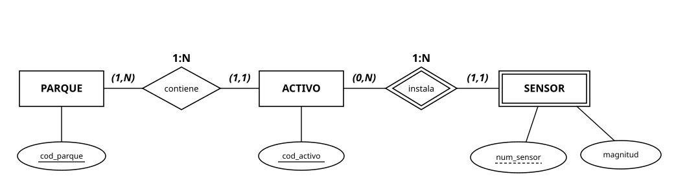

    Interprétalo por escrito: (a) las frases de cardinalidad de los cuatro extremos; (b) qué elementos gráficos declaran la debilidad de SENSOR y cuál es su discriminante; (c) cómo se identifica un sensor concreto según este diagrama; (d) una regla del contexto de la empresa que el diagrama no captura.
- **AE4** `[prepara RA6.d, e]` El diagrama de AE3 tomó una decisión: SENSOR débil. Cuestiónala profesionalmente: modela la alternativa (SENSOR **fuerte** con clave propia `num_serie` del fabricante) en la notación que prefieras, explica qué cambia en la identificación respecto del diagrama dado, y pronúnciate razonadamente por una de las dos opciones para esta empresa.
- **AE5** `[prepara RA6.d]` Modela la relación entre TECNICO y CUADRILLA sabiendo que "cada técnico pertenece a una cuadrilla, cada cuadrilla tiene un jefe que es uno de sus técnicos". Resuelve el doble papel del jefe (dos relaciones con roles) y anota todas las cardinalidades.
- **AE6** `[prepara RA6.b, d — jerarquía]` Modela ORDEN_DE_TRABAJO con especialización en PREVENTIVA (atributos: periodicidad, fecha programada) y CORRECTIVA (atributo: avería registrada que la origina). Decide y justifica totalidad y solapamiento con el contexto.
- **AE7** `[prepara RA6.d]` Incorpora INTERVENCION: cada orden se ejecuta mediante una o varias intervenciones; cada intervención pertenece a una orden, la realizan uno o varios técnicos y tiene fecha y horas empleadas. Modela con cardinalidades completas y justifica dónde vive `horas_empleadas`.
- **AE8** `[prepara RA6.d, h]` El consumo de repuestos: "en cada intervención se consumen repuestos en cierta cantidad". Modela la asociación INTERVENCION—REPUESTO con su atributo `cantidad`, y documenta en lenguaje natural dos restricciones del contexto que el diagrama no captura (lista de RA6.h en preparación).
- **AE9** `[prepara RA6.d — agregación]` Nueva necesidad: "la empresa asigna a cada pareja parque-contrata (las CONTRATAS externas ya homologadas trabajan en parques concretos) un técnico propio como supervisor de la contrata en ese parque; la homologación de la contrata en el parque existe antes y con independencia de que haya supervisor asignado". Modela con agregación, justifica frente a la ternaria con la frase del contexto que decide, y anota cardinalidades.
- **AE10** `[prepara RA6.a-h — síntesis]` Ensambla el diagrama completo (AE1-AE9) en una única entrega limpia con herramienta gráfica: notación uniforme, sin entidades-isla, con la lista consolidada de preguntas al cliente y de restricciones no capturadas. Este diagrama será tu punto de partida oficial de la UD3.

## Apartado 11. Para ampliar

- [Documentación de MySQL Workbench — modelado de datos](https://dev.mysql.com/doc/workbench/en/wb-data-modeling.html) — la herramienta profesional de diagramado que usarás más adelante sobre MySQL.
- [Diagramas entidad-relación en Mermaid](https://mermaid.js.org/syntax/entityRelationshipDiagram.html) — la sintaxis con la que están hechos los diagramas de estos apuntes.
- [Documentación de draw.io](https://www.drawio.com/doc/) — guía de la herramienta de diagramado de las entregas de esta unidad.
