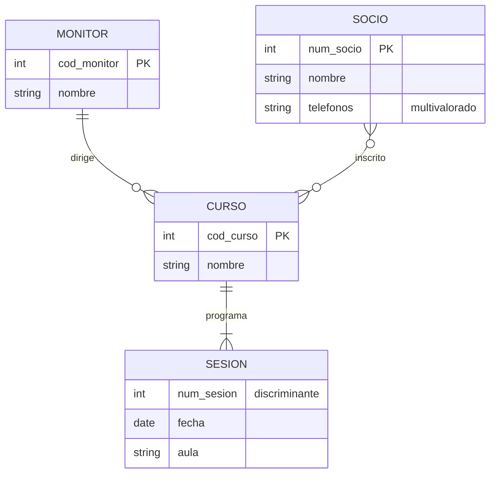

# UD3. Modelo relacional y normalización

**Módulo 0484 — Bases de Datos · 1.º DAW · IES Río Arba · Curso 2026-27 · 24 horas · 1.ª evaluación**

**Vinculación con el resultado de aprendizaje.** Esta unidad completa el **RA6**: *"Diseña modelos relacionales normalizados interpretando diagramas entidad/relación"* (RD 686/2010 en la redacción dada por el RD 405/2023). Aquí se evalúan **definitivamente los ocho criterios**, incluido el RA6.a iniciado en la UD2:

| CE | Qué exige (literal resumido) | Apartado donde se trabaja y evalúa |
|---|---|---|
| RA6.a | Utilizar herramientas gráficas para representar el diseño lógico | Apartado 4 (y entrega de la AE) — consolidación de lo iniciado en UD2 |
| RA6.b | Identificar las tablas del diseño lógico | Apartados 1 y 4 |
| RA6.c | Identificar los campos que forman parte de las tablas | Apartados 1 y 4 |
| RA6.d | Analizar las relaciones entre las tablas | Apartados 2 y 4 |
| RA6.e | Identificar los campos clave | Apartado 2 |
| RA6.f | Aplicar reglas de integridad | Apartado 3 |
| RA6.g | Aplicar reglas de normalización | Apartado 6 |
| RA6.h | Analizar y documentar las restricciones que no pueden plasmarse en el diseño lógico | Apartado 5 |

**Al terminar esta unidad sabrás:** hablar el idioma del modelo relacional sin mezclarlo con el de las hojas de cálculo; traducir cualquier diagrama E/R —el tuyo de la UD2 incluido— a un esquema de tablas correcto, aplicando la regla adecuada a cada tipo de relación, a las débiles, a las jerarquías y a las agregaciones; elegir y justificar claves primarias y ajenas, y decidir qué debe pasar cuando se borra una fila referenciada; detectar diseños enfermos por sus síntomas y curarlos con la normalización hasta la tercera forma normal; y documentar con oficio lo que ninguna tabla puede vigilar por sí sola.

**Entorno de trabajo de la unidad.** Seguimos en el nivel lógico: todavía sin MySQL (el DDL llega en la UD5; aquí decidimos **qué** tablas, no las tecleamos). Herramientas: draw.io o MySQL Workbench para los diagramas lógicos en pata de gallo — aquí se consolida y evalúa el RA6.a — y una **notación textual de esquemas** que usaremos constantemente:

> `prestamos(num_prestamo, carne → lectores, isbn, num_ejemplar, fecha_prest, fecha_dev)`
> La **clave primaria va en negrita** (aquí: **num_prestamo**), y cada **clave ajena lleva una flecha** a la tabla a la que apunta. Practica esta notación desde el primer ejercicio: es la taquigrafía profesional de la unidad y la que usarás en el examen.

## Apartado 1. El modelo relacional: terminología y reglas del juego

### Apartado 1.1. La terminología, con su traducción

El modelo relacional organiza los datos en **relaciones** — lo que informalmente llamamos tablas. La terminología formal convive con la informal y debes manejar ambas:

| Término formal | Término informal | Qué es |
|---|---|---|
| Relación | Tabla | El conjunto de datos sobre un mismo tipo de cosa |
| Tupla | Fila (registro) | Cada elemento concreto |
| Atributo | Columna (campo) | Cada propiedad |
| Dominio | — | Conjunto de valores válidos de un atributo |
| Grado | — | Número de atributos de la relación |
| Cardinalidad | — | Número de tuplas (¡ojo!: en la UD2 "cardinalidad" era otra cosa — el contexto desambigua) |

Y la distinción estructural que ordena toda la unidad: el **esquema** de la relación es su definición (`lectores(carne, nombre, telefono)` — estable, se diseña una vez) y la **instancia** es su contenido en un momento dado (las filas de hoy — cambia sin parar). Esta unidad diseña esquemas; las instancias llegarán en las UD siguientes.

### Apartado 1.2. Las reglas que la separan de una hoja de cálculo

Una relación no es una pestaña de hoja de cálculo con ínfulas. Sus propiedades:

1. **No hay tuplas duplicadas.** Dos filas idénticas son la misma información dicha dos veces: prohibido. (Consecuencia inmediata: toda relación tiene clave — apartado 2.)
2. **Las tuplas no tienen orden.** "La primera fila" no significa nada; si el orden importa (llegada, ranking), es un **dato** y merece su atributo.
3. **Los atributos no tienen orden** y cada uno tiene nombre único dentro de su relación.
4. **Los valores son atómicos**: en cada celda, un solo valor del dominio. Ni listas ("600111222, 976555444"), ni estructuras. Esta regla es la 1FN y la retomaremos en el apartado 6 — los atributos multivalorados de la UD2 chocan exactamente aquí.
5. **NULL existe y es traicionero.** NULL significa "valor desconocido o no aplicable" — no es cero, no es cadena vacía, no es "no". Dos NULL no son iguales entre sí. Decidir qué atributos admiten NULL es una decisión de diseño que se toma en esta unidad y se declara en la UD5.

**Ejercicios del apartado.**

- **E1.** Traduce a terminología formal e informal: en `libros`, con 6 filas y 4 columnas, indica grado y cardinalidad; señala esquema e instancia; y di qué término de esta tabla chocaría con el significado que "cardinalidad" tenía en la UD2.
- **E2.** Una "tabla" de hoja de cálculo de la biblioteca tiene: filas duplicadas de un mismo préstamo, la columna `telefonos` con "600111222 / 976555444", y las filas ordenadas "por importancia del lector". Señala qué propiedad del apartado 1.2 viola cada cosa y qué transformación la arreglaría.
- **E3.** Para `prestamos(num_prestamo, carne, isbn, num_ejemplar, fecha_prest, fecha_dev)`: razona atributo a atributo cuáles deberían admitir NULL y cuáles jamás, y explica la diferencia entre "fecha_dev es NULL" y "fecha_dev es la cadena vacía".

## Apartado 2. Claves: quién identifica a quién

### Apartado 2.1. La escalera de claves

- **Superclave**: cualquier conjunto de atributos que identifica sin ambigüedad cada tupla. `{carne}` lo es en `lectores`; también `{carne, nombre}` — sobrada, pero superclave.
- **Clave candidata**: superclave **mínima** (si le quitas un atributo, deja de identificar). `{carne}` y `{dni}` son candidatas en `lectores`; `{carne, nombre}` no (le sobra `nombre`).
- **Clave primaria (PK)**: la candidata elegida para identificar oficialmente. Criterios heredados de la UD2 — conocida siempre, estable, mínima — más uno nuevo del nivel lógico: **sin NULL jamás** (apartado 3).
- **Claves alternativas**: las candidatas no elegidas. No se tiran: se declararán únicas en la UD5.
- **Clave compuesta**: primaria formada por varios atributos. No es un defecto — es la forma natural de las tablas que traducen débiles y N:M (apartado 4).

### Apartado 2.2. La clave ajena: el pegamento del modelo

Una **clave ajena (FK)** es un atributo (o conjunto) de una tabla cuyos valores **deben existir como clave primaria en otra** (o en la misma: reflexivas). Es el mecanismo con el que el modelo relacional materializa las relaciones del E/R: donde la UD2 dibujaba un rombo, aquí habrá una FK — o una tabla con dos.

En la notación de la unidad: `ejemplares(isbn → libros, num_ejemplar, estado)` — la pareja **isbn, num_ejemplar** en negrita como PK compuesta, con `isbn` haciendo doble servicio: parte de la clave propia **y** ajena hacia `libros`. Ese doble papel es la firma de las entidades débiles traducidas, y entenderlo ahora te ahorra media UD5.

Matiz que separa niveles: la FK puede **admitir NULL** cuando la participación era opcional en el E/R — un técnico sin supervisor lleva `supervisor` a NULL. La mínima (0 o 1) de la UD2 se convierte aquí en una decisión NULL/NOT NULL: las cardinalidades que anotaste con frases ahora legislan.

**Ejercicios del apartado.**

- **E4.** En `tecnicos(cod_tecnico, dni, nombre, cod_cuadrilla, supervisor)`: lista todas las superclaves razonables, identifica las candidatas, elige primaria justificando con los cuatro criterios, y señala las dos claves ajenas presentes con su tabla destino (una es reflexiva).
- **E5.** Escribe en la notación de la unidad el esquema de `valoraciones` que traduce la relación N:M *valora* de la UD2 (figura 2 de aquella unidad) con sus atributos `puntuacion` y `fecha`. Justifica por qué su PK debe ser compuesta y qué pasaría con las propiedades del apartado 1.2 si usaras solo `carne` como primaria.
- **E6.** Un compañero propone `dni` como PK de `tecnicos` "porque nunca se repite". Rebátelo (o dale la razón) usando los cuatro criterios y lo aprendido sobre minimización en la UD1 — y di qué se hace con `dni` si no es primaria.

## Apartado 3. Integridad: las reglas que el gestor vigilará por ti

Diseñar es también declarar qué estados de la base de datos son **ilegales**. Las tres reglas de integridad del modelo (RA6.f) — que en la UD5 se convertirán en cláusulas de MySQL, pero cuya decisión se toma aquí:

1. **Integridad de entidad**: ningún atributo de la clave primaria admite NULL. Una fila sin identidad completa no es identificable — y una tabla con filas no identificables viola el apartado 1.2. Por eso la PK compuesta de `ejemplares` obliga a conocer siempre isbn **y** número.
2. **Integridad referencial**: toda clave ajena, o es NULL (si se permitió), o **apunta a una primaria existente**. Prohibido el préstamo del carné 999 si no hay lector 999; prohibido el ejemplar de una obra fantasma. Es la regla que mata para siempre las inconsistencias del cuaderno de la UD1.
3. **Integridad de dominio**: cada valor, dentro de su dominio — fechas que son fechas, cantidades no negativas, estados dentro del catálogo permitido. Parte se declara con tipos (UD5) y parte con restricciones de validación; lo que ningún mecanismo cubra pasará a la lista del apartado 5.

La integridad referencial obliga además a legislar el **borrado y la modificación de lo referenciado**: ¿qué pasa con los préstamos de un lector que se da de baja? Las políticas, que decidirás caso a caso y documentarás en el esquema:

| Política | Efecto al borrar la fila referenciada | Cuándo suele ser la correcta | Cláusula que teclearás (UD5) |
|---|---|---|---|
| **Rechazar** (restringir) | El borrado falla si hay filas que apuntan | Lo referenciado tiene historia que debe conservarse (lectores con préstamos) | `ON DELETE RESTRICT` |
| **Propagar** (en cascada) | Se borran también las filas que apuntan | Las hijas no tienen sentido sin el padre (ejemplares de una obra descatalogada, líneas de una factura) | `ON DELETE CASCADE` |
| **Poner a NULL** | La FK de las filas que apuntan pasa a NULL | La referencia era opcional y lo demás sobrevive (técnicos cuyo supervisor causa baja) | `ON DELETE SET NULL` |

La última columna es **vocabulario, no sintaxis**: son los nombres que MySQL Workbench te mostrará tal cual si lo usas para el diagrama de la actividad evaluativa (junto a `NO ACTION`, que en MySQL equivale a rechazar). Aquí basta con reconocerlos; en la UD5 los teclearás.

La elección **nunca es técnica: es de negocio** — "¿debe poder borrarse?" y "¿qué debe sobrevivir?" son preguntas para el cliente, y la respuesta se anota junto a cada FK.

¿Y la **modificación** de la clave referenciada? La respuesta profesional es evitarla de raíz: una primaria bien elegida **no cambia** — la estabilidad es uno de los cuatro criterios del apartado 2.1. Por eso la política de actualización (`ON UPDATE ...`, UD5) es una palanca de emergencia, no una herramienta de diseño: si te descubres necesitándola a menudo, el problema no es la política — es la clave.

**Ejercicios del apartado.**

- **E7.** Sobre el esquema de la biblioteca (`lectores`, `libros`, `ejemplares`, `prestamos`): pon un ejemplo concreto de violación de cada una de las tres reglas de integridad, con los valores exactos que la provocarían.
- **E8.** Decide y justifica la política de borrado de cada FK del esquema anterior (cuatro decisiones). Al menos una debe ser distinta de las demás, o tu justificación deberá explicar por qué todas coinciden.
- **E9.** Un instituto tiene `alumnos`, `grupos(cod_grupo, tutor → profesores)` y `profesores`. El profesor tutor de 1.º A se jubila. Analiza qué permite o impide cada política aplicada a `grupos.tutor`, y cuál elegirías sabiendo que "todo grupo debe tener tutor" es norma del centro — y dónde acaba esa norma si ninguna política la garantiza del todo (pista: apartado 5).

## Apartado 4. Del diagrama E/R al esquema relacional

Aquí se cosecha la UD2. La traducción es un **algoritmo**, y su variable de control es la **etiqueta de tipo** que pusiste sobre cada rombo (apartado 1.2 de la UD2: el tipo se forma con los máximos — te avisamos de que esta regla decidiría la traducción; es ahora).

### Apartado 4.1. Entidades y atributos

- **Entidad fuerte** → tabla con sus atributos simples; su clave primaria, la elegida en el diagrama.
- **Atributo compuesto** → se descompone en sus partes simples (`direccion` → `calle`, `numero`, `localidad`): la atomicidad del apartado 1.2 no negocia.
- **Atributo multivalorado** → **tabla aparte** con FK a su entidad y el valor: `telefonos_lector(carne → lectores, telefono)`. La señal de alarma de la UD2 explota exactamente aquí, y esta es su solución.
- **Atributo derivado** → no se traduce (no se almacena); se documenta cómo se calcula (apartado 5).

### Apartado 4.2. Relaciones, por su etiqueta de tipo

- **1:N** → la clave del lado **uno** viaja como FK al lado **muchos**. LECTOR—realiza—PRESTAMO: `prestamos` lleva `carne → lectores`. Si la relación tenía atributos, viajan con la FK al lado muchos.
- **N:M** → **tabla intermedia** con las dos FK, cuya PK es (normalmente) la pareja; los atributos de la relación viven en ella. *valora* → `valoraciones(carne → lectores, isbn → libros, puntuacion, fecha)`. Ninguna otra opción conserva las propiedades del apartado 1.2 — es el motivo profundo por el que la UD2 prohibía "resolver" N:M con multivalorados.
- **1:1** → FK en uno de los dos lados (única, y NOT NULL si su participación era obligatoria). ¿En cuál? En el lado de participación **más obligatoria** (menos NULL) o, si empatan, en el que más se consulte desde el otro. Si ambas participaciones son totales y las entidades viven y mueren juntas, cabe incluso **fusionar** en una tabla — decisión a justificar, no a improvisar.
- **Reflexiva** → mismo mecanismo según su tipo, con la FK apuntando a la propia tabla y nombre de rol: `tecnicos(…, supervisor → tecnicos)` para la 1:N de la UD2.
- **Ternaria** → tabla asociativa con las tres FK (la descomposición que la UD2 te enseñó como formato de entrega era, literalmente, esta traducción): `imparticiones(cod_profesor → profesores, cod_modulo → modulos, cod_grupo → grupos, horas_semanales)`.

### Apartado 4.3. Débiles, jerarquías y agregación

- **Entidad débil** → tabla cuya PK es **compuesta**: clave del padre (que además es FK) + discriminante. `ejemplares(isbn → libros, num_ejemplar, estado)`. Borrado del padre: casi siempre en cascada — la dependencia en existencia de la UD2, hecha política.
- **Jerarquía (generalización/especialización)** → tres estrategias, y la elección depende de las anotaciones (total/parcial, exclusiva/solapada) que decidiste en la UD2:

| Estrategia | Cómo | Encaja bien cuando |
|---|---|---|
| Tabla única | Una tabla con todos los atributos + columna `tipo`; los no aplicables, a NULL | Pocos atributos propios; consultas casi siempre sobre el conjunto |
| Tabla por subtipo (padre + hijas) | Tabla del supertipo + una por subtipo con PK = FK al padre | La general: conserva la jerarquía tal cual; funciona con parcial y con solapada |
| Solo tablas hija | Una tabla por subtipo repitiendo los atributos comunes; sin tabla padre | Solo si la jerarquía es **total y exclusiva** y nadie consulta el conjunto |

- **Agregación** → la relación agregada se traduce primero (si era N:M, su tabla intermedia); esa tabla, que ya tiene PK propia, recibe las relaciones de la agregación como cualquier entidad. La promesa de la UD2 ("la UD3 lo resuelve con naturalidad") era esto: `organizaciones(cod_biblioteca → bibliotecas, cod_actividad → actividades)` y sobre ella `…, cod_monitor → monitores` (NULL permitido: la pareja existía antes que el monitor).

### Apartado 4.4. Ejemplo resuelto: del diagrama al esquema, decisión a decisión

El **club deportivo municipal**: socios que se inscriben en cursos dirigidos por monitores, con sesiones programadas por curso. El diagrama, en pata de gallo (la débil, con línea continua):

Reglas del enunciado que completan el dibujo: *dirige* es **1:N** con atributo `fecha_asignacion` (cuándo se asignó el monitor al curso); *inscrito* es **N:M** con atributo `fecha_inscripcion`; todo curso tiene monitor; SESION es débil de CURSO, numerada dentro de cada curso.

**La traducción, narrada con el algoritmo:**

1. **Entidades fuertes** (4.1): `socios`, `monitores`, `cursos` — cada una a su tabla con sus simples y su primaria.
2. **Multivalorado** (4.1): `telefonos` no cabe en una celda (atomicidad) → tabla aparte con FK al socio y el valor; su PK, la pareja (un socio no repite el mismo teléfono).
3. ***dirige*, etiqueta 1:N** (4.2): la clave del lado uno viaja como FK al lado muchos → `cod_monitor` entra en `cursos`, **NOT NULL** (todo curso tiene monitor: la mínima legisla). Su atributo viaja con la FK: `fecha_asignacion` también a `cursos`.
4. ***inscrito*, etiqueta N:M** (4.2): tabla intermedia con las dos FK; su PK, la pareja; el atributo de la relación vive en ella → nace `inscripciones`.
5. **SESION, débil** (4.3): PK compuesta = clave del padre (que además es FK) + discriminante → (`cod_curso`, `num_sesion`).

**El esquema íntegro, en la notación de entrega** (política de borrado justificada en cada FK):

- `socios(`**num_socio**`, nombre)`
- `monitores(`**cod_monitor**`, nombre)`
- `cursos(`**cod_curso**`, nombre, cod_monitor → monitores, fecha_asignacion)` — borrado de monitor: **rechazar** (todo curso exige monitor: primero se reasigna, luego se da de baja; la reasignación pendiente, a la lista RS del apartado 5).
- `telefonos_socio(`**num_socio** `→ socios,` **telefono**`)` — borrado de socio: **propagar** (los teléfonos no sobreviven a su dueño; además, minimización de la UD1: datos de contacto sin titular sobran).
- `inscripciones(`**num_socio** `→ socios,` **cod_curso** `→ cursos, fecha_inscripcion)` — borrado de socio: **propagar** (baja del club arrastra sus inscripciones); borrado de curso: **rechazar** (un curso con inscritos no se elimina sin resolverlos antes).
- `sesiones(`**cod_curso** `→ cursos,` **num_sesion**`, fecha, aula)` — borrado de curso: **propagar** (la dependencia en existencia de la débil, hecha política).

Este es, exactamente, el artefacto que E10 y la actividad evaluativa te pedirán producir por tu cuenta: mismo formato, mismas justificaciones, mismo nivel de detalle.

**Ejercicios del apartado.**

- **E10.** Traduce completa la **figura 8 de la UD2** (el diagrama Chen de lectura: LECTOR, PRESTAMO, EJEMPLAR débil, LIBRO) a esquema relacional en la notación de la unidad, con políticas de borrado justificadas en cada FK.
- **E11.** Traduce la jerarquía de la **figura 5 de la UD2** (USUARIO, parcial y exclusiva) con las estrategias 1 y 2, escribe ambos esquemas, y justifica cuál elegirías para la biblioteca sabiendo que los préstamos se relacionan con USUARIO. Explica por qué la estrategia 3 queda descartada de entrada en este caso.
- **E12.** Traduce la agregación de la **figura 6 de la UD2** (biblioteca—organiza—actividad, asignada a monitor) con las fechas de inicio y fin de la asignación (ejercicio E20 de la UD2). Señala qué mínima del diagrama se convierte en qué decisión NULL/NOT NULL.
- **E13.** La escuela de música del E21 de la UD2 tenía una matrícula "por curso". Escribe el esquema de esa asociación en las dos lecturas que allí quedaron abiertas (curso como atributo de la clave de la asociación, o no) y demuestra con un ejemplo de filas concretas qué información pierde la lectura sin curso.

## Apartado 5. Restricciones semánticas: lo que las tablas no pueden vigilar

Traducido el diagrama, queda un residuo — y ese residuo es materia evaluable (RA6.h): las **reglas del negocio que el diseño lógico no puede plasmar**. Vienes alimentando esta lista desde el paso 7 del método de la UD2; ahora se convierte en un entregable con forma fija.

Ejemplos de la biblioteca que ninguna tabla, clave ni FK garantiza por sí sola:
- "Un ejemplar no puede tener dos préstamos vivos a la vez."
- "La fecha de devolución, si existe, es posterior a la de préstamo."
- "Un lector con préstamos vencidos no puede llevarse más libros."
- "El jefe de una cuadrilla pertenece a la cuadrilla que dirige" (¿te suena? AE5 de la UD2 — te avisamos de que el diagrama no lo garantizaba).
- Y las **derivadas**: cómo se calcula `edad`, que decidimos no almacenar.

Formato de documentación de la unidad (y del examen): cada restricción con **código, enunciado en lenguaje natural, tablas y atributos implicados, y mecanismo previsto** — algunas caerán en restricciones de validación de la UD5, otras en disparadores de la UD7, otras quedarán en la aplicación; anticipar la casilla correcta puntúa, dejarla en "pendiente de decidir" es honesto y acepta.

> **RS-03** · "Un ejemplar no puede tener dos préstamos vivos a la vez" · `prestamos(isbn, num_ejemplar, fecha_dev)` · Mecanismo previsto: verificación al insertar (UD7); mientras tanto, procedimiento de mostrador.

La lista de restricciones semánticas **forma parte del esquema entregable** con el mismo rango que las tablas: un diseño sin su lista es un diseño a medio documentar.

**Ejercicios del apartado.**

- **E14.** Clasifica cada regla en su sitio: (a) "la puntuación de una valoración está entre 1 y 5"; (b) "no se presta a quien tiene vencidos"; (c) "todo préstamo pertenece a un lector existente"; (d) "el correo del lector es único". ¿Cuáles son integridad del apartado 3 (y de qué tipo), y cuáles restricciones semánticas del apartado 5?
- **E15.** Escribe, en el formato RS de la unidad, las tres restricciones de la lista de la biblioteca que consideres más dañinas si se incumplen, ordenadas por daño y con el mecanismo previsto razonado.
- **E16.** Recupera tu lista de "no capturadas" de la entrega de la escuela de música (E19 de la UD2) y formalízala en formato RS. Si alguna resulta ser, bien mirada, integridad declarable del apartado 3, reclasifícala y explica el porqué.

## Apartado 6. Normalización: diagnosticar y curar diseños

### Apartado 6.1. La enfermedad: redundancia y sus anomalías

Cuando el diseño no ha pasado por un buen E/R — o el E/R estaba mal — aparecen tablas como esta (la reconocerás: es el cuaderno de la biblioteca con columnas):

`prestamos_todo(carne, nombre, telefono, isbn, titulo, estante, fecha_prest)`

Sus síntomas tienen nombre clínico:
- **Anomalía de modificación**: cambiar el teléfono de Marta exige tocar todas sus filas — y olvidar una crea la inconsistencia de la UD1.
- **Anomalía de inserción**: no puedes dar de alta un lector nuevo **sin préstamo** (¿qué pones en isbn?) ni catalogar un libro que nadie ha sacado.
- **Anomalía de borrado**: si Rosa devuelve su único préstamo y borras la fila, Rosa desaparece de la base de datos.

La causa común: **hechos distintos conviviendo en la misma tabla** (quién es el lector, qué es el libro, qué préstamo hubo). La normalización es el procedimiento que los separa.

### Apartado 6.2. Dependencias funcionales: el instrumento de diagnóstico

Una **dependencia funcional** X → Y se lee "X determina Y": conocido el valor de X, el de Y queda fijado. En `prestamos_todo`: `carne → nombre, telefono` · `isbn → titulo, estante` · y la clave (carne, isbn, fecha_prest) → todo. Las dependencias **no se inventan mirando los datos de hoy: se deducen del negocio** — los datos solo pueden refutarlas, nunca confirmarlas.

### Apartado 6.3. Las formas normales, como escalera

- **1FN**: valores atómicos y sin grupos repetidos — la regla 4 del apartado 1.2. Los multivalorados, a su tabla (apartado 4.1). Toda relación auténtica ya está en 1FN.
- **2FN**: en 1FN y, además, **ningún atributo no clave depende de una parte de la clave** (solo importa con claves compuestas). En `prestamos_todo`, `nombre` depende solo de `carne` (parte de la clave): violación. Cura: extraer el hecho a su tabla — nace `lectores`.
- **3FN**: en 2FN y, además, **ningún atributo no clave depende de otro atributo no clave** (dependencias transitivas). El diagnóstico y la cura, trabajados de principio a fin en el apartado 6.4.
- **Formas superiores** (mención, bajo una convención que conviene dejar clara): en la práctica profesional, **una base de datos se considera normalizada cuando alcanza la 3FN** — ese es el objetivo operativo del curso y el alcance mínimo declarado del artefacto. Por encima existen, y basta con reconocer sus nombres: la **FNBC**, versión estricta de la 3FN para casos con varias claves candidatas solapadas; la **4FN**, que ataca las dependencias multivaloradas independientes conviviendo en una misma tabla (dos hechos multivalorados sin relación entre sí, multiplicados en filas); y la **5FN**, que trata las dependencias de reunión (tablas solo reconstruibles combinando todas sus piezas a la vez). Ninguna de las tres es exigible en este módulo: se citan para que sus nombres no te asusten en documentación ajena, no para practicarlas.

El procedimiento práctico, que es lo que se examina: **(1)** lista las dependencias funcionales del enunciado; **(2)** localiza la que viola la forma normal (¿parcial? ¿transitiva?); **(3)** extrae el hecho a una tabla nueva con su determinante como clave, dejando una FK; **(4)** repite hasta 3FN; **(5)** comprueba que no has perdido información (podrías reconstruir la tabla original combinando las piezas).

Y el cierre del círculo: si haces bien la UD2 y traduces bien el apartado 4, **el esquema sale casi normalizado de serie** — la normalización es tu control de calidad y tu herramienta de rescate de diseños ajenos, no tu método de diseño principal. No te lo creas por fe: el apartado 6.4 lo demuestra.

### Apartado 6.4. Ejemplo resuelto: `prestamos_todo`, de la hoja enferma a la 3FN

La hoja real del mostrador, con la ubicación detallada de los libros:

`prestamos_todo(carne, nombre, telefono, isbn, titulo, cod_estante, planta_estante, fecha_prest)`

**Paso 1 — dependencias funcionales** (del negocio, no de los datos): `carne → nombre, telefono` · `isbn → titulo, cod_estante` · `cod_estante → planta_estante` · clave de la hoja: (**carne, isbn, fecha_prest**) → todo.

**Paso 2 — localizar violaciones.** Hay de los dos tipos, y conviene verlos juntos: `carne → nombre, telefono` e `isbn → titulo, cod_estante` son dependencias de **parte de la clave** (violan 2FN); `cod_estante → planta_estante` es una dependencia **entre atributos no clave** — la planta no depende del préstamo ni del libro directamente, sino del estante: transitiva (violará 3FN cuando lleguemos).

**Paso 3 — extraer los hechos parciales.** Cada determinante parcial se lleva su hecho a una tabla propia, dejando FK:

**Estado intermedio en 2FN:**
- `lectores(`**carne**`, nombre, telefono)`
- `libros(`**isbn**`, titulo, cod_estante, planta_estante)`
- `prestamos(`**carne** `→ lectores,` **isbn** `→ libros,` **fecha_prest**`)`

Ya no hay dependencias parciales — pero `libros` arrastra la transitiva: si la biblioteca reordena la planta de un estante, hay que tocar todos los libros de ese estante (anomalía de modificación en miniatura), y un estante vacío no existe en ninguna parte (inserción).

**Paso 4 — extraer la transitiva.** `cod_estante → planta_estante` se va a su tabla:

**Esquema final en 3FN, en la notación de entrega:**
- `lectores(`**carne**`, nombre, telefono)`
- `estantes(`**cod_estante**`, planta_estante)`
- `libros(`**isbn**`, titulo, cod_estante → estantes)`
- `prestamos(`**carne** `→ lectores,` **isbn** `→ libros,` **fecha_prest**`)`

**Paso 5 — comprobación de no-pérdida.** Combinando `prestamos` con `lectores` (por carne), `libros` (por isbn) y `estantes` (por cod_estante) se reconstruye exactamente cada fila original de la hoja: ninguna información se ha perdido — solo ha dejado de repetirse.

**El cierre del círculo, demostrado.** Ahora traduce mentalmente con el apartado 4 el E/R evidente de este dominio — LECTOR y LIBRO fuertes, ESTANTE como entidad (un libro está en un estante: 1:N), *realiza/es objeto de* alrededor del préstamo: obtienes **este mismo esquema**, tabla por tabla y flecha por flecha, sin haber normalizado nada. Diseñar bien y normalizar convergen en el mismo sitio; la diferencia es que el buen E/R llega a la primera y la normalización llega rescatando. Las dos rutas debes dominarlas — los exámenes y la vida traen de las dos.

**Ejercicios del apartado.**

- **E17.** La clínica veterinaria municipal apunta cada visita en una hoja plana: `visitas_todo(cod_mascota, nombre_mascota, especie, nombre_dueno, telefono_dueno, fecha_visita, cod_veterinario, nombre_veterinario, diagnostico)`. Escribe sus dependencias funcionales, provoca con filas concretas una anomalía de cada tipo (modificación, inserción, borrado), y normaliza hasta 3FN mostrando el paso 2FN intermedio en la notación de entrega.
- **E18.** `matriculas(cod_alumno, cod_modulo, nombre_modulo, curso, nota, tutor_grupo)` con las dependencias razonables de un instituto: identifica en qué forma normal está, qué dependencia viola la siguiente, y normaliza justificando cada extracción.
- **E19.** Diagnóstico inverso: un esquema en 3FN de la biblioteca se "desnormaliza" fusionando `libros` e `ejemplares` "para hacer menos consultas". Describe qué anomalías reaparecen exactamente y qué preguntas de negocio se vuelven peligrosas de responder.
- **E20.** ¿Verdadero o falso, con contraejemplo o justificación?: (a) "toda tabla con clave simple está en 2FN"; (b) "una tabla con dos columnas siempre está en 3FN"; (c) "si los datos actuales no repiten nada, la tabla está normalizada".

## Apartado 7. Errores frecuentes

1. **Traducir N:M con una FK y rezar.** Meter `isbn` en `lectores` (¿cuál de sus libros?) o listas en una celda (viola 1FN). N:M = tabla intermedia, sin excepciones.
2. **Olvidar el doble papel de la clave del padre en las débiles.** `ejemplares` sin que `isbn` sea FK, o con un `id_ejemplar` inventado que rompe la identificación decidida en el E/R. Si cambias la decisión, cámbiala en el diagrama, no de tapadillo en las tablas.
3. **FK sin política de borrado.** "Ya lo decidiré" = lo decidirá el gestor por ti con su valor por defecto, y no te va a gustar en producción. Cada flecha de tu esquema lleva su política anotada.
4. **Elegir PK "bonita" en la intermedia.** Añadir `id_valoracion` autonumérico y dejar sin proteger la pareja (carne, isbn): permite valorar dos veces el mismo libro. Si añades clave artificial, la pareja queda como alternativa única — o no añadas.
5. **Normalizar mirando los datos.** "No veo repeticiones" no demuestra nada (apartado 6.2): las dependencias salen del negocio. Y el recíproco: desnormalizar "por rendimiento" en 1.º es optimizar un problema que no tienes — el rendimiento de verdad se estudia en la UD4 con instrumentos, no con corazonadas.
6. **Lista de restricciones semánticas vacía.** Ningún dominio real tiene cero reglas fuera del esquema. Lista vacía = análisis sin terminar, y así se corrige.

## Apartado 8. La IA en esta unidad

La regla de siempre: el resultado es tuyo y lo defiendes tú.

- **Usos razonables aquí**: generar tablas de práctica con anomalías para diagnosticarlas; pedir enunciados extra de traducción E/R→relacional; contrastar tu lista de dependencias funcionales describiéndole el negocio (no los datos).
- **Lo que debes verificar siempre**: las traducciones y normalizaciones que un asistente te proponga. Los fallos típicos de los modelos de IA en esta materia son exactamente los del apartado 7 — claves artificiales que desprotegen parejas, políticas de borrado omitidas, "3FN" declaradas sin comprobar la transitiva — y llegan con seguridad absoluta. Audita contra el procedimiento del apartado 6.3, paso a paso.
- **Lo que se te pedirá defender**: en la defensa se te pedirá **derivar**, no recitar: "¿por qué esta tabla existe?", "¿qué dependencia rompía la 2FN aquí?", "¿qué pasa si borro este lector?". Un esquema que no sabes derivar desde su diagrama y sus dependencias se considera no propio, con las consecuencias que fija la programación.

## Apartado 9. Actividad evaluativa final

**Contexto.** La empresa comarcal de **mantenimiento de parques renovables** de la UD2 — 15 parques, 450 activos, 5.000 sensores, 60 técnicos en cuadrillas, órdenes preventivas y correctivas, intervenciones con consumo de repuestos, contratas homologadas por parque con supervisor asignable. **Tu materia prima es el diagrama que ensamblaste en la AE10 de la UD2** (con las correcciones que recibiera): esta actividad lo convierte en esquema relacional completo. Donde tu diagrama tomara una decisión distinta de la canónica (p. ej., SENSOR fuerte en la AE4), traduce **tu** decisión con coherencia — se corrige la traducción, no la decisión ya evaluada.

**Instrucciones.** 10 ejercicios, 1 punto cada uno, etiquetados con el CE oficial del RA6 que evalúan. Esquemas en la notación textual de la unidad (PK en negrita, FK con flecha); el diagrama lógico final (AE10), con herramienta. **Tiempo estimado: 2 horas más el acabado del diagrama.** Entrega: documento + archivo fuente y exportación del diagrama, por la tarea de Classroom. Defensa oral por muestreo.

- **AE1** `[RA6.b]` Identifica y enumera **todas las tablas** que tu diagrama produce al traducirse, indicando para cada una de qué elemento del E/R procede (entidad fuerte, débil, N:M, multivalorado, jerarquía, agregación). Sin escribir aún los campos: el mapa antes que el territorio.
- **AE2** `[RA6.c]` Escribe el esquema completo de `parques`, `activos`, `tecnicos` y `cuadrillas` en la notación de la unidad, con todos sus campos (los del contexto más los razonables), marcando PK y FK.
- **AE3** `[RA6.d]` Analiza por escrito cómo ha quedado plasmada cada relación de tu diagrama: para cada rombo del E/R, di qué mecanismo la traduce (FK en qué tabla, o tabla intermedia) y por qué su **etiqueta de tipo** obligaba a ese mecanismo.
- **AE4** `[RA6.e]` Justifica las claves de los tres casos delicados: la PK de `sensores` según tu decisión de AE4 de la UD2 (compuesta si débil, propia si fuerte — y qué queda como alternativa), la PK de la tabla de consumos de repuestos, y la reflexiva o doble relación del jefe de cuadrilla.
- **AE5** `[RA6.f]` Declara la política de borrado y modificación de **cada FK** de tu esquema (tabla de FKs con política y justificación de negocio en una línea). Señala razonadamente el caso más discutible.
- **AE6** `[RA6.d]` Traduce la jerarquía de órdenes de trabajo (preventiva/correctiva, total y exclusiva según la AE6 de la UD2) con **dos** de las tres estrategias del apartado 4.3, y elige una para la empresa justificando con sus consultas previsibles (el jefe de mantenimiento pregunta casi siempre por "órdenes", a secas).
- **AE7** `[RA6.d]` Traduce la agregación de contratas (AE9 de la UD2): esquema de la tabla de homologaciones y de la asignación de supervisor, con la mínima "(0,1) — puede no haber supervisor" convertida en su decisión NULL exacta.
- **AE8** `[RA6.g]` La oficina central usaba esta hoja: `partes_todo(cod_intervencion, fecha, cod_orden, tipo_orden, cod_activo, nombre_parque, cod_tecnico, nombre_tecnico, cod_repuesto, descripcion_repuesto, cantidad)`. Escribe sus dependencias funcionales, di en qué forma normal está, y normalízala hasta 3FN mostrando el paso intermedio — comprueba que aterriza en (un subconjunto de) tu esquema.
- **AE9** `[RA6.h]` Entrega la **lista consolidada de restricciones semánticas** del sistema en formato RS (mínimo seis, incluidas las heredadas de tus listas de la UD2: jefe-pertenece-a-su-cuadrilla, cantidades positivas, correctiva-exige-avería…), cada una con su mecanismo previsto.
- **AE10** `[RA6.a]` Entrega el **diagrama lógico completo** del esquema final con herramienta (draw.io o MySQL Workbench, pata de gallo): todas las tablas con sus campos, PK marcadas, FKs como líneas con sus cardinalidades, identificativas en trazo continuo. Formato de entrega doble de la guía de draw.io (fuente + exportación). Este diagrama es la evaluación definitiva del criterio de herramienta iniciado en la UD2 — y tu plano de construcción para la UD5.

## Apartado 10. Para ampliar

- [Manual de referencia de MySQL — uso de claves ajenas](https://dev.mysql.com/doc/refman/8.4/en/create-table-foreign-keys.html) — cómo se declararán en la UD5 las políticas que has decidido aquí.
- [Documentación de modelado de MySQL Workbench](https://dev.mysql.com/doc/workbench/en/wb-data-modeling.html) — la alternativa profesional a draw.io para el diagrama lógico de la AE10.
- [Guía rápida de draw.io para las entregas de diagramas](../recursos/guia-drawio.md) — convención de nombrado y formato de entrega doble.
