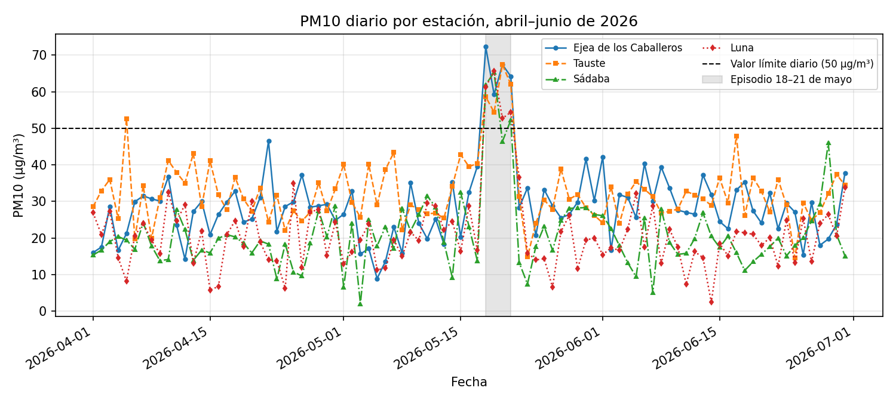
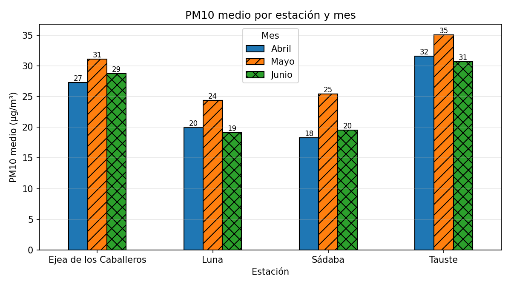
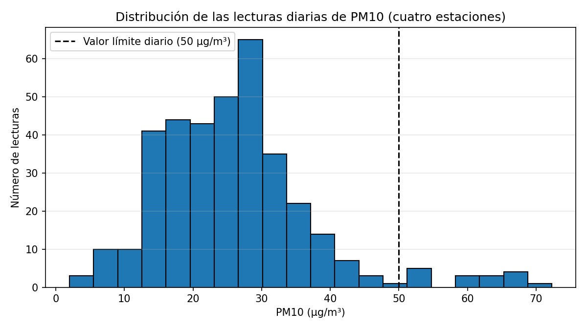
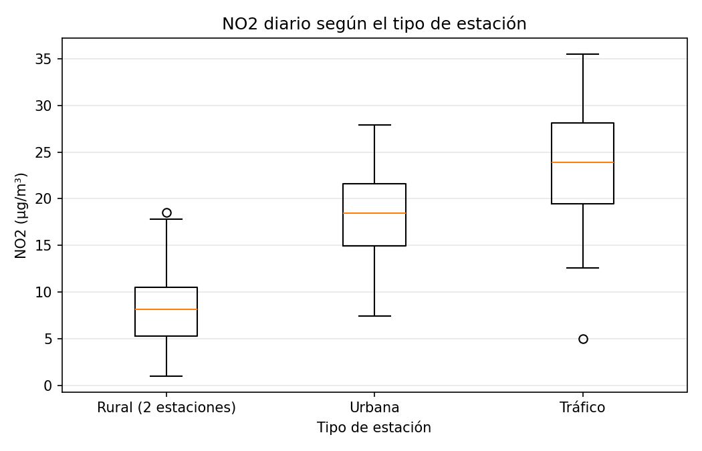
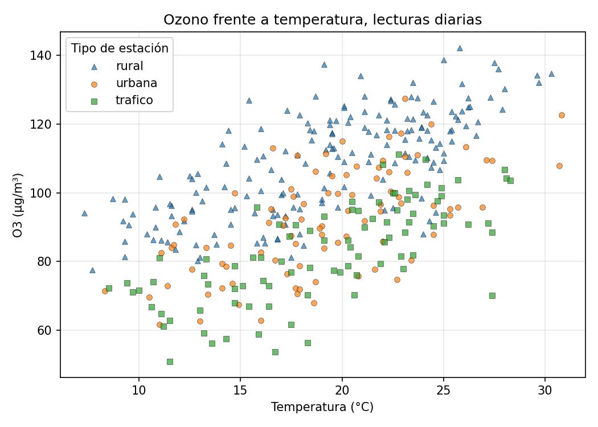
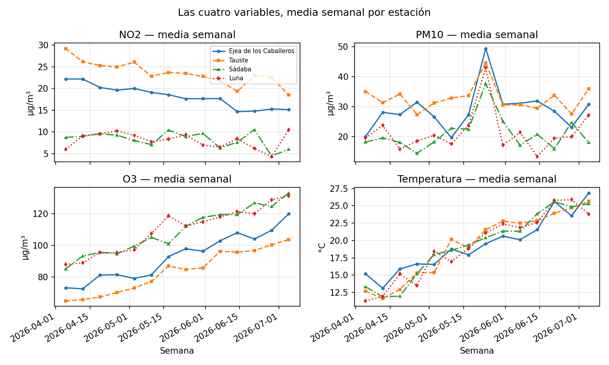

# UD2. Preparación, análisis y visualización de datos; protección de datos

**Módulo optativo AOP1089 — Big Data e Inteligencia Artificial · 2.º DAW · IES Río Arba · Curso 2026-27 · 14 horas · 1.ª evaluación**

**Vinculación con el resultado de aprendizaje.** Esta unidad trabaja completo el **RA2**: *"Aplica distintas técnicas de análisis de datos, preparando los datos para su tratamiento y visualización"* (Resolución de 10 de julio de 2025, bloque IFC303). Es la unidad del **pipeline de datos**: todo lo que pasa entre recibir un fichero y poder fiarse de una cifra o de un gráfico sacado de él. Y empieza por la ley, no termina en ella.

| CE | Qué exige (resumen) | Apartado donde se trabaja |
|---|---|---|
| RA2.a | Interpretar las leyes de protección de datos | Apartado 1 (y su aplicación con código, apartado 4) |
| RA2.b | Definir los distintos tipos de datos y sus características | Apartado 2 |
| RA2.c | Identificar las herramientas y metodologías para el análisis de datos | Apartado 3 |
| RA2.d | Aplicar técnicas de limpieza y preprocesamiento de datos | Apartado 4 |
| RA2.e | Visualizar los datos en distintos tipos gráficos | Apartado 5 |
| RA2.f | Utilizar procedimientos para contrastar la calidad de los resultados obtenidos | Apartado 6 |
| RA2.g | Documentar el proceso de análisis de datos y sus resultados | Apartado 7 |

**Sobre el criterio RA2.a.** Es el único criterio de tipo normativo que se evalúa en el módulo, y la programación lo declara **mínimo**: sin evidencia positiva en él no se alcanza la suficiencia del RA2. Reconecta con lo que viste en Bases de Datos en primero (la legislación de protección de datos de su primera unidad); aquí se aplica sobre datos de verdad y con código. El **Reglamento de Inteligencia Artificial** aparece en el apartado 1 como **contenido de contexto**: no tiene criterio de evaluación asociado y no se pregunta en la actividad evaluativa, pero un profesional de datos que construye o alimenta sistemas de IA tiene que saber que existe y qué le pide a sus datos.

**Al terminar esta unidad sabrás:** leer un dataset con la ley de protección de datos delante — reconocer qué columnas son datos personales, cuáles permiten identificar a alguien combinándolas y qué principios obligan a minimizar, anonimizar o no tocar —; distinguir los tipos de datos que conviven en una tabla y hacer que pandas los trate como lo que son; describir el pipeline del análisis y elegir la herramienta adecuada para cada paso; limpiar y preparar un fichero sucio de verdad (ausentes, duplicados, centinelas, formatos mezclados, categorías inconsistentes) y cruzarlo con otro; dibujar con Matplotlib el gráfico que corresponde a cada pregunta — serie temporal, barras, histograma, caja, dispersión — y hacerlo legible; contrastar la calidad de lo que has obtenido con recuentos, aserciones, comprobaciones cruzadas y una referencia normativa real; y documentar el proceso para que otra persona lo reproduzca y sepa qué se descartó y por qué.

**Entorno de trabajo de la unidad.** El mismo taller de la UD1 — Python, entorno virtual y cuadernos de Jupyter — con dos librerías nuevas que son las protagonistas: **pandas**, para cargar, explorar, limpiar y transformar tablas, y **Matplotlib**, para dibujarlas. Se instalan dentro del entorno de la carpeta `ud2/` de tu repositorio:

```
pip install pandas matplotlib jupyterlab
pip freeze > requirements.txt
```

Trabajarás sobre todo en **cuadernos** — el formato natural para mirar datos, corregir y volver a mirar — y entregarás además algún **script** cuando el enunciado lo pida. Todo lo que dibujes se guarda en `ud2/figuras/`, y tu `DECISIONES.md` recoge desde el primer commit las decisiones de limpieza (apartado 7): en esta unidad es más que un trámite, es el documento que responde a la pregunta «¿por qué esta cifra?». Los materiales no fijan números de versión: trabajamos con la **versión soportada actual** de cada pieza. Una consecuencia práctica: la salida exacta de alguna orden (el nombre que pandas da a un tipo, el formato de una tabla impresa) puede variar ligeramente entre versiones; los apuntes reproducen las salidas obtenidas al escribirlos y lo que cuenta es entender lo que dicen.

**Los datos de la unidad.** El caso hilo de la teoría es una **red comarcal de calidad del aire** de las Cinco Villas: cuatro estaciones que registran cada día dióxido de nitrógeno (NO2), partículas (PM10), ozono (O3) y temperatura, más un fichero de **avisos ciudadanos** sobre episodios de humo, olor o polvo. Son **datos ficticios de aula** con la estructura de una exportación de portal de datos abiertos — lugares reales, estaciones, lecturas, avisos y contactos inventados — y llegan **sucios a propósito**: limpiarlos es la unidad. Los tres ficheros del hilo (`calidad_aire.csv`, `estaciones.json`, `reportes_olores.csv`) y los dos de la actividad evaluativa (`consumos.csv`, `edificios.json`) están en el repositorio de la unidad del aula de código, con un `README.md` que los describe. En el aula, además, trabajaremos un taller con datos abiertos **reales** de la administración (los del portal de datos abiertos de Aragón, ver apartado 11): ahí verás que la suciedad de nuestros ficheros no es una exageración.

<div style="page-break-before: always;"></div>

## Apartado 1. La ley delante: protección de datos

Un analista de datos recibe ficheros. Antes de escribir `import pandas`, antes incluso de abrirlos, tiene que responder a una pregunta que no es técnica: **¿hay personas detrás de estos datos?** Si la respuesta es sí — y lo es mucho más a menudo de lo que parece —, todo lo que haga a partir de ahí está regulado. En primero viste que las bases de datos tienen una ley encima; en esta unidad la ley pasa a ser una parte del diseño del análisis: decide qué columnas cargas, cuáles transformas antes de nada, qué cifras puedes publicar y qué queda fuera. Por eso el apartado 1 es la ley y no la librería.

### Apartado 1.1. Las normas y a quién protegen

La norma de referencia en toda la Unión Europea es el **Reglamento General de Protección de Datos**, el Reglamento (UE) 2016/679, conocido como **RGPD**. Es un reglamento — se aplica directamente en todos los Estados, sin necesidad de ley nacional — y en España lo completa la **Ley Orgánica 3/2018, de Protección de Datos Personales y garantía de los derechos digitales** (LOPDGDD), que concreta algunos puntos y designa a la **Agencia Española de Protección de Datos** (AEPD) como autoridad que vigila, orienta y sanciona. Los dos textos están enlazados en el apartado 11; conviene que abras el RGPD al menos una vez para ver cómo es: 99 artículos, y los que un analista necesita de verdad son menos de diez.

Lo primero es saber a qué se aplica. El RGPD protege **datos personales**, que define (artículo 4.1) como *toda información sobre una persona física identificada o identificable*. La palabra decisiva es **identificable**: no hace falta que la fila lleve el nombre. Una persona es identificable si se la puede reconocer, *directa o indirectamente*, a partir de un identificador — nombre, número, datos de localización, identificador en línea — o de *uno o varios elementos propios de su identidad*. Con esa definición, son datos personales un correo electrónico, una matrícula, una dirección IP, una fecha de nacimiento junto a un código postal, o un texto libre en el que alguien cuenta lo que le pasa a su vecino. Y **no** son datos personales las lecturas de una estación de medida de la calidad del aire: detrás no hay ninguna persona.

Lo segundo es saber qué es un **tratamiento** (artículo 4.2): cualquier operación sobre datos personales — recogida, registro, conservación, consulta, modificación, comunicación, supresión. **Cargar un CSV con pandas es un tratamiento.** Hacer un `groupby` sobre él también. Guardar un gráfico en el que se distinguen personas, también. No hay una fase "técnica" exenta.

Y lo tercero es distinguir dos operaciones que se confunden todo el tiempo y que el Reglamento separa con cuidado:

- **Seudonimizar** (artículo 4.5) es tratar los datos de modo que **ya no puedan atribuirse a una persona sin información adicional**, y esa información adicional se guarda aparte y protegida. Es lo que hace este módulo con vuestros **alias**: en el aula de código eres `A07`, y la tabla que dice quién es `A07` existe, cifrada, solo en el equipo del docente. Los datos seudonimizados **siguen siendo datos personales** y el RGPD se les aplica entero; lo que cambia es que reducen el riesgo y la ley lo valora como medida de seguridad.
- **Anonimizar** es romper la posibilidad de identificación de forma **irreversible**: no existe información adicional que permita volver atrás. Los datos anónimos quedan **fuera** del Reglamento (considerando 26). La trampa es que la anonimización de verdad es difícil: quitar el nombre no anonimiza si el resto de columnas, combinadas, siguen señalando a una persona. Lo verás en el apartado 1.3 y lo harás con código en el apartado 4.

### Apartado 1.2. Los principios que gobiernan cualquier análisis

El artículo 5 del RGPD enumera los **principios del tratamiento**. Para un analista funcionan como un contrato: cada vez que decides qué columnas cargar o qué publicar, estás cumpliendo o violando uno de ellos.

1. **Licitud, lealtad y transparencia.** El tratamiento tiene que apoyarse en una **base jurídica** (artículo 6): el consentimiento de la persona, la ejecución de un contrato, una obligación legal, la protección de intereses vitales, una misión de interés público o un interés legítimo que no pese menos que los derechos de la persona. Cuando un ayuntamiento recibe avisos ciudadanos sobre humo, la base es la misión de interés público; cuando una empresa quiere usar esos mismos datos para vender purificadores, no la tiene.
2. **Limitación de la finalidad.** Los datos se recogen para fines *determinados, explícitos y legítimos* y no se tratan después de manera incompatible con ellos. Un aviso enviado para que el servicio de medio ambiente inspeccione una quema no se recogió para entrenar un modelo que perfile a quien avisa.
3. **Minimización de datos.** Los datos tratados deben ser *adecuados, pertinentes y limitados a lo necesario*. Es el principio que más usa un analista, y el más fácil de cumplir: si para contar avisos por localidad y semana no necesitas el correo, **no lo cargues**. Una columna que no está en el `DataFrame` no puede filtrarse por error, ni acabar en un gráfico, ni en un commit.
4. **Exactitud.** Los datos deben ser exactos y, si es necesario, actualizados. La limpieza del apartado 4 es también una obligación legal cuando lo que limpias describe a personas: una edad mal tecleada es un dato inexacto sobre alguien.
5. **Limitación del plazo de conservación.** No se conservan identificando a las personas más tiempo del necesario para la finalidad. Un dataset de trabajo que copiaste "por si acaso" hace dos años, sigue siendo un tratamiento.
6. **Integridad y confidencialidad.** Seguridad adecuada frente a accesos no autorizados y pérdidas. Un CSV con datos personales en un repositorio público es una brecha, no un descuido.

Y el apartado 2 del mismo artículo añade la **responsabilidad proactiva**: el responsable no solo cumple, sino que debe **poder demostrar** que cumple. De ahí que la documentación del apartado 7 — qué columnas se cargaron, qué se retiró, qué se anonimizó y cómo — no sea un adorno: es la evidencia de cumplimiento. Dos artículos más completan lo que necesitas: el artículo 9 declara **categorías especiales** de datos — origen étnico, opiniones políticas, religión, afiliación sindical, datos genéticos y biométricos, **salud**, vida y orientación sexual — cuyo tratamiento está prohibido salvo excepciones tasadas; y el artículo 25 exige **protección de datos desde el diseño y por defecto**, es decir, que las garantías se incorporen al diseñar el tratamiento y no se parcheen al final. Esta unidad está construida así: el apartado de la ley va antes que el de la librería.

**Los datos abiertos y su licencia.** Las administraciones publican en sus portales de datos abiertos conjuntos de datos **reutilizables**: los de calidad del aire, transporte, presupuestos, padrón agregado. Se publican bajo una **licencia** — habitualmente una Creative Commons de reconocimiento — que te dice qué puedes hacer con ellos y qué debes citar; y se publican **sin datos personales** o con ellos agregados, precisamente porque el RGPD se aplica también a la administración. Cuando en el taller de la unidad descargues un fichero real del portal, lee su licencia y su ficha de metadatos antes que sus columnas: ahí está la finalidad, la fecha de actualización y las unidades, y sin eso no hay análisis honesto posible.

### Apartado 1.3. Leer un dataset con la ley delante

Convertimos lo anterior en un procedimiento. Antes de cargar cualquier fichero que pueda contener información sobre personas, responde por escrito — en tu `DECISIONES.md` — a esta **lista de comprobación**:

1. **¿Hay personas detrás?** Si ninguna columna se refiere a personas físicas (lecturas de sensores, consumos de edificios, precios), el RGPD no se aplica y sigues al apartado 2. Cuidado con los textos libres: una columna `observaciones` puede llevar personas dentro aunque el resto de la tabla no.
2. **¿Cuál es la finalidad de mi análisis y cuál fue la de la recogida?** Si no son compatibles, no sigas.
3. **Clasifica cada columna** en una de cuatro cajas: **identificadores directos** (nombre, correo, teléfono, DNI, matrícula, identificador de usuario), **cuasi-identificadores** (edad, sexo, código postal, localidad, fechas significativas, profesión: no identifican solos, pero identifican combinados), **datos de categoría especial** (artículo 9) y **datos no personales** (el resto).
4. **Minimiza:** ¿qué columnas necesita mi finalidad? Las demás no se cargan (`usecols` en pandas, lo verás en el apartado 4) o se retiran en el primer paso.
5. **Decide el tratamiento de lo que queda:** los identificadores directos se retiran o se seudonimizan; los cuasi-identificadores se **generalizan** (edad → tramo de edad; código postal → dos primeros dígitos; fecha → semana) hasta que ninguna combinación señale a menos de *k* personas — la idea de **k-anonimidad**: cada combinación de cuasi-identificadores debe ser compartida por al menos *k* filas —; los datos de categoría especial se retiran salvo base jurídica expresa; los textos libres se revisan a mano o se descartan.
6. **Documenta** lo anterior: es la evidencia de responsabilidad proactiva.

Apliquémoslo al segundo fichero de la unidad. `reportes_olores.csv` recoge treinta avisos ciudadanos recibidos por el servicio comarcal de medio ambiente sobre episodios de humo, olor o polvo. Su cabecera y sus cinco primeras filas *(fichero íntegro en el repositorio de la unidad)*:

```
id,fecha,localidad,codigo_postal,edad,sexo,correo,texto
1,2026-06-09,Sádaba,50670,81,F,a.garcia@example.org,"Llevamos tres días con olor a quemado, mi madre es mayor y tose mucho."
2,2026-06-27,Sádaba,50670,31,M,luisa_92@example.org,"Humo en la zona del río, parece una hoguera."
3,2026-06-12,Ejea de los Caballeros,50600,65,M,jvillanueva@example.org,"Mucho polvo en el aire, los coches amanecieron cubiertos de arena."
4,2026-04-05,Luna,50610,25,F,pepe.t@example.org,"Olor a quemado toda la tarde, creo que vienen de las granjas del camino."
5,2026-05-04,Ejea de los Caballeros,50600,45,F,marta.lm@example.org,Olor a purín muy fuerte desde el mediodía.
```

Con la lista de comprobación en la mano:

- **Hay personas detrás**: quien avisa, y a veces terceros nombrados en el texto.
- **Identificador directo**: `correo`. No hace falta nada más para contactar con una persona concreta. Para contar avisos por localidad no aporta nada: se retira.
- **Cuasi-identificadores**: `localidad`, `codigo_postal`, `edad`, `sexo` y, en menor medida, `fecha`. Ninguno identifica solo; pero en un municipio pequeño, "mujer de 81 años del 50670 que avisó el 9 de junio" — la primera fila de la muestra — puede ser una sola persona. Antes de publicar nada desagregado hay que generalizar.
- **Categoría especial**: no hay columna de salud, pero el **texto libre** la contiene: *"Mi hija tiene asma"*, *"mi madre es mayor y tose mucho"* son datos de salud de terceros. Y el texto trae también identificadores directos de terceros — *"Soy el de la panadería"*, *"el vecino de enfrente"* —, que la persona escribió voluntariamente pero que el servicio no puede difundir.
- **Datos no personales**: la fecha del episodio y, tras generalizar, la zona. Eso es lo que un análisis de "dónde y cuándo se concentran los episodios" necesita, y nada más.

La conclusión práctica es la que vas a ejecutar en el apartado 4: el fichero se carga **sin** la columna `correo`, la edad se convierte en tramos, el código postal se reduce, y el texto libre o se descarta o se sustituye por una categoría cerrada (humo · olor · polvo) asignada a mano. El resultado ya no describe a nadie y puede cruzarse con las lecturas de las estaciones sin riesgo. Fíjate en el orden: la decisión se toma **antes** del código y queda escrita; el código solo la ejecuta.

### Apartado 1.4. Contexto: el Reglamento de Inteligencia Artificial

*Este subapartado es contenido de contexto: no tiene criterio de evaluación asociado y no entra en la actividad evaluativa. Está aquí porque trabajarás con datos que alimentan sistemas de IA desde la UD3.*

Desde 2024 la Unión Europea tiene también un reglamento sobre inteligencia artificial: el **Reglamento (UE) 2024/1689**, el Reglamento de Inteligencia Artificial, de aplicación escalonada durante varios años. No sustituye al RGPD — los dos se aplican a la vez — y su lógica es distinta: en vez de proteger un derecho concreto, clasifica los **sistemas de IA por el riesgo** que suponen y gradúa las obligaciones. Cuatro niveles: prácticas de **riesgo inaceptable**, prohibidas (por ejemplo, la manipulación subliminal o la puntuación social por parte de las administraciones); sistemas de **alto riesgo**, sometidos a requisitos estrictos (los que deciden sobre el acceso a educación, empleo, servicios esenciales, o los que forman parte de productos regulados); sistemas de **riesgo limitado**, con obligaciones de **transparencia** (un asistente conversacional debe identificarse como tal; un contenido generado o manipulado, señalarse); y el resto, de **riesgo mínimo**, sin obligaciones específicas.

Lo que te interesa como persona que prepara datos está en las obligaciones de los sistemas de alto riesgo, y en particular en la **gobernanza de datos**: los conjuntos de datos de entrenamiento, validación y prueba deben ser pertinentes, suficientemente representativos y, en la medida de lo posible, completos y libres de errores; y deben examinarse los **posibles sesgos** que puedan afectar a la salud, la seguridad o los derechos de las personas. Léelo con los ojos de esta unidad: es exactamente el pipeline que aprendes — tipos de datos correctos, limpieza, validación de la calidad, documentación — elevado a obligación legal cuando el modelo que alimentan puede tomar decisiones sobre personas. Un modelo que decidiera qué avisos ciudadanos inspeccionar primero, entrenado con avisos que solo llegan de las localidades donde la gente sabe que existe el formulario, aprendería a ignorar a las demás; el Reglamento pide que ese sesgo se examine, y el apartado 6 te da las herramientas para verlo en los datos.

**Ejercicios del apartado.**

- **E1.** Abre `reportes_olores.csv` en un editor de texto (todavía no con pandas) y clasifica cada una de sus ocho columnas en las cuatro cajas del apartado 1.3. Para cada columna que hayas puesto en «identificador directo» o «cuasi-identificador», indica qué principio del artículo 5 te obliga a hacer algo con ella si tu finalidad es contar episodios por localidad y semana, y qué harías exactamente.
- **E2.** El servicio quiere publicar los avisos en el portal de datos abiertos para que la ciudadanía vea dónde se concentran los episodios. Propón el fichero que publicarías: qué columnas, con qué transformaciones, y en qué nivel de agregación. Justifica en cinco líneas por qué tu propuesta es una **anonimización** y no una seudonimización, y señala qué combinación de columnas del fichero original impediría publicarlo tal cual aunque se quitara el correo.
- **E3.** *(Contexto, no evaluable en RA2.a.)* El servicio plantea entrenar un modelo que priorice qué avisos inspeccionar antes. Con la muestra de treinta avisos que tienes, escribe tres razones por las que ese conjunto de datos no cumpliría lo que el Reglamento de Inteligencia Artificial pide a los datos de un sistema que decide sobre personas, y qué tendría que cambiar en la recogida — no en el modelo — para acercarse.

<div style="page-break-before: always;"></div>

## Apartado 2. Tipos de datos y sus características

Un fichero de datos es una colección de columnas, y cada columna es de un **tipo**. El tipo no es un detalle técnico: decide qué operaciones tienen sentido (sumar temperaturas sí; sumar códigos postales no), qué gráfico corresponde (una serie temporal para fechas, barras para categorías), qué significa un valor ausente y qué errores puede esconder. Media unidad — la limpieza, la visualización, la validación — depende de haber contestado bien a la pregunta "¿de qué tipo es esto?". Y la respuesta tiene dos capas: lo que el dato **es** y lo que pandas **cree** que es.

### Apartado 2.1. Lo que el dato es

Por **estructura**, los datos se clasifican en tres familias que ya conoces de primero:

- **Estructurados**: tablas con filas y columnas de tipo fijo — un CSV, una tabla SQL, una hoja de cálculo bien hecha. `calidad_aire.csv` lo es: cada fila una lectura, cada columna una variable.
- **Semiestructurados**: tienen estructura, pero anidada y flexible — JSON, XML, documentos de MongoDB. `estaciones.json` lo es: un objeto con metadatos y una lista de estaciones, cada una con sus claves. Para analizarlos se **aplanan** a tabla.
- **No estructurados**: texto libre, imágenes, audio. La columna `texto` de los avisos es texto libre dentro de una tabla: la tabla es estructurada, esa columna no, y por eso le hace falta un tratamiento propio (la UD5 lo hará con lenguaje natural; aquí la convertiremos en categorías a mano).

Por **naturaleza**, dentro de una tabla conviven variables muy distintas, y el catálogo mínimo es este:

| Tipo | Qué es | Ejemplos en la unidad | Operaciones con sentido |
|---|---|---|---|
| Cuantitativo continuo | Magnitud medida, con decimales y unidad | `no2`, `pm10`, `o3` (µg/m³), `temperatura` (°C), `latitud` | Media, desviación, rangos, histogramas, series |
| Cuantitativo discreto | Recuento de cosas enteras | `edad` (años), número de avisos por semana | Media, recuentos, barras |
| Cualitativo nominal | Categoría sin orden | `estacion`, `localidad`, `tipo` de estación, `sexo` | Frecuencias, agrupación, barras; **nunca** media |
| Cualitativo ordinal | Categoría con orden | tramo de edad (`18-34` < `35-64` < `65+`), nivel de calidad del aire (buena < regular < mala) | Frecuencias, comparaciones de orden; la media es discutible |
| Booleano | Verdadero/falso | "supera el valor límite", "fin de semana" | Recuentos, proporciones |
| Temporal | Instante o periodo | `fecha` | Ordenar, agrupar por semana o mes, diferencias entre fechas |
| Geográfico | Posición o zona | `latitud`/`longitud`, `codigo_postal` | Mapas, distancias, agrupación por zona |
| Identificador | Etiqueta única | `id` del aviso, `id` de estación (`EST-01`) | Cruzar tablas y contar; **nunca** aritmética aunque sea un número |
| Texto libre | Lenguaje natural | `texto` del aviso | Búsqueda, categorización, PLN (UD5) |

Dos trampas viven en esa tabla. **Un número no es siempre una cantidad**: `codigo_postal` y el `id` son etiquetas, su media no significa nada y pandas la calculará encantado. Y **una categoría puede llegar disfrazada de texto libre**: `estacion` debería tomar cuatro valores y toma doce ("Tauste", "TAUSTE", "tauste") — trabajo del apartado 4.

Cada columna tiene además **características** que conviene anotar antes de analizar, porque son las reglas contra las que validarás después (apartado 6): la **unidad** (µg/m³, °C — `estaciones.json` las declara), el **rango válido** (una concentración no es negativa; una temperatura ambiente en Aragón no llega a 99 °C), la **granularidad** (una lectura por estación y día), la **cardinalidad** esperada (cuatro estaciones, no doce) y **cómo se codifica lo ausente** (celda vacía, `NA`, o un centinela como `-999` que parece un número y no lo es).

### Apartado 2.2. Lo que pandas cree que es

**pandas** organiza los datos en dos estructuras: la **`Series`** (una columna: una secuencia de valores del mismo tipo con una etiqueta por fila, el **índice**) y el **`DataFrame`** (una tabla: un diccionario de `Series` que comparten índice). Todo lo que hagas en la unidad es una de tres cosas: seleccionar filas o columnas, transformar columnas, o agrupar y agregar. Empezamos por cargar el fichero del hilo:

```python
import pandas as pd

aire = pd.read_csv("calidad_aire.csv")
print(aire.head())
print(aire.shape)
print(aire.dtypes)
```

```
        fecha                estacion   no2  pm10    o3 temperatura
0  2026-04-01  Ejea de los Caballeros  27.9  16.0  68.0        18,6
1  2026-04-01                   Luna    6.4  26.9  95.6        14,7
2  2026-04-01                  Sádaba   9.0  15.3  84.7        18,1
3  2026-04-01                  Tauste  35.5  28.5  72.1        14,7
4  2026-04-02  Ejea de los Caballeros  20.9  17.5  77.7        12,6
(370, 6)
fecha              str
estacion           str
no2            float64
pm10           float64
o3             float64
temperatura        str
dtype: object
```

Tres lecturas. `head()` muestra las cinco primeras filas con su índice (0 a 4). `shape` dice 370 filas y 6 columnas — y cuatro estaciones por 91 días son 364: ya hay algo que cuadrar. Y `dtypes` es la segunda capa: pandas ha **inferido** un tipo por columna. Las concentraciones son `float64` (correcto); `fecha` es texto (`str`; en versiones anteriores, `object`), porque un CSV no lleva tipos y pandas no convierte fechas si no se lo pides; y `temperatura` **también es texto**, porque llega con coma decimal. Una columna numérica que es texto no falla al cargar: falla — o da un resultado silenciosamente falso — cuando calculas una media.

`info()` reúne lo anterior con el recuento de valores no nulos, y `describe()` da el resumen estadístico de las columnas numéricas:

```python
aire.info()
print(aire.describe())
```

```
<class 'pandas.DataFrame'>
RangeIndex: 370 entries, 0 to 369
Data columns (total 6 columns):
 #   Column       Non-Null Count  Dtype  
---  ------       --------------  -----  
 0   fecha        370 non-null    str    
 1   estacion     370 non-null    str    
 2   no2          356 non-null    float64
 3   pm10         360 non-null    float64
 4   o3           370 non-null    float64
 5   temperatura  370 non-null    str    
dtypes: float64(3), str(3)
memory usage: 17.5 KB
              no2         pm10          o3
count  356.000000   360.000000  370.000000
mean    14.512079    20.837222   97.752973
std      8.112383   114.255198   19.562786
min      1.000000  -999.000000  -12.000000
25%      7.975000    17.800000   85.250000
50%     13.300000    25.100000   96.800000
75%     20.625000    31.025000  112.425000
max     35.500000  1250.000000  142.300000
```

Cuánto cuenta esa tabla: `no2` tiene 356 valores de 370 (faltan 14) y `pm10` 360 (faltan 10); `pm10` tiene un mínimo de **−999** — un centinela de "sin dato" codificado como número — y un máximo de **1250**, imposible; `o3` un mínimo negativo; y la desviación típica de `pm10` (114) frente a su mediana (25) delata que un solo valor la dispara. Son **errores de los datos** que el tipo numérico permite ver. `temperatura` no aparece porque es texto: su 99 °C sigue escondido.

**Poner el tipo correcto.** La conversión de tipos es el primer paso del preprocesamiento, y hay que hacerla con cuidado. Con la fecha basta pedirla al cargar; con la temperatura la tentación es `decimal=","`, y es una **trampa**:

```python
aire = pd.read_csv("calidad_aire.csv", decimal=",", parse_dates=["fecha"])
print(aire.dtypes)
```

```
fecha          datetime64[us]
estacion                  str
no2                       str
pm10                      str
o3                        str
temperatura           float64
dtype: object
```

La temperatura se ha arreglado — y las tres concentraciones se han **roto**: `decimal` es un ajuste **global** del fichero, y al declarar la coma como separador decimal, "27.9" deja de ser un número. Un fichero con dos convenciones mezcladas no se arregla con una opción global; se arregla columna a columna:

```python
aire = pd.read_csv("calidad_aire.csv", parse_dates=["fecha"])
aire["temperatura"] = aire["temperatura"].str.replace(",", ".").astype(float)
print(aire.dtypes)
print(aire["fecha"].min().date(), aire["fecha"].max().date())
print(aire.describe().round(1))
```

```
fecha          datetime64[us]
estacion                  str
no2                   float64
pm10                  float64
o3                    float64
temperatura           float64
dtype: object
2026-04-01 2026-06-30
                            fecha    no2    pm10     o3  temperatura
count                         370  356.0   360.0  370.0        370.0
mean   2026-05-16 01:21:43.783783   14.5    20.8   97.8         19.4
min           2026-04-01 00:00:00    1.0  -999.0  -12.0          7.3
25%           2026-04-23 00:00:00    8.0    17.8   85.2         15.8
50%           2026-05-16 00:00:00   13.3    25.1   96.8         19.4
75%           2026-06-08 00:00:00   20.6    31.0  112.4         23.1
max           2026-06-30 00:00:00   35.5  1250.0  142.3         99.0
std                           NaN    8.1   114.3   19.6          6.5
```

`aire["temperatura"]` es una `Series`; `.str` da acceso a las operaciones de texto sobre todos sus valores a la vez — *sin bucle*, que es el estilo pandas que anunciaba la UD1 —, y `.astype(float)` convierte la columna entera. Ahora `fecha` es `datetime64` (y `describe()` la incluye: el trimestre va del 1 de abril al 30 de junio) y la temperatura es numérica, con su 99 °C ya a la vista. El tipo correcto no arregla los datos; los hace **visibles**.

Queda un tipo que merece mención: **`category`**. Una columna nominal con pocos valores distintos se representa mejor como categoría que como texto — ocupa menos y declara su naturaleza —, pero solo tiene sentido cuando los valores son los que deben ser:

```python
aire["estacion"] = aire["estacion"].astype("category")
print(aire["estacion"].cat.categories.size)
```

```
12
```

Doce categorías para cuatro estaciones. Convertir antes de limpiar solo consolida la suciedad; la categoría llega al final del apartado 4.

**Aplanar el JSON.** El fichero de estaciones se carga con la biblioteca estándar, como en la UD1, y la lista de objetos se convierte en tabla:

```python
import json

with open("estaciones.json", encoding="utf-8") as fh:
    red = json.load(fh)
estaciones = pd.DataFrame(red["estaciones"])
print(estaciones)
print(estaciones.dtypes)
```

```
       id               localidad     tipo  latitud  longitud
0  EST-01  Ejea de los Caballeros   urbana    42.13     -1.14
1  EST-02                  Tauste  trafico    41.92     -1.25
2  EST-03                  Sádaba    rural    42.28     -1.27
3  EST-04                    Luna    rural    42.17     -0.93
id               str
localidad        str
tipo             str
latitud      float64
longitud     float64
dtype: object
```

Cuatro filas limpias con un identificador, dos nominales y dos coordenadas. Es la tabla con la que cruzaremos las lecturas en el apartado 4 — cuando los nombres de estación del CSV coincidan por fin con estas localidades.

**Ejercicios del apartado.**

- **E4.** Clasifica cada columna de `reportes_olores.csv` y de `consumos.csv` según la tabla del apartado 2.1 (naturaleza) y anota para cada una su unidad, su rango válido y cómo crees que se codifica lo ausente. Señala las columnas numéricas con las que **no** tiene sentido calcular una media y explica por qué.
- **E5.** Carga `consumos.csv` con `read_csv` sin opciones y muestra `dtypes`, `info()` y `describe()`. Enumera todo lo que esas tres salidas te permiten sospechar del fichero **sin mirar las filas** (tipos mal inferidos, ausentes, centinelas, valores imposibles), y qué columna necesita conversión de tipo antes de seguir.
- **E6.** Un compañero carga `calidad_aire.csv` con `decimal=","` porque "así la temperatura sale bien", calcula `aire["no2"].mean()` y obtiene un error. Reproduce el error, copia su última línea, explica qué tipo tiene `no2` en su `DataFrame` y por qué, y escribe la carga correcta.

<div style="page-break-before: always;"></div>

## Apartado 3. Herramientas y metodología del análisis

Ya sabes qué son los datos y qué tipo tiene cada columna. Antes de tocarlos, conviene tener claro **el camino completo** y **con qué** se recorre cada tramo: eso es lo que pide el criterio c) del RA2, y lo que distingue a quien analiza datos de quien hace cuentas.

### Apartado 3.1. El pipeline

El análisis de datos es un proceso con fases reconocibles, que en la industria se formaliza en metodologías como **CRISP-DM** (comprensión del problema → comprensión de los datos → preparación → modelado → evaluación → despliegue). Esta unidad cubre las tres primeras fases y la evaluación de lo obtenido; la UD3 añade el modelado. En la práctica el camino se recorre así:

```
 1. Definir la pregunta ─► 2. Obtener ─► 3. Explorar ─► 4. Limpiar ─► 5. Transformar
        ▲                                                                      │
        │                                                                      ▼
 8. Documentar ◄── 7. Validar ◄── 6. Analizar y visualizar ◄──────────────────┘
        (y volver a empezar si la validación falla)
```

1. **Definir la pregunta** — *¿en qué estaciones y qué días fue peor el aire, y cuántas veces se superó el valor límite de partículas?* Sin pregunta no hay criterio para decidir qué columnas cargar (minimización) ni qué gráfico dibujar.
2. **Obtener** los datos de donde viven — fichero, API, base de datos (UD1).
3. **Explorar**: mirar antes de tocar — tipos, recuentos, rangos, valores distintos, ausentes (apartado 3.3).
4. **Limpiar** lo que la exploración destapó (apartado 4).
5. **Transformar**: cruzar tablas, derivar columnas, agregar (apartado 4).
6. **Analizar y visualizar** las cifras y gráficos que responden a la pregunta (apartado 5).
7. **Validar**: ¿cuadran los recuentos? ¿el gráfico dice lo mismo que la tabla? ¿es coherente con una referencia externa? (apartado 6).
8. **Documentar** el proceso y sus decisiones (apartado 7).

La flecha de vuelta importa: el pipeline es **iterativo** — validar descubre una limpieza incompleta, la pregunta se afina al ver los datos —, pero no admite saltarse fases: analizar sin explorar produce medias con −999 dentro.

### Apartado 3.2. Las herramientas

Cada tramo tiene herramientas, y elegir bien es parte del oficio. Las que usarás en el módulo, en el orden en que aparecen, y las que conviene conocer aunque no se usen aquí:

| Herramienta | Para qué sirve | Cuándo elegirla | Límites |
|---|---|---|---|
| **Hoja de cálculo** | Mirar un fichero pequeño, corregir a mano una celda, un gráfico rápido | Datos pequeños, revisión puntual, comunicar con quien no programa | Irreproducible (nadie sabe qué celda tocaste); convierte tipos por su cuenta (fechas, ceros a la izquierda); se ahoga con cientos de miles de filas |
| **SQL** sobre una base de datos | Filtrar, cruzar y agregar datos que **ya viven** en una base de datos | Volúmenes grandes, datos compartidos con una aplicación, agregaciones que el motor hace mejor que tú | No dibuja; la limpieza fina y la estadística son incómodas |
| **pandas** (sobre **NumPy**) | Cargar, explorar, limpiar, transformar y agregar tablas en memoria, de forma **reproducible** en código | El grueso de esta unidad: todo lo que quepa en la memoria del equipo | Trabaja en memoria: el límite es la RAM; un solo hilo |
| **Matplotlib** | Dibujar cualquier gráfico, con control total | Toda visualización de la unidad | Hay que decirle todo; otras librerías construidas encima dan gráficos estadísticos o interactivos con menos código |
| **Jupyter** | Cuaderno donde el código, sus salidas, los gráficos y la explicación conviven | Explorar, iterar, entregar un análisis legible | El orden de ejecución importa (UD1); no es un formato para producción |
| **Scripts** de Python | Ejecutar el pipeline entero sin nadie delante | Cuando el análisis se repite (cada semana, cada carga) o alimenta una aplicación | Sin la interactividad del cuaderno |
| **Herramientas de inteligencia de negocio** | Cuadros de mando para usuarios finales, conectados a fuentes en vivo | Cuando el destinatario del análisis no programa y quiere explorar por su cuenta | Menos control; la preparación de datos sigue haciéndose antes |
| **Procesamiento distribuido** | Datos que no caben en una máquina | Big Data de verdad: terabytes, clústeres | Complejidad de infraestructura; fuera del alcance de este módulo |

La regla práctica: la hoja para mirar, SQL para lo que ya vive en la base de datos, pandas y Matplotlib para todo lo demás, y el cuaderno como taller. Si el fichero no cabe en memoria, pandas lo lee **por trozos** (`read_csv(..., chunksize=...)`) y agrega trozo a trozo; más allá, la respuesta es una base de datos o un sistema distribuido. Y dos criterios pesan más que el volumen: la **reproducibilidad** (un análisis que solo existe en celdas no se puede repetir ni defender; el código sí) y la **trazabilidad** (una fila borrada con pandas queda en el historial y en tu registro; borrada en la hoja, no).

### Apartado 3.3. Explorar: mirar antes de tocar

La exploración es sistemática, y se hace con un puñado de operaciones de pandas que cubrirán el 80 % de lo que necesitas en el módulo. Partimos de la carga correcta del apartado 2:

```python
aire = pd.read_csv("calidad_aire.csv", parse_dates=["fecha"])
aire["temperatura"] = aire["temperatura"].str.replace(",", ".").astype(float)
```

**Valores distintos de una categoría.** `value_counts()` es la primera orden sobre cualquier columna nominal:

```python
print(aire["estacion"].value_counts())
```

```
estacion
Tauste                     88
Sádaba                     86
Luna                       84
Ejea de los Caballeros     82
Ejea de los Caballeros      6
Luna                        5
EJEA DE LOS CABALLEROS      5
Sadaba                      4
LUNA                        4
TAUSTE                      2
tauste                      2
 Sádaba                     2
Name: count, dtype: int64
```

Ahí están las doce variantes: mayúsculas, un espacio al final ("Luna " no se distingue a simple vista de "Luna": cuéntalas), un espacio delante y "Sadaba" sin tilde. Sumando variantes, cada estación llega a 91. Anota la regla de normalización — espacios, mayúsculas, tilde — para el apartado 4.

**Ausentes y duplicados.** Dos recuentos que se hacen siempre:

```python
print(aire.isna().sum())
print(aire.duplicated().sum())
```

```
fecha           0
estacion        0
no2            14
pm10           10
o3              0
temperatura     0
dtype: int64
6
```

Catorce ausentes en `no2`, diez en `pm10` y seis filas **exactamente iguales** a otra: 370 − 6 = 364, cuatro estaciones por 91 días.

**Seleccionar.** Columnas por nombre, filas por posición (`iloc`) o por etiqueta (`loc`), y filas por **condición**, que es lo que más usarás:

```python
print(aire[["fecha", "pm10"]].head(3))
print(aire.iloc[0:2, 1:4])
altas = aire[aire["pm10"] > 50]
print(len(altas))
print(altas.sort_values("pm10", ascending=False).head(4))
```

```
       fecha  pm10
0 2026-04-01  16.0
1 2026-04-01  26.9
2 2026-04-01  15.3
                 estacion   no2  pm10
0  Ejea de los Caballeros  27.9  16.0
1                   Luna    6.4  26.9
17
         fecha                estacion   no2    pm10     o3  temperatura
296 2026-06-12                  Tauste  26.1  1250.0   91.2         27.2
191 2026-05-18  Ejea de los Caballeros  16.5    72.3   92.6         17.2
199 2026-05-20  EJEA DE LOS CABALLEROS  12.7    67.4  101.2         17.5
202 2026-05-20                  Tauste  23.3    67.4   77.0         19.9
```

`aire["pm10"] > 50` produce una `Series` de verdaderos y falsos, y entre corchetes se queda con las filas verdaderas: el **filtro booleano**, que se combina con `&`, `|` y `~`, cada condición entre paréntesis. Diecisiete lecturas superan 50 µg/m³ — pero una es el 1250 imposible y las demás se concentran en unos días de mayo: hubo un episodio real y un error de sensor, y la cifra honesta no es 17. La exploración produce **sospechas concretas** que la limpieza confirmará o descartará.

**Agrupar y agregar.** La operación central del análisis: partir la tabla por los valores de una columna y calcular algo en cada trozo.

```python
print(aire[(aire["estacion"] == "Tauste") & (aire["no2"] > 30)].shape[0])
print(aire.groupby("estacion")["no2"].mean().round(1))
```

```
11
estacion
 Sádaba                    10.8
EJEA DE LOS CABALLEROS     15.7
Ejea de los Caballeros     18.1
Ejea de los Caballeros     21.9
LUNA                        8.0
Luna                        7.9
Luna                        8.3
Sadaba                     10.3
Sádaba                      8.1
TAUSTE                     23.8
Tauste                     23.7
tauste                     27.6
Name: no2, dtype: float64
```

Segundo servicio de la exploración: **te enseña que todavía no puedes fiarte de nada**. El filtro `estacion == "Tauste"` ha ignorado las cuatro lecturas "TAUSTE" y "tauste", y el `groupby` ha calculado doce medias donde debería haber cuatro. Peor con las partículas:

```python
print(aire.groupby("estacion").agg(lecturas=("pm10", "size"),
                                   pm10_media=("pm10", "mean"),
                                   pm10_max=("pm10", "max")).round(1))
```

```
                         lecturas  pm10_media  pm10_max
estacion                                               
 Sádaba                         2        19.2      20.9
EJEA DE LOS CABALLEROS          5        36.2      67.4
Ejea de los Caballeros         82        28.7      72.3
Ejea de los Caballeros          6        29.5      42.2
LUNA                            4        27.8      52.7
Luna                           84         8.5      65.6
Luna                            5        24.2      28.8
Sadaba                          4        14.2      17.1
Sádaba                         86         9.0      65.3
TAUSTE                          2        31.8      32.9
Tauste                         88        34.9    1250.0
tauste                          2        29.4      30.4
```

En esta tabla de **partículas**, la media de PM10 de "Luna" (8,5) y la de "Sádaba" (9,0) son **más bajas que las de sus variantes mal escritas** (24,2 y 14,2): los −999 están dentro, tirando de la media hacia abajo; y la de "Tauste" (34,9) está inflada por el 1250 que se ve en su máximo. (Las medias de NO2 de la tabla anterior no sufren ninguna de las dos cosas — su columna no tiene centinelas ni atípicos — y por eso 7,9, 8,1 y 23,7 son cifras razonables aunque sigan repartidas en doce nombres.) Cada una de esas cifras saldría en un informe con dos decimales y aspecto de verdad. `agg` con nombres — `lecturas=("pm10", "size")` — es la forma de pedir varias estadísticas a la vez y llamarlas como quieras; `size` cuenta filas, `count` contaría solo las no nulas.

**Ordenar y resumir texto y fechas.** Para cerrar la exploración: la fila más caliente, el resumen de las columnas de texto y el reparto por mes:

```python
print(aire.sort_values("temperatura", ascending=False).head(3))
print(aire.describe(include="str"))
print(aire["fecha"].dt.month.value_counts().sort_index())
```

```
         fecha                estacion   no2  pm10     o3  temperatura
84  2026-04-21                  Sádaba  17.3  19.2   96.2         99.0
362 2026-06-29  Ejea de los Caballeros  13.8  23.7  122.6         30.8
330 2026-06-21  Ejea de los Caballeros   7.4  32.3  108.0         30.7
       estacion
count       370
unique       12
top      Tauste
freq         88
fecha
4    122
5    125
6    123
Name: count, dtype: int64
```

Un 21 de abril a 99 °C en Sádaba (el siguiente valor es 30,8: error, no récord); `describe(include="str")` confirma doce valores donde esperábamos cuatro; y el accesor `.dt` extrae el mes para agrupar — 122, 125 y 123 lecturas: 30, 31 y 30 días por cuatro estaciones **más las seis duplicadas** (120 + 2, 124 + 1, 120 + 3). Con esto tienes el **parte de exploración**, lo que se escribe en el registro antes de limpiar:

> 370 filas por 364 esperadas (6 duplicadas exactas). Estación: 12 variantes de 4 valores (espacios, mayúsculas, tilde). Ausentes: `no2` 14, `pm10` 10. Centinela −999 en `pm10`. Imposibles: `pm10` 1250 (Tauste, 12/06), `temperatura` 99,0 (Sádaba, 21/04), `o3` negativo. Temperatura con coma decimal (convertida). Fechas correctas: 01/04 a 30/06.

**Ejercicios del apartado.**

- **E7.** Redacta el parte de exploración de `consumos.csv` con el mismo formato que el de arriba: carga correcta, `value_counts` de las columnas nominales, ausentes, duplicados, `describe()` y las filas sospechosas que localices con filtros booleanos. Cada afirmación del parte debe ir acompañada de la orden de pandas que la demuestra.
- **E8.** Sobre `calidad_aire.csv` (cargado como en el apartado 3.3, sin limpiar todavía), obtén con filtros y `groupby`: las lecturas de mayo con `o3` mayor que 120; el número de lecturas por estación **y mes** (pista: se puede agrupar por dos columnas); y la fecha con la temperatura media más alta entre las cuatro estaciones. Para cada resultado, indica en una línea si te fías de él y por qué (piensa en las variantes de nombre, en los centinelas y en las duplicadas).
- **E9.** Un compañero propone hacer toda la limpieza en una hoja de cálculo ("es más rápido, veo las celdas") y luego cargar el resultado con pandas. Con la tabla del apartado 3.2 y el pipeline del 3.1, escribe cinco líneas sobre qué pierde el análisis con esa decisión, en qué caso concreto de este fichero la hoja tomaría una decisión por su cuenta sin avisar, y qué parte del trabajo sí es razonable hacer mirando una hoja.

<div style="page-break-before: always;"></div>

## Apartado 4. Limpieza y preprocesamiento

El parte de exploración del apartado 3 es una lista de tareas. Este apartado las ejecuta en orden — estructura (duplicados, nombres), valores (centinelas, imposibles, ausentes), información añadida (cruces, derivadas) — con una regla para todos los pasos: **cada transformación se comprueba con un recuento y se anota**, porque limpiar es tomar decisiones que cambian las cifras. Partimos de la carga correcta del apartado 2.

### Apartado 4.1. Duplicados y nombres

Las seis filas repetidas se retiran con `drop_duplicates()`, que por defecto considera duplicada una fila idéntica en **todas** las columnas:

```python
antes = len(aire)
aire = aire.drop_duplicates()
print(antes, "->", len(aire))
```

```
370 -> 364
```

Cuando la repetida no es idéntica (dos lecturas del mismo día y estación con valores distintos), `drop_duplicates(subset=["fecha", "estacion"])` decide por clave y `keep` dice cuál conservar — y exige decidir cuál es la buena.

Los nombres de estación se **normalizan** en dos pasos: una clave sin espacios ni mayúsculas, y un diccionario que la lleva a su forma canónica — que además resuelve la tilde que falta en "Sadaba", cosa que `strip()` y `lower()` no pueden hacer solos:

```python
CANONICO = {"ejea de los caballeros": "Ejea de los Caballeros", "tauste": "Tauste",
            "sádaba": "Sádaba", "sadaba": "Sádaba", "luna": "Luna"}
clave = aire["estacion"].str.strip().str.lower()
print(clave.value_counts())
aire["estacion"] = clave.map(CANONICO)
print(aire["estacion"].isna().sum())
print(aire["estacion"].value_counts())
```

```
estacion
ejea de los caballeros    91
luna                      91
tauste                    91
sádaba                    87
sadaba                     4
Name: count, dtype: int64
0
estacion
Ejea de los Caballeros    91
Luna                      91
Sádaba                    91
Tauste                    91
Name: count, dtype: int64
```

`map` sustituye cada valor por su correspondiente y pone **ausente** a cualquiera que no esté en el diccionario: el `isna().sum()` intermedio (debe dar 0) comprueba que no se ha escapado ninguna variante. 91 lecturas por estación: el fichero cuadra.

### Apartado 4.2. Centinelas y valores imposibles

Un **centinela** es un número que significa "no hay dato" (−999, 9999, un 0 imposible): la peor clase de ausente, porque pandas lo suma y lo promedia sin protestar. Se convierte en ausente de verdad — `NaN`, la representación de lo ausente en columnas numéricas — y se mira la media:

```python
print(aire["pm10"].mean().round(1), aire["pm10"].min())
aire["pm10"] = aire["pm10"].replace(-999, np.nan)
print(aire["pm10"].mean().round(1), aire["pm10"].min())
```

```
20.8 -999.0
29.5 2.0
```

De 20,8 a 29,5 µg/m³: tres centinelas entre 364 lecturas movían la media del trimestre más de ocho puntos.

Los **valores imposibles** se detectan con **rangos físicos** que se declaran por escrito — son las características de cada columna del apartado 2.1 — y se tratan como ausentes, nunca se "corrigen" a ojo:

```python
RANGOS = {"no2": (0, 200), "pm10": (0, 500), "o3": (0, 300), "temperatura": (-20, 45)}
for col, (lo, hi) in RANGOS.items():
    fuera = aire[col].notna() & ~aire[col].between(lo, hi)
    if fuera.any():
        print(aire.loc[fuera, ["fecha", "estacion", col]])
    aire.loc[fuera, col] = np.nan
print(aire.isna().sum().to_dict())
```

```
         fecha estacion    pm10
296 2026-06-12   Tauste  1250.0
         fecha estacion    o3
171 2026-05-13     Luna -12.0
        fecha estacion  temperatura
84 2026-04-21   Sádaba         99.0
{'fecha': 0, 'estacion': 0, 'no2': 14, 'pm10': 14, 'o3': 1, 'temperatura': 1}
```

Los tres sospechosos, localizados y anulados. `between` devuelve verdadero dentro del rango, `~` lo niega y `notna()` evita contar como fuera de rango lo que ya era ausente. Los rangos son **generosos a propósito**: 500 µg/m³ de partículas se ha medido en tormentas de polvo; 1250 no. Un rango estrecho borraría datos reales, y eso es más grave que conservar un valor dudoso.

### Apartado 4.3. Ausentes

Quedan 14 ausentes en `no2`, 14 en `pm10` y uno en `o3` y en `temperatura`. Con un ausente hay tres cosas que hacer, las tres legítimas según el caso:

1. **Dejarlo.** Las funciones estadísticas de pandas **ignoran** los `NaN`: `mean()`, `max()`, `describe()` calculan sobre los valores presentes. Para una media por estación, dejar los ausentes es la opción más honesta.
2. **Eliminar la fila** — `dropna(subset=["pm10"])` — cuando la fila sin ese dato no sirve para el análisis concreto (por ejemplo, contar superaciones del valor límite: un día sin lectura no es un día sin superación, es un día sin información).
3. **Imputar**: rellenar con un valor estimado. `fillna(valor)` con una constante o con la media es tentador y **casi siempre incorrecto** en una serie temporal, porque inventa un valor plano que no respeta la dinámica de la serie. Lo razonable, si hay que imputar, es **interpolar** entre los vecinos de la misma estación, con un límite de huecos seguidos, y **marcar** qué valores son imputados.

Vemos dónde faltan las partículas y aplicamos la tercera opción con sus dos garantías — por estación, y con marca:

```python
print(aire.groupby("estacion")["pm10"].apply(lambda s: s.isna().sum()))
aire = aire.sort_values(["estacion", "fecha"]).reset_index(drop=True)
aire["pm10_imputado"] = aire["pm10"].isna()
aire["pm10"] = aire.groupby("estacion")["pm10"].transform(lambda s: s.interpolate(limit=2))
print(aire.isna().sum().to_dict())
print(aire.loc[aire["pm10_imputado"], ["fecha", "estacion", "pm10"]].head(3))
```

```
estacion
Ejea de los Caballeros    1
Luna                      1
Sádaba                    6
Tauste                    6
Name: pm10, dtype: int64
{'fecha': 0, 'estacion': 0, 'no2': 14, 'pm10': 0, 'o3': 1, 'temperatura': 1, 'pm10_imputado': 0}
         fecha                estacion   pm10
27  2026-04-28  Ejea de los Caballeros  28.80
169 2026-06-18                    Luna  21.40
208 2026-04-27                  Sádaba  18.55
```

Tres ideas. `sort_values` por estación y fecha es **obligatorio** antes de interpolar: la interpolación usa la fila anterior y la siguiente, que deben ser el día anterior y el siguiente de la misma estación. `groupby(...).transform(...)` aplica una función a cada grupo y devuelve una columna alineada fila a fila — la forma de hacer "por estación" cualquier operación que devuelva una serie. Y `pm10_imputado` **conserva la verdad**: los catorce valores nuevos son estimaciones, y cualquier cifra que salga de ellos debe poder excluirlos o declararlos. `limit=2` deja ausentes los huecos de más de dos días (aquí ninguno). Con `no2` decidimos **dejar** los ausentes: no se cuentan superaciones de NO2 y sus medias los ignoran solas. Ambas decisiones van al `DECISIONES.md`.

### Apartado 4.4. Cruzar tablas

Las lecturas no saben de qué tipo es su estación ni dónde está; `estaciones.json` sí. `merge` une las dos tablas por una clave, como un `JOIN` de SQL, y `validate` declara la relación esperada para que pandas proteste si no se cumple:

```python
aire = aire.merge(estaciones, left_on="estacion", right_on="localidad",
                  how="left", validate="many_to_one")
print(aire.shape, aire["id"].isna().sum())
aire = aire.drop(columns="localidad")
print(aire.columns.tolist())
```

```
(364, 12) 0
['fecha', 'estacion', 'no2', 'pm10', 'o3', 'temperatura', 'pm10_imputado', 'id', 'tipo', 'latitud', 'longitud']
```

Las dos comprobaciones de todo `merge`: el **número de filas** no cambia (364: un `left` muchos-a-uno no crea ni pierde filas) y **ninguna fila queda sin pareja** (`id` sin ausentes). Con las doce variantes habría **30 filas con `id` ausente**: el cruce es la prueba definitiva de la normalización. `how="left"` conserva todas las lecturas; `"inner"` descartaría en silencio las que no encuentran pareja.

### Apartado 4.5. Columnas derivadas y la tabla que por fin es cierta

Preprocesar es también **derivar** lo que la pregunta necesita — mes, fin de semana, "supera el valor límite" — y fijar los tipos definitivos. Ahora sí, `estacion` puede ser categoría:

```python
aire["mes"] = aire["fecha"].dt.month
aire["fin_de_semana"] = aire["fecha"].dt.dayofweek >= 5
aire["supera_pm10"] = aire["pm10"] > 50
aire["estacion"] = aire["estacion"].astype("category")
print(aire["estacion"].cat.categories.tolist())
print(aire.groupby("estacion", observed=True).agg(lecturas=("pm10", "size"), pm10_media=("pm10", "mean"),
      pm10_max=("pm10", "max"), dias_supera=("supera_pm10", "sum")).round(1))
print(aire["supera_pm10"].sum())
print(aire[aire["supera_pm10"]].groupby("fecha").size())
```

```
['Ejea de los Caballeros', 'Luna', 'Sádaba', 'Tauste']
                        lecturas  pm10_media  pm10_max  dias_supera
estacion                                                           
Ejea de los Caballeros        91        29.1      72.3            4
Luna                          91        21.2      65.6            4
Sádaba                        91        21.1      65.3            3
Tauste                        91        32.5      67.4            5
16
fecha
2026-04-05    1
2026-05-18    4
2026-05-19    4
2026-05-20    3
2026-05-21    4
dtype: int64
```

Frente a la tabla del apartado 3.3: cuatro filas en vez de doce, 91 lecturas cada una, máximos de 65 a 72 en lugar de 1250. Y una historia que antes no se veía: **16 superaciones de 50 µg/m³, 15 de ellas en cuatro días de mayo en las cuatro estaciones a la vez** — un episodio real que afectó a toda la comarca — más una aislada en Tauste el 5 de abril (52,6). Dos detalles de sintaxis: `observed=True` evita filas vacías en el `groupby` de una categoría, y `("supera_pm10", "sum")` suma booleanos (verdadero cuenta 1): la forma pandas de contar cuántas filas cumplen algo.

La columna `tipo` permite ya la pregunta que justifica el cruce:

```python
print(aire.groupby(["tipo", "fin_de_semana"], observed=True)["no2"].mean().round(1))
```

```
tipo     fin_de_semana
rural    False             8.3
         True              7.5
trafico  False            26.0
         True             17.7
urbana   False            18.6
         True             17.6
Name: no2, dtype: float64
```

El NO2 de tráfico cae de 26,0 a 17,7 µg/m³ el fin de semana; el rural apenas se mueve. Es la primera cifra de la unidad que **significa algo**, y ha necesitado cinco pasos de limpieza y un cruce. Guardamos la tabla limpia:

```python
aire.to_csv("calidad_aire_limpio.csv", index=False)
chk = pd.read_csv("calidad_aire_limpio.csv", parse_dates=["fecha"])
print(chk.shape)
print(chk.dtypes)
```

```
(364, 14)
fecha            datetime64[us]
estacion                    str
no2                     float64
pm10                    float64
o3                      float64
temperatura             float64
pm10_imputado              bool
id                          str
tipo                        str
latitud                 float64
longitud                float64
mes                       int64
fin_de_semana              bool
supera_pm10                bool
dtype: object
```

`index=False` evita guardar el índice como columna. Al releer, `estacion` vuelve a ser texto: el CSV **no guarda tipos**, así que la conversión forma parte de cada carga — una razón más para que el pipeline sea código.

### Apartado 4.6. Aplicar la ley con código: anonimizar los avisos

El apartado 1.3 dejó tomada la decisión sobre `reportes_olores.csv`; ahora se ejecuta. La minimización empieza en la carga — `usecols` deja fuera el correo y el código postal, que **nunca entran en memoria** —, y sigue con la generalización de la edad a tramos:

```python
rep = pd.read_csv("reportes_olores.csv", usecols=["id", "fecha", "localidad", "edad", "sexo", "texto"],
                  parse_dates=["fecha"])
print(rep.columns.tolist(), rep.shape)
rep["tramo_edad"] = pd.cut(rep["edad"], bins=[17, 34, 64, 120], labels=["18-34", "35-64", "65+"])
print(rep["tramo_edad"].value_counts().sort_index())
```

```
['id', 'fecha', 'localidad', 'edad', 'sexo', 'texto'] (30, 6)
tramo_edad
18-34     9
35-64    14
65+       7
Name: count, dtype: int64
```

`pd.cut` convierte una variable continua en categorías **ordinales** con los cortes dados (cada intervalo incluye su límite superior). ¿Es ya anónimo? Se comprueba, no se supone: la **k-anonimidad** cuenta cuántas filas comparten cada combinación de cuasi-identificadores:

```python
k = rep.groupby(["localidad", "tramo_edad", "sexo"], observed=True).size()
print(k.min(), (k == 1).sum(), len(k))
k2 = rep.groupby(["localidad", "tramo_edad"], observed=True).size()
print(k2.min(), (k2 == 1).sum(), len(k2))
```

```
1 15 22
1 3 12
```

Con localidad, tramo y sexo hay 22 combinaciones, **15 con una sola persona** (k = 1): quien sepa que su vecina de 81 años de Sádaba envió un aviso la encuentra. Sin el sexo, 12 combinaciones y aún 3 únicas. Ninguna combinación que conserve la localidad consigue k ≥ 2 fila a fila (E12), y la conclusión es la profesional: **se publica el agregado**, no las filas. Antes, el texto libre se sustituye por una categoría cerrada con reglas de palabras clave **por orden de prioridad** ("olor a plástico quemado" es humo: la primera regla gana), revisando lo que no encaja:

```python
rep["semana"] = rep["fecha"].dt.isocalendar().week
rep["categoria"] = np.select([rep["texto"].str.contains("humo|quema|hoguera", case=False),
                              rep["texto"].str.contains("olor|purín|químico", case=False),
                              rep["texto"].str.contains("polvo|calima|arena|polen", case=False)],
                             ["humo", "olor", "polvo"], default="otro")
print(rep["categoria"].value_counts())
print(rep[rep["categoria"] == "otro"]["texto"].tolist())
publicable = rep[["semana", "localidad", "tramo_edad", "categoria"]]
print(publicable.head())
print(publicable.groupby(["localidad", "categoria"], observed=True).size().unstack(fill_value=0))
```

```
categoria
humo     18
polvo     8
olor      4
Name: count, dtype: int64
[]
   semana               localidad tramo_edad categoria
0      24                  Sádaba        65+      humo
1      26                  Sádaba      18-34      humo
2      24  Ejea de los Caballeros        65+     polvo
3      14                    Luna      18-34      humo
4      19  Ejea de los Caballeros      35-64      olor
categoria               humo  olor  polvo
localidad                                
Ejea de los Caballeros     0     1      3
Luna                       7     1      1
Sádaba                     9     1      1
Tauste                     2     1      3
```

`np.select` evalúa las condiciones en orden y asigna la primera que se cumple; la lista vacía confirma que nada quedó en `otro` (si quedara, se clasifica **a mano**). La última tabla — `unstack` gira la categoría a columnas — es lo publicable: el humo se concentra en Luna y Sádaba, el polvo en Ejea y Tauste, y no hay una persona en ella. La tabla fila a fila, aun sin correo ni texto, **no** se publica (k = 1): se conserva en local para el análisis.

Queda ver, para cerrar el círculo del apartado 1.1, qué es y qué no es un **seudónimo**. Si el servicio necesita saber que dos avisos vienen de la misma persona sin guardar su correo, lo sustituye por un resumen criptográfico con una **sal** — una cadena secreta que se guarda aparte:

```python
import hashlib

todos = pd.read_csv("reportes_olores.csv")
SAL = "clave-secreta-guardada-aparte"
todos["seudonimo"] = todos["correo"].apply(lambda c: hashlib.sha256((SAL + c).encode()).hexdigest()[:10])
print(todos[["correo", "seudonimo"]].head(3))
print(todos["seudonimo"].nunique())
```

```
                    correo   seudonimo
0     a.garcia@example.org  be0ea2b784
1     luisa_92@example.org  e964e3af3d
2  jvillanueva@example.org  aecf1899e8
30
```

Treinta seudónimos para treinta correos: la misma persona recibe siempre el mismo código y nadie vuelve del código al correo **sin la sal** — pero quien la tenga, sí. Por eso es seudonimización (sigue siendo dato personal y la sal se protege), y por eso para el análisis de la unidad el correo **no se carga**: la mejor protección es la columna que no existe.

**Ejercicios del apartado.**

- **E10.** Escribe la función `limpiar_aire(ruta)` que reciba la ruta de `calidad_aire.csv` y devuelva la tabla limpia de este apartado (tipos, duplicados, nombres, centinelas, rangos, imputación marcada, cruce con estaciones, columnas derivadas), y una función `resumen(aire)` que devuelva un diccionario con los recuentos que has ido comprobando (filas, estaciones, ausentes por columna, imputados, superaciones). Ejecútalas y comprueba que obtienes exactamente las cifras del apartado.
- **E11.** Sustituye la interpolación de `pm10` por `fillna` con la media de cada estación y compara los valores imputados de mayo (dos en Sádaba, tres en Tauste) de una y otra forma junto a sus vecinos reales. Explica en cuatro líneas cuál respeta mejor la serie y qué pasaría con `dias_supera` si el hueco cayera dentro del episodio del 18 al 21 de mayo.
- **E12.** Sobre `reportes_olores.csv`, prueba generalizaciones alternativas — tramos de edad más anchos, agrupar semanas en meses, prescindir de la localidad en favor de "zona norte / zona sur" — y mide con `groupby(...).size()` la k mínima que consigues con cada una. Documenta qué combinación alcanza k ≥ 3 y qué información pierde el análisis por el camino.
- **E13.** Repite el cruce del apartado 4.4 con `how="inner"` **antes** de normalizar los nombres de estación (vuelve a cargar el fichero bruto) y anota cuántas filas quedan y qué estaciones sobreviven. Explica por qué ese resultado es peligroso, qué comprobación lo habría delatado y por qué `validate="many_to_one"` no lo detecta.

<div style="page-break-before: always;"></div>

## Apartado 5. Visualizar con distintos tipos de gráficos

Un gráfico no es un adorno del informe: es la forma más rápida de **ver** lo que una tabla esconde — y también la forma más rápida de engañar, a otros o a ti mismo. El criterio e) del RA2 pide visualizar en *distintos tipos gráficos*, y la palabra importante es *distintos*: cada tipo responde a una pregunta y no sirve para las demás. Este apartado enseña los cinco que cubren casi todo el análisis de datos y la regla para elegir entre ellos. Trabajamos sobre la tabla limpia del apartado 4 (`calidad_aire_limpio.csv` o, mejor, la función `limpiar_aire` del E10) con **Matplotlib**.

### Apartado 5.1. Figura, ejes y una regla para elegir

Matplotlib dibuja en una **figura** (`Figure`, el lienzo) que contiene uno o varios **ejes** (`Axes`, cada gráfico con sus ejes x e y). Todo lo que hagas en la unidad sigue el mismo patrón: crear figura y ejes con `plt.subplots()`, dibujar sobre los ejes (`ax.plot`, `ax.bar`, `ax.hist`…), rotularlos (`set_title`, `set_xlabel`, `set_ylabel`, `legend`) y guardar la figura (`fig.savefig`). Es la interfaz **orientada a objetos** de la librería, y la usamos siempre — la alternativa `plt.plot(...)` sin ejes explícitos funciona para una prueba rápida y se vuelve ingobernable con dos gráficos. En un cuaderno la figura aparece bajo la celda; en un script, `savefig` la escribe a disco, y en este módulo todas se guardan en `figuras/` con nombre que diga qué son.

La regla para elegir el tipo es la pregunta que quieres responder:

| Pregunta | Gráfico | Método |
|---|---|---|
| ¿Cómo cambia algo a lo largo del tiempo? | Serie temporal (líneas) | `ax.plot` |
| ¿Cómo se comparan unas categorías con otras? | Barras | `ax.bar` / `DataFrame.plot.bar` |
| ¿Cómo se reparten los valores de una variable? | Histograma | `ax.hist` |
| ¿Cómo se distribuye una variable en varios grupos, con sus atípicos? | Diagrama de caja | `ax.boxplot` |
| ¿Están relacionadas dos variables? | Dispersión | `ax.scatter` |

### Apartado 5.2. La serie temporal

La pregunta de la unidad — *¿cuándo y dónde fue peor el aire?* — es temporal, y su gráfico es la serie. Cuatro estaciones, una línea cada una, el valor límite como referencia y el episodio sombreado:

```python
import matplotlib.pyplot as plt

LIMITE_PM10 = 50   # valor límite diario, µg/m³ (RD 102/2011)
ESTILOS = {"Ejea de los Caballeros": ("-", "o"), "Tauste": ("--", "s"),
           "Sádaba": ("-.", "^"), "Luna": (":", "d")}

fig, ax = plt.subplots(figsize=(10, 4.5))
for estacion, (ls, mk) in ESTILOS.items():
    serie = aire[aire["estacion"] == estacion]
    ax.plot(serie["fecha"], serie["pm10"], linestyle=ls, marker=mk, markersize=3, linewidth=1.2, label=estacion)
ax.axhline(LIMITE_PM10, color="black", linestyle="--", linewidth=1, label="Valor límite diario (50 µg/m³)")
ax.axvspan(pd.Timestamp("2026-05-18"), pd.Timestamp("2026-05-21"), color="grey", alpha=0.2, label="Episodio 18–21 de mayo")
ax.set_title("PM10 diario por estación, abril–junio de 2026")
ax.set_xlabel("Fecha"); ax.set_ylabel("PM10 (µg/m³)")
ax.grid(alpha=0.3); ax.legend(loc="upper right", fontsize=8, ncol=2)
fig.autofmt_xdate(); fig.tight_layout()
fig.savefig("figuras/pm10_serie.png", dpi=150)
```



Lo que se ve en dos segundos: el episodio del 18 al 21 de mayo levanta a las cuatro estaciones a la vez por encima del límite; Tauste (tráfico) va casi siempre por encima de las rurales; y la superación aislada del 5 de abril está ahí, sola. Tres decisiones que no son estéticas: **trazo y marcador distintos** por estación además del color (para quien no distingue colores y para imprimir); `axhline` con la **referencia** — sin el valor límite un gráfico de contaminación no dice si el aire es bueno o malo —; y `axvspan` marcando el **periodo** del informe. `autofmt_xdate()` inclina las fechas; `tight_layout()` ajusta márgenes.

### Apartado 5.3. Barras: comparar categorías

Para comparar estaciones y meses, la media agrupada del apartado 4 se dibuja como barras agrupadas. pandas tiene un atajo — `DataFrame.plot.bar` dibuja sobre unos ejes de Matplotlib — y el resto se hace con Matplotlib:

```python
medias = aire.groupby(["estacion", "mes"], observed=True)["pm10"].mean().unstack()
print(medias.round(1))
fig, ax = plt.subplots(figsize=(8, 4.5))
medias.plot.bar(ax=ax, edgecolor="black")
for barras, hatch in zip(ax.containers, ["", "//", "xx"]):
    for b in barras: b.set_hatch(hatch)
    ax.bar_label(barras, fmt="%.0f", fontsize=8)
ax.set_title("PM10 medio por estación y mes"); ax.set_xlabel("Estación"); ax.set_ylabel("PM10 medio (µg/m³)")
ax.legend(title="Mes", labels=["Abril", "Mayo", "Junio"], loc="upper center"); ax.tick_params(axis="x", rotation=0); ax.grid(axis="y", alpha=0.3)
fig.tight_layout(); fig.savefig("figuras/pm10_barras.png", dpi=150)
```

```
mes                        4     5     6
estacion                                
Ejea de los Caballeros  27.3  31.1  28.8
Luna                    20.0  24.4  19.1
Sádaba                  18.3  25.4  19.5
Tauste                  31.6  35.1  30.7
```



`unstack` gira el `groupby` doble a una columna por mes, que es como pandas quiere los datos para barras agrupadas. Las **tramas** (`hatch`) distinguen los meses sin color y `bar_label` escribe el valor sobre cada barra. Y una regla innegociable: **las barras empiezan en cero** — un eje que arranca en 15 convierte una diferencia del 10 % en una del 300 % visual; Matplotlib no lo hace por defecto, no lo hagas tú.

### Apartado 5.4. Histograma y caja: cómo se reparten los valores

Una media resume; un **histograma** muestra la forma completa de la distribución — dónde se acumulan los valores, si hay cola, cuántos caen fuera de la referencia:

```python
fig, ax = plt.subplots(figsize=(8, 4.5))
ax.hist(aire["pm10"].dropna(), bins=20, edgecolor="black")
ax.axvline(LIMITE_PM10, color="black", linestyle="--", label="Valor límite diario (50 µg/m³)")
ax.set_title("Distribución de las lecturas diarias de PM10 (cuatro estaciones)")
ax.set_xlabel("PM10 (µg/m³)"); ax.set_ylabel("Número de lecturas"); ax.legend(); ax.grid(axis="y", alpha=0.3)
fig.tight_layout(); fig.savefig("figuras/pm10_histograma.png", dpi=150)
print(aire["pm10"].dropna().describe().round(1))
```

```
count    364.0
mean      26.0
std       11.3
min        2.0
25%       18.2
50%       25.2
75%       31.0
max       72.3
Name: pm10, dtype: float64
```



La masa está entre 15 y 35 µg/m³, y a la derecha del límite queda un grupo separado — las 16 superaciones — que no es la cola sino algo distinto: el episodio. `bins` fija los intervalos (pocos esconden la forma, muchos la fragmentan). Mediana (25,2) y media (26,0) casi coinciden: distribución poco asimétrica salvo por ese grupo.

El **diagrama de caja** compara la distribución de varios grupos de un vistazo — mediana (la línea), cuartiles (la caja), rango habitual (los bigotes) y **atípicos** (los puntos):

```python
grupos = [aire.loc[aire["tipo"] == t, "no2"].dropna() for t in ["rural", "urbana", "trafico"]]
fig, ax = plt.subplots(figsize=(7, 4.5))
ax.boxplot(grupos, tick_labels=["Rural (2 estaciones)", "Urbana", "Tráfico"])
ax.set_title("NO2 diario según el tipo de estación"); ax.set_xlabel("Tipo de estación"); ax.set_ylabel("NO2 (µg/m³)")
ax.grid(axis="y", alpha=0.3); fig.tight_layout(); fig.savefig("figuras/no2_caja.png", dpi=150)
print(aire.groupby("tipo")["no2"].median().round(1))
```

```
tipo
rural       8.1
trafico    23.9
urbana     18.4
Name: no2, dtype: float64
```



Las tres cajas ni se solapan: el tipo de estación explica el NO2 mucho más que el día. El atípico bajo de tráfico (un día en torno a 5 µg/m³) hay que ir a mirarlo: ¿fin de semana, festivo, sensor? La caja es la herramienta para **detectar atípicos** antes de decidir si son errores (apartado 4.2) o datos reales con explicación (apartado 6). El argumento que rotula las cajas es `tick_labels`; en versiones anteriores, `labels`.

### Apartado 5.5. Dispersión: ¿están relacionadas?

Cuando la pregunta es si dos variables van juntas, cada lectura es un punto:

```python
MARCAS = {"rural": "^", "urbana": "o", "trafico": "s"}
fig, ax = plt.subplots(figsize=(7, 5))
for tipo, mk in MARCAS.items():
    sub = aire[aire["tipo"] == tipo]
    ax.scatter(sub["temperatura"], sub["o3"], marker=mk, s=22, alpha=0.7, edgecolor="black", linewidth=0.3, label=tipo)
ax.set_title("Ozono frente a temperatura, lecturas diarias"); ax.set_xlabel("Temperatura (°C)"); ax.set_ylabel("O3 (µg/m³)")
ax.legend(title="Tipo de estación"); ax.grid(alpha=0.3); fig.tight_layout(); fig.savefig("figuras/o3_temperatura.png", dpi=150)
print(aire[["temperatura", "o3"]].corr().round(2))
```

```
             temperatura    o3
temperatura         1.00  0.55
o3                  0.55  1.00
```



La nube sube hacia la derecha — más temperatura, más ozono — y el **coeficiente de correlación** de 0,55 lo cuantifica: positiva y moderada. Pero el gráfico dice más: las rurales están arriba y la de tráfico abajo **a la misma temperatura**; hay una segunda variable que la correlación global no ve. Y correlación no es causa: detrás de la temperatura y el ozono hay un tercer factor, la radiación solar.

### Apartado 5.6. Varios ejes en una figura

`plt.subplots(filas, columnas)` devuelve una **rejilla** de ejes, y con ella se construye el panel que resume las cuatro variables — aquí con la media **semanal**, que suaviza el ruido diario. `resample("W")` agrupa una serie temporal por semanas (la etiqueta de cada punto es el domingo que cierra la semana, y por eso el último cae en julio):

```python
fig, axes = plt.subplots(2, 2, figsize=(10, 6), sharex=True)
for ax, (col, unidad) in zip(axes.flat, [("no2", "µg/m³"), ("pm10", "µg/m³"), ("o3", "µg/m³"), ("temperatura", "°C")]):
    for estacion, (ls, mk) in ESTILOS.items():
        serie = aire[aire["estacion"] == estacion].set_index("fecha")[col].resample("W").mean()
        ax.plot(serie.index, serie.values, linestyle=ls, marker=mk, markersize=3, label=estacion)
    ax.set_title(f"{col.upper() if col != 'temperatura' else 'Temperatura'} — media semanal"); ax.set_ylabel(unidad); ax.grid(alpha=0.3)
axes[0, 0].legend(fontsize=7)
for ax in axes[1]: ax.set_xlabel("Semana")
fig.suptitle("Las cuatro variables, media semanal por estación"); fig.autofmt_xdate(); fig.tight_layout()
fig.savefig("figuras/panel_semanal.png", dpi=150)
```



`axes.flat` recorre la rejilla como una lista; `sharex=True` alinea el tiempo; `suptitle` titula la figura entera. Y el panel cuenta el trimestre: el NO2 baja con el buen tiempo, el ozono sube, la temperatura explica a los dos, y el pico de PM10 de mayo es un suceso aparte.

### Apartado 5.7. Reglas de legibilidad y honestidad

Un gráfico se entrega cuando cumple esta lista, no antes: **título** que diga qué se representa, dónde y cuándo; **ejes rotulados con unidades** (µg/m³ y °C no son opcionales); **leyenda** si hay más de una serie; **referencia** cuando exista (valor límite, media, objetivo); distinción de series **también por forma** — trazo, marcador, trama — y no solo por color; **barras desde cero** y ejes sin truncar sin avisarlo; una escala **logarítmica** solo si se anuncia; y **resolución** suficiente para el destino (`dpi=150` para pantalla e informes; más para imprimir). Dos consejos más: los gráficos circulares no aparecen en esta unidad a propósito — comparar ángulos es más difícil que comparar longitudes, y con más de tres o cuatro categorías se vuelven ilegibles —, y toda figura del repositorio se genera **desde código** que está en el repositorio: un PNG que no sabes reproducir es un dato sin fuente.

**Ejercicios del apartado.**

- **E14.** Dibuja la serie temporal diaria de NO2 de las cuatro estaciones con la media móvil de siete días superpuesta a cada una (`rolling(7).mean()`), marcando los fines de semana con `axvspan`. Explica en tres líneas qué muestra la media móvil que la serie diaria no deja ver, y qué pierde.
- **E15.** Construye las barras del apartado 5.3 para NO2 en lugar de PM10, primero con el eje y empezando en cero y después con `ax.set_ylim(15, 30)`. Guarda las dos figuras, compáralas y escribe qué conclusión sacaría un lector apresurado de cada una. Con esa experiencia, formula una regla propia sobre cuándo es legítimo recortar un eje (pista: no en barras).
- **E16.** Haz el diagrama de caja de PM10 **por estación y mes** (doce cajas, agrupadas por estación) y el histograma de PM10 solo con las lecturas del episodio del 18 al 21 de mayo frente al del resto del trimestre, en dos ejes de la misma figura con la misma escala x. Identifica el atípico del apartado 5.4 (el NO2 bajo de la estación de tráfico): ve a la fila, di qué día es y propón una explicación con los datos de esa fila.
- **E17.** Sobre `consumos.csv` limpio (usa lo que tengas del E7), dibuja la serie mensual de kWh de los seis edificios en un panel de 2 × 3 ejes con `sharey=True`, con título, unidades y estilos distinguibles sin color. Explica por qué `sharey` es una buena decisión aquí y en qué caso sería una mala decisión.

<div style="page-break-before: always;"></div>

## Apartado 6. Contrastar la calidad de los resultados

Tienes una tabla limpia, seis gráficos y una cifra — 16 superaciones — que va a acabar en un informe. La pregunta del criterio f) del RA2 es la que hace un profesional antes de firmar: **¿cómo sé que es verdad?** No basta con haber sido cuidadoso; hace falta un **procedimiento** que lo demuestre, repetible y escrito. Este apartado enseña cinco, de menor a mayor alcance, y todos se aplican al resultado de la unidad. Partimos de `limpiar_aire` y `resumen` (E10), importadas desde el módulo `limpieza.py` de tu repositorio.

### Apartado 6.1. Recuentos de control como aserciones

La primera comprobación ya la has hecho a mano en el apartado 4, paso a paso; ahora se convierte en **código que falla si algo no cuadra**. Una **aserción** (`assert`) es una afirmación sobre los datos que detiene el programa cuando es falsa — y un pipeline con aserciones se protege solo contra el fichero de la semana que viene:

```python
from limpieza import limpiar_aire, resumen

aire = limpiar_aire()
r = resumen(aire)
print(r)
assert r["filas"] == 364 and r["estaciones"] == 4
assert (aire.groupby("estacion", observed=True).size() == 91).all()
assert aire["fecha"].between("2026-04-01", "2026-06-30").all()
assert aire["pm10"].between(0, 500).all() and aire["no2"].dropna().between(0, 200).all()
assert not aire.duplicated(subset=["fecha", "estacion"]).any()
print("todas las aserciones pasan")
```

```
{'filas': 364, 'estaciones': 4, 'ausentes': {'fecha': 0, 'estacion': 0, 'no2': 14, 'pm10': 0, 'o3': 1, 'temperatura': 1, 'pm10_imputado': 0, 'id': 0, 'tipo': 0, 'latitud': 0, 'longitud': 0, 'mes': 0, 'fin_de_semana': 0, 'supera_pm10': 0}, 'imputados': 14, 'superaciones': 16}
todas las aserciones pasan
```

Cinco afirmaciones: tamaño, una lectura por estación y día, fechas del trimestre, valores en rango y **ninguna clave repetida** (distinto de `drop_duplicates()`: dos lecturas del mismo día y estación con valores diferentes). Las aserciones codifican el **conocimiento del dominio**; sin él no hay validación, solo aritmética.

### Apartado 6.2. Comprobación cruzada: el mismo resultado por otra vía

Un resultado calculado dos veces por el mismo camino tiene los mismos errores dos veces. La comprobación cruzada lo calcula por un camino **independiente**, y en este ciclo tienes uno a mano: SQL. La tabla limpia se carga en una base de datos SQLite en memoria y la agregación se escribe como consulta:

```python
import sqlite3
import numpy as np

con = sqlite3.connect(":memory:")
aire.assign(estacion=aire["estacion"].astype(str)).to_sql("lectura", con, index=False)
sql = pd.read_sql_query("""
    SELECT estacion, COUNT(*) AS lecturas, ROUND(AVG(pm10), 1) AS pm10_media,
           MAX(pm10) AS pm10_max, SUM(supera_pm10) AS dias_supera
    FROM lectura GROUP BY estacion ORDER BY estacion""", con)
print(sql)
pandas_ = (aire.groupby("estacion", observed=True)
           .agg(lecturas=("pm10", "size"), pm10_media=("pm10", "mean"), pm10_max=("pm10", "max"), dias_supera=("supera_pm10", "sum"))
           .round(1).reset_index().assign(estacion=lambda d: d["estacion"].astype(str)))
coinciden = np.allclose(sql[["pm10_media", "pm10_max", "dias_supera", "lecturas"]].to_numpy(float),
                        pandas_[["pm10_media", "pm10_max", "dias_supera", "lecturas"]].to_numpy(float))
print("coinciden SQL y pandas:", coinciden)
```

```
                 estacion  lecturas  pm10_media  pm10_max  dias_supera
0  Ejea de los Caballeros        91        29.1      72.3            4
1                    Luna        91        21.2      65.6            4
2                  Sádaba        91        21.1      65.3            3
3                  Tauste        91        32.5      67.4            5
coinciden SQL y pandas: True
```

`to_sql` vuelca el `DataFrame` a una tabla (la categoría pasa antes a texto), `read_sql_query` devuelve el resultado como `DataFrame` y `np.allclose` compara tolerando redondeos. La coincidencia no prueba la "verdad" — ambas vías parten de la misma tabla limpia — pero descarta un error de agregación. Para validar también la limpieza, la tercera vía cuenta **sobre el fichero bruto**, sin pandas:

```python
import csv

bruto = list(csv.DictReader(open("calidad_aire.csv", encoding="utf-8")))
vistas, supera = set(), 0
for fila in bruto:
    clave = (fila["fecha"], fila["estacion"].strip().lower().replace("sadaba", "sádaba"))
    if clave in vistas: continue
    vistas.add(clave)
    if fila["pm10"] not in ("", "-999") and 50 < float(fila["pm10"]) <= 500:
        supera += 1
print(len(vistas), supera)
```

```
364 16
```

Python puro que llega a 364 y 16 desde el fichero sucio: la cifra tiene tres caminos independientes detrás.

### Apartado 6.3. Sensibilidad: ¿cuánto dependen las cifras de mis decisiones?

Cada decisión de limpieza (imputar, los rangos, el umbral) podría haber sido otra. Un resultado es **robusto** si no cambia con decisiones razonables distintas, y **frágil** si sí — y en ese caso el informe debe decirlo. Se comprueba recalculando:

```python
sin_imputados = aire[~aire["pm10_imputado"]]
print("superaciones sin imputados:", int(sin_imputados["supera_pm10"].sum()), "| imputados que superan:", int(aire.loc[aire["pm10_imputado"], "supera_pm10"].sum()))
print("media pm10 con/sin imputados:", round(aire["pm10"].mean(), 2), round(sin_imputados["pm10"].mean(), 2))
for umbral in (40, 50, 60):
    print(f"umbral {umbral}:", int((aire["pm10"] > umbral).sum()))
cobertura = aire.groupby("estacion", observed=True)["pm10_imputado"].apply(lambda s: round(100 * (1 - s.mean()), 1))
print(cobertura)
```

```
superaciones sin imputados: 16 | imputados que superan: 0
media pm10 con/sin imputados: 25.99 26.0
umbral 40: 31
umbral 50: 16
umbral 60: 9
estacion
Ejea de los Caballeros    98.9
Luna                      98.9
Sádaba                    93.4
Tauste                    93.4
Name: pm10_imputado, dtype: float64
```

Las 16 superaciones **no dependen de la imputación** (ningún imputado supera el límite) y la media apenas se mueve (25,99 frente a 26,0): la decisión del 4.3 es inocua y puede afirmarse por escrito. La cifra **sí depende del umbral** — por eso el umbral no lo eliges tú: viene de la norma (6.5). Y la **cobertura** (porcentaje de lecturas reales) se publica junto al resultado: 93,4 % en Sádaba y Tauste; con un 60 %, cualquier media sería sospechosa.

### Apartado 6.4. Coherencia interna: gráfico, tabla y tiempo

Lo que dice el gráfico y lo que dice la tabla tienen que ser lo mismo, y la serie temporal tiene que ser una serie: sin huecos y sin saltos. Dos comprobaciones rápidas:

```python
print(aire[aire["supera_pm10"]].groupby("fecha").size())
print(aire.groupby("estacion", observed=True)["fecha"].apply(lambda s: s.diff().dt.days.max()).to_dict())
```

```
fecha
2026-04-05    1
2026-05-18    4
2026-05-19    4
2026-05-20    3
2026-05-21    4
dtype: int64
{'Ejea de los Caballeros': 1.0, 'Luna': 1.0, 'Sádaba': 1.0, 'Tauste': 1.0}
```

La primera tabla es lo que muestra la serie del 5.2: el sombreado del 18 al 21 y un punto suelto en abril. La segunda dice que en cada estación la mayor distancia entre lecturas consecutivas es un día: no falta ninguna fecha. Un `diff()` de 3 sería un hueco que ni `isna()` ni `describe()` verían: una fila que no existe no es un ausente.

### Apartado 6.5. Contraste con una referencia externa

La validación más fuerte compara el resultado con algo que **no sale de tus datos**: una norma, un dato oficial, una medida independiente. Para la calidad del aire la referencia es el Real Decreto 102/2011, relativo a la mejora de la calidad del aire, que fija para las partículas PM10 un **valor límite diario de 50 µg/m³ que no puede superarse en más de 35 ocasiones por año civil** en cada estación (la ficha de preguntas frecuentes del ministerio, apartado 11, lo explica con ejemplos). El umbral del apartado 4.5 no era una elección nuestra: era ese.

```python
por_estacion = aire.groupby("estacion", observed=True)["supera_pm10"].sum()
print(por_estacion.to_dict(), "| máximo permitido al año: 35")
print("margen consumido en el trimestre (%):", (100 * por_estacion / 35).round(1).to_dict())
```

```
{'Ejea de los Caballeros': 4, 'Luna': 4, 'Sádaba': 3, 'Tauste': 5} | máximo permitido al año: 35
margen consumido en el trimestre (%): {'Ejea de los Caballeros': 11.4, 'Luna': 11.4, 'Sádaba': 8.6, 'Tauste': 14.3}
```

Y aquí la validación exige leer la norma, no solo aplicarla: el límite es **anual** y los datos son **un trimestre**. Se puede afirmar que en abril–junio ninguna estación ha consumido más del 14,3 % de las 35 superaciones permitidas — no que el año cumpla. Afirmar el cumplimiento anual con tres meses sería una cifra correcta contestando a una pregunta que no era. Y la referencia calibra la magnitud: 16 superaciones en un trimestre es un episodio notable, no un incumplimiento — esa es la frase del informe.

**Ejercicios del apartado.**

- **E18.** Añade a `resumen()` del E10 tres comprobaciones más como aserciones — la cobertura mínima de PM10 por estación (≥ 90 %), la ausencia de huecos de fecha y que la media de NO2 de la estación de tráfico sea mayor que la de las rurales — y rompe una a propósito editando una copia del CSV (borra tres días de Luna). Copia el mensaje de la aserción que falla y explica por qué las otras no se enteran.
- **E19.** Sobre `consumos.csv` limpio, calcula el consumo total anual por edificio con pandas y, por separado, con una consulta SQL sobre SQLite **y** con un bucle sobre `csv.DictReader` del fichero bruto. Muestra las tres cifras para cada edificio y, si alguna no coincide, localiza en cuál de los tres caminos está el error y por qué (pista: los duplicados y el valor en MWh).
- **E20.** Haz el análisis de sensibilidad del apartado 6.3 para el NO2 de la estación de tráfico: la media entre semana y en fin de semana con y sin el atípico del 14 de junio, y con rangos físicos de NO2 de (0, 200) y de (5, 100). Redacta en cinco líneas si la conclusión "el fin de semana baja el NO2 de tráfico" es robusta, y qué frase exacta pondrías en el informe.

<div style="page-break-before: always;"></div>

## Apartado 7. Documentar el proceso y los resultados

Un análisis que no está documentado no existe: nadie puede reproducirlo, revisarlo ni defenderlo — ni tú dentro de tres meses. El criterio g) del RA2 pide documentar el proceso y sus resultados, y en este módulo esa documentación tiene una forma concreta que ya conoces: el **repositorio** con su historial, el **cuaderno** como documento, el **`DECISIONES.md`** y los **resultados exportados**. Y tiene una función legal que viste en el apartado 1.2: es la evidencia de **responsabilidad proactiva** cuando hay personas detrás de los datos.

### Apartado 7.1. El cuaderno como documento

Un cuaderno es un documento si se escribe como tal: una celda de texto inicial con la **pregunta**, el origen de los datos y la fecha; una celda antes de cada bloque de código diciendo **qué** hace y **por qué**; las salidas visibles; una conclusión legible sin Python. Antes de entregar, **reiniciar el kernel y ejecutar todo de arriba abajo** — un cuaderno ejecutado en desorden miente. Los cuadernos largos se parten por fase (`01-exploracion.ipynb`, `02-limpieza.ipynb`, `03-analisis.ipynb`) y el código reutilizado — `limpiar_aire`, `resumen` — vive en un módulo `.py` que importan: un cuaderno que copia la limpieza tres veces tiene tres sitios donde equivocarse.

### Apartado 7.2. El registro de decisiones

El `DECISIONES.md` de esta unidad recoge las decisiones de **protección de datos** y de **limpieza**, con sus cifras. No es un diario: es la respuesta a "¿por qué esta cifra y no otra?". El de la unidad, tal como debería quedar en tu repositorio:

```markdown
# DECISIONES — UD2, red comarcal de calidad del aire

## Protección de datos (apartado 1.3)
- `calidad_aire.csv` y `estaciones.json`: sin datos personales. Sin restricciones.
- `reportes_olores.csv`: contiene datos personales. Finalidad del análisis: contar episodios por
  localidad, semana y categoría (compatible con la finalidad de recogida: gestión de avisos).
  - `correo` (identificador directo) y `codigo_postal`: NO se cargan (`usecols`).
  - `edad` → tramos 18-34 / 35-64 / 65+. `texto` → categoría cerrada humo/olor/polvo, revisada.
  - k-anonimidad fila a fila: k = 1 con (localidad, tramo, sexo) y con (localidad, tramo).
    Decisión: se publica solo el agregado localidad × categoría; las filas quedan en local.

## Limpieza de `calidad_aire.csv` (apartado 4)
- 370 filas → 364 tras retirar 6 duplicadas exactas (4 estaciones × 91 días, comprobado).
- `estacion`: 12 variantes → 4, por normalización y diccionario canónico (incluida la tilde de Sádaba).
- `temperatura`: coma decimal → convertida columna a columna (NO `decimal=","`, rompe las demás).
- Centinela −999 en `pm10` (3 filas) → ausente. Sin él la media de PM10 pasa de 20,8 a 29,5.
- Rangos físicos: no2 0–200, pm10 0–500, o3 0–300, temperatura −20–45. Fuera de rango → ausente:
  pm10 1250 (Tauste 12/06), o3 −12 (Luna 13/05), temperatura 99 (Sádaba 21/04).
- Ausentes: `pm10` 14 → interpolados por estación (límite 2 días), marcados en `pm10_imputado`;
  `no2` 14 → se dejan (las medias los ignoran; no se cuentan superaciones de NO2).
- Cruce con `estaciones.json` por localidad: 364 filas, 0 sin pareja.

## Validación (apartado 6)
- Aserciones de tamaño, unicidad, fechas y rangos: pasan.
- Agregado por estación coincidente por pandas, SQL (SQLite) y recuento sobre el fichero bruto.
- 16 superaciones de 50 µg/m³: robustas a la imputación (0 imputados superan); cobertura mínima 93,4 %.
- Referencia: RD 102/2011, valor límite diario 50 µg/m³, máximo 35 superaciones/año. Datos de un
  trimestre: no se afirma cumplimiento anual; margen consumido máximo 14,3 % (Tauste).

## Herramientas de IA
- Asistente usado para: (declarar aquí, o "no se ha usado").
```

Cada línea tiene un número que sale de una salida del cuaderno; nada que no puedas señalar con el dedo. Cuando en la defensa te pregunten "¿y si no hubieras interpolado?", la respuesta está escrita: 16 superaciones igualmente, 0 imputados superan.

### Apartado 7.3. Reproducibilidad y resultados

Un análisis es reproducible si otra persona, con tu repositorio y sin hablar contigo, obtiene tus cifras. La lista: `requirements.txt` (UD1); rutas **relativas** a la carpeta del proyecto, nunca `C:\Users\...`; los datos de entrada **sin modificar** en `datos/` (la limpieza es código, no un fichero corregido a mano); el código de las figuras en el repositorio; y los resultados **exportados** con nombre y formato claros, no copiados a mano a un documento:

```python
os.makedirs("resultados", exist_ok=True)
por_estacion = (aire.groupby("estacion", observed=True)
                .agg(lecturas=("pm10", "size"), pm10_imputados=("pm10_imputado", "sum"), pm10_media=("pm10", "mean"),
                     pm10_max=("pm10", "max"), dias_supera_pm10=("supera_pm10", "sum"), no2_media=("no2", "mean"))
                .round(1))
por_estacion.to_csv("resultados/resumen_estaciones.csv")
aire[aire["supera_pm10"]][["fecha", "estacion", "tipo", "pm10", "pm10_imputado"]].to_csv("resultados/superaciones_pm10.csv", index=False)
print(open("resultados/resumen_estaciones.csv").read())
```

```
estacion,lecturas,pm10_imputados,pm10_media,pm10_max,dias_supera_pm10,no2_media
Ejea de los Caballeros,91,1,29.1,72.3,4,18.4
Luna,91,1,21.2,65.6,4,7.9
Sádaba,91,6,21.1,65.3,3,8.3
Tauste,91,6,32.5,67.4,5,23.8
```

La tabla de resultados lleva su propia columna de calidad (`pm10_imputados`): quien la lea sabe cuántas de las 91 lecturas son estimadas. Y el informe termina con lo que el responsable del servicio necesita leer sin abrir un cuaderno — **frases interpretadas** generadas desde las cifras, no escritas de memoria:

```python
r = resumen(aire)
print(f"Se han analizado {r['filas']} lecturas diarias de {r['estaciones']} estaciones entre abril y junio de 2026.")
print(f"El valor límite diario de PM10 (50 µg/m³) se superó {r['superaciones']} veces, 15 de ellas en el episodio del 18 al 21 de mayo, que afectó a las cuatro estaciones.")
print(f"{r['imputados']} valores de PM10 son estimaciones por interpolación y ninguno de ellos supera el límite.")
```

```
Se han analizado 364 lecturas diarias de 4 estaciones entre abril y junio de 2026.
El valor límite diario de PM10 (50 µg/m³) se superó 16 veces, 15 de ellas en el episodio del 18 al 21 de mayo, que afectó a las cuatro estaciones.
14 valores de PM10 son estimaciones por interpolación y ninguno de ellos supera el límite.
```

Tres frases que caben en un correo, cada cifra trazable hasta una celda del cuaderno y una línea del registro.

**Ejercicios del apartado.**

- **E21.** Escribe el `DECISIONES.md` de tu análisis de `consumos.csv` (E7, E19) con la estructura del apartado 7.2: protección de datos (hay una columna de contacto), cada decisión de limpieza con su cifra antes/después, y las validaciones hechas. Ninguna cifra sin la orden que la produce en tu cuaderno.
- **E22.** Reorganiza tu trabajo de la unidad en el repositorio: `datos/` intactos, `limpieza.py` con las funciones, tres cuadernos por fase que lo importan, `figuras/` y `resultados/` generados por código, `README.md` con la pregunta, cómo ejecutar y qué produce cada cuaderno. Pide a un compañero que clone el repositorio y ejecute todo sin preguntarte nada; anota qué falló y arréglalo.
- **E23.** Genera con f-strings, desde `resumen()` y `por_estacion`, un párrafo de cinco frases interpretadas para el servicio que incluya la estación con más superaciones, la diferencia de NO2 entre tipos de estación y la cobertura mínima de datos. Después escribe la única frase del párrafo que **no** se puede afirmar con datos de un trimestre y por qué.

<div style="page-break-before: always;"></div>

## Apartado 8. Errores frecuentes y depuración

Los mensajes de pandas y Matplotlib son largos pero honestos: la última línea dice el tipo de error y casi siempre la causa. Estos son los que verás sin falta en esta unidad, con el mensaje real y cómo salir de él:

1. **`TypeError: Cannot perform reduction 'mean' with string dtype`** — pides la media de una columna que pandas cargó como texto (la temperatura con coma decimal). No es un error de cálculo: es el tipo. Vuelve al apartado 2.2 y convierte la columna. Su hermano al convertir: **`ValueError: could not convert string to float: '18,6'`** — `astype(float)` sobre una cadena con coma; primero `str.replace(",", ".")`.
2. **`KeyError: 'PM10'`** — la columna no se llama así (mayúsculas, un espacio, una tilde). `list(aire.columns)` enseña los nombres reales; `aire.columns.str.strip().str.lower()` los normaliza si el fichero viene sucio también en la cabecera.
3. **`ValueError: The truth value of a Series is ambiguous. Use a.empty, a.bool(), a.item(), a.any() or a.all().`** — has escrito `and` u `or` entre dos condiciones de filtro. Con `Series` se usan `&`, `|` y `~`, y **cada condición entre paréntesis**; sin los paréntesis, la precedencia de `&` produce el mismo error o, peor, un filtro distinto del que crees.
4. **`ChainedAssignmentError: A value is being set on a copy of a DataFrame or Series through chained assignment.`** — has escrito `aire[aire["pm10"] < 0]["pm10"] = np.nan`: el primer corchete crea una copia y el segundo la modifica; la tabla original **no cambia** (el mínimo sigue en −999). Una sola operación con `loc`: `aire.loc[aire["pm10"] < 0, "pm10"] = np.nan`. En versiones anteriores el aviso era `SettingWithCopyWarning` y a veces sí modificaba el original: unas veces funcionaba y otras no. Usa `loc` siempre.
5. **`AttributeError: Can only use .dt accessor with datetimelike values`** — `.dt.month` sobre una columna de fechas que sigue siendo texto porque no pediste `parse_dates` (o `to_datetime`). Y el caso silencioso que no da error: comparar `aire["fecha"] > "2026-05-01"` con la fecha como texto **funciona** (compara cadenas, y con el formato año-mes-día el orden coincide) — hasta el día en que el fichero llegue con fechas `01/05/2026`. Convierte siempre.
6. **`ValueError: time data "03/2025" doesn't match format "%Y-%m"`** — `to_datetime` sobre una columna con dos formatos mezclados: infiere el formato de la primera fila y falla en la primera que no lo sigue. El propio mensaje propone la salida: convertir cada formato por separado (`format=...` sobre las filas que lo cumplen) o `format="mixed"`, que interpreta cada valor por su cuenta — y que hay que verificar después, porque "03/05" puede ser marzo o mayo.
7. **`MergeError: Merge keys are not unique in right dataset; not a many-to-one merge`** — `validate="many_to_one"` ha hecho su trabajo: la tabla de la derecha tiene una clave repetida (dos fichas de la misma estación) y el cruce habría **duplicado** lecturas. Arregla la tabla de la derecha; no quites el `validate`.
8. **`AttributeError: 'numpy.ndarray' object has no attribute 'plot'`** — `fig, axes = plt.subplots(2, 2)` devuelve una rejilla, no un eje: dibuja sobre `axes[0, 0]` o recorre `axes.flat`. Y el aviso **`UserWarning: No artists with labels found to put in legend.`** — llamas a `legend()` sin haber puesto `label=` en ningún `plot`: la leyenda no tiene qué mostrar.
9. **Sin mensaje: la cifra silenciosamente falsa.** El error más caro de la unidad no lanza excepción: `groupby` sobre doce variantes de un nombre, una media con −999 dentro, un `inner` que descarta filas, un CSV releído con la fecha como texto. Contra eso no hay traza: hay parte de exploración (apartado 3.3), recuentos antes y después (apartado 4) y aserciones (apartado 6.1).

<div style="page-break-before: always;"></div>

## Apartado 9. La IA en esta unidad

Puedes usar un asistente de IA en esta unidad con la misma regla de todo el módulo: **el uso se declara en el `DECISIONES.md` de cada entrega**, y lo entregado es tuyo — lo explicas y lo defiendes. En una unidad *de datos*, además, la regla del apartado 1 se aplica también al asistente: **un dataset con datos personales no se pega en un chat**. Pegar `reportes_olores.csv` en un asistente en la nube es una comunicación de datos a un tercero sin base jurídica; se pega la cabecera y dos filas inventadas, o se describe la estructura, nunca las filas.

- **Usos razonables aquí**: pedir la sintaxis de una operación de pandas que sabes describir y no recuerdas (`pivot`, `resample`, un `agg` con nombres); alternativas de un gráfico y cómo rotularlo; que te explique un mensaje de error del apartado 8 que no entiendas; que te proponga aserciones para tu `resumen()`; o que redacte a partir de **tus** cifras la versión larga de las frases interpretadas del apartado 7.
- **Lo que debes verificar siempre**: todo parámetro que te dé (los asistentes mezclan versiones e inventan argumentos: contrástalo ejecutando y con la documentación del apartado 11); toda cifra sobre tus datos (no ha ejecutado tu código: es una invención plausible, y para eso existe el apartado 6); y toda afirmación normativa, en la fuente oficial.
- **Lo que se te pedirá defender**: cada decisión de limpieza de la AE con su cifra antes y después; por qué ese gráfico y no otro; qué pasaría con tu resultado si no hubieras imputado; y, sobre la protección de datos, qué columna quitaste, cuándo y por qué. Si el código lo escribió un asistente y no sabes por qué `transform` y no `apply`, la defensa lo revela en el primer minuto.

<div style="page-break-before: always;"></div>

## Apartado 10. Actividad evaluativa final

**Contexto — el servicio comarcal de mantenimiento de edificios.** Un servicio comarcal gestiona **seis edificios públicos** en cuatro localidades — casa consistorial, pabellón, colegio, piscina cubierta, centro de día y biblioteca — y recibe cada mes la lectura de consumo eléctrico y su coste, que hoy se copia a mano en una hoja de cálculo. Quieren saber **cuánto consume cada edificio por metro cuadrado, cómo varía a lo largo del año y a qué precio están pagando el kilovatio hora**, con cifras en las que puedan confiar. Trabajas con dos ficheros **dados**, en el repositorio de la unidad: `consumos.csv` (lecturas mensuales de 2025) y `edificios.json` (ficha de los seis edificios). Aquí, la cabecera y las cinco primeras filas del primero y las cinco primeras líneas del segundo *(fichero íntegro en el repositorio de la unidad)*:

```
edificio_id,edificio,mes,kwh,coste_eur,contacto_tecnico
EDI-01,Casa consistorial,2025-01,6410,1226.59,tecnico.tauste@example.org
EDI-01,Casa consistorial,2025-02,5815,1056.09,tecnico.tauste@example.org
EDI-01,Casa consistorial,2025-03,4949,1036.81,tecnico.tauste@example.org
EDI-01,Casa consistorial,2025-04,4708,835.51,tecnico.tauste@example.org
EDI-01,Casa consistorial,2025-05,4675,921.75,tecnico.tauste@example.org
```

```json
{
  "servicio": "Servicio comarcal de mantenimiento de edificios (datos ficticios de aula)",
  "edificios": [
    {
      "id": "EDI-01",
```

**Instrucciones.** 10 ejercicios, 1 punto cada uno; el código se entrega **ejecutable** y las respuestas razonadas, sobre el contexto (código que no se ejecuta o respuestas sin justificar no puntúan completas). Los ficheros llegan **sucios**, como en la unidad: parte del trabajo es descubrir cómo. **Tiempo estimado: 4 horas**, más la preparación del repositorio. **Entrega**: carpeta `ud2/ae/` en tu repositorio de la unidad del aula de código, con `limpieza_consumos.py` (funciones), un cuaderno por bloque de ejercicios, `figuras/` y `resultados/` generados por código, `requirements.txt` y el `DECISIONES.md` actualizado; commits por bloques de ejercicios. **Defensa individual de 4–5 minutos** según el calendario publicado. Los datos son ficticios de aula; el correo de contacto de cada edificio es un **dato personal** a todos los efectos de esta actividad.

- **AE1** `[RA2.a]` Aplica la lista de comprobación del apartado 1.3 a `consumos.csv` y `edificios.json` **antes de cargar nada** y escribe la sección de protección de datos del `DECISIONES.md`: qué columna es dato personal y de quién, cuál es la finalidad del análisis y si es compatible con la de recogida, qué principio del artículo 5 te obliga a actuar y qué decides (no cargar, seudonimizar o conservar, y por qué). Después ejecuta la decisión en la carga (`usecols` o seudónimo con sal guardada aparte) y añade una aserción que compruebe que la columna original **no existe** en ninguna tabla de tu análisis.
- **AE2** `[RA2.b]` Clasifica cada columna de los dos ficheros según el apartado 2.1 (naturaleza, unidad, rango válido, codificación de lo ausente) y consigue que `dtypes` refleje lo que cada columna es: `mes` como fecha o periodo, consumo y coste numéricos, identificadores como texto. Señala las dos columnas numéricas de los ficheros con las que **no** tiene sentido calcular una media y por qué.
- **AE3** `[RA2.c]` Redacta el parte de exploración de `consumos.csv` (formato del apartado 3.3: cada afirmación con la orden que la demuestra) y el plan del pipeline para la pregunta del servicio: fases, qué herramienta usas en cada una y por qué no una hoja de cálculo ni SQL para la limpieza. Incluye la lista de los problemas detectados con su recuento.
- **AE4** `[RA2.d]` Escribe `limpiar_consumos(ruta)` que resuelva, con recuento antes y después de cada paso: duplicados; nombres de edificio inconsistentes; el mes en dos formatos distintos (unifícalos en una fecha o periodo mensual); centinelas; valores ausentes (decide por columna y justifica); y un valor de consumo en una **unidad distinta** — detéctalo por rango físico razonable (kWh por m² y mes) y decide, documentándolo, si lo corriges o lo anulas. Termina con doce meses por edificio o con la explicación de por qué no.
- **AE5** `[RA2.d]` Cruza la tabla limpia con `edificios.json` por identificador con `validate` y las dos comprobaciones del apartado 4.4; deriva `kwh_m2` (consumo por metro cuadrado), `precio_kwh` (coste entre consumo) y `trimestre`; y obtén el consumo anual por edificio y por tipo de edificio, y el `kwh_m2` medio por tipo. Indica qué tipo de edificio consume más por metro cuadrado y si el resultado te parece plausible.
- **AE6** `[RA2.e]` Dibuja la serie mensual de consumo (kWh) de los seis edificios en una figura, distinguibles sin color, con título, ejes con unidades y leyenda; y las barras del consumo anual por metro cuadrado de cada edificio, ordenadas de mayor a menor, con la cifra sobre cada barra y el eje desde cero. Guarda ambas en `figuras/` y explica en dos líneas qué pregunta responde cada una.
- **AE7** `[RA2.e]` Dibuja el histograma de `precio_kwh` con la mediana marcada; el diagrama de caja de `kwh_m2` por tipo de edificio; y la dispersión superficie frente a consumo anual con el nombre de cada edificio anotado (`ax.annotate`). Interpreta cada gráfico en dos frases y señala qué edificio se sale del patrón en la dispersión y qué harías para averiguar por qué.
- **AE8** `[RA2.f]` Valida el análisis con tres procedimientos del apartado 6: aserciones sobre la tabla limpia (tamaño, unicidad edificio-mes, rangos, meses por edificio); el consumo anual por edificio calculado por pandas, por SQL sobre SQLite y por un bucle sobre el CSV bruto, con los tres resultados coincidiendo o con la explicación de por qué no; y un análisis de sensibilidad: cómo cambia el consumo anual del edificio afectado según la decisión que tomaste con el valor en otra unidad, y cómo cambia el `precio_kwh` medio con y sin los meses de coste ausente.
- **AE9** `[RA2.f, RA2.a]` Contrasta la calidad de lo obtenido con referencias **externas al fichero de consumos**: la ficha de `edificios.json` (¿hay edificios sin doce meses? ¿superficies coherentes con el consumo?) y la coherencia coste-consumo (¿el precio por kWh es estable entre edificios y meses, o hay meses en que coste y consumo no casan?). Publica una tabla de **cobertura** por edificio (meses reales, meses imputados o ausentes). Y cierra con un script de comprobación que recorra `resultados/`, `figuras/` y tus cuadernos y verifique que **ningún fichero entregado contiene un correo** (busca `@`): la protección de datos se demuestra al final, no solo al principio.
- **AE10** `[RA2.g]` Documenta el análisis: `README.md` (pregunta, cómo ejecutar, qué produce cada cuaderno), `DECISIONES.md` completo con la estructura del apartado 7.2 (protección de datos, cada decisión de limpieza con su cifra, validaciones), `resultados/` exportados con su columna de calidad, y un párrafo de **cinco frases interpretadas** para el responsable del servicio generado desde tus cifras con f-strings, que incluya qué afirmación no se puede hacer con un solo año de datos. Se defiende sin leer.

<div style="page-break-before: always;"></div>

## Apartado 11. Para ampliar

- [Guía de usuario de pandas](https://pandas.pydata.org/pandas-docs/stable/user_guide/index.html) — la referencia oficial (en inglés) de la librería de los apartados 2 a 4 y 6: los capítulos sobre datos ausentes, agrupación, series temporales y cruces (`merge`) cubren exactamente lo que has hecho, con más casos. La [portada de la documentación](https://pandas.pydata.org/docs/) tiene además la guía de inicio para quien quiera repasar `Series` y `DataFrame` desde cero.
- [Guía de usuario de Matplotlib](https://matplotlib.org/stable/users/index.html) y su [catálogo de tipos de gráfico](https://matplotlib.org/stable/plot_types/index.html) — la documentación oficial (en inglés) de la librería del apartado 5: la guía de inicio rápido explica figura y ejes como aquí, y el catálogo muestra cada tipo con su código mínimo. Es donde comprobar los parámetros que te dé un asistente.
- [Reglamento (UE) 2016/679, RGPD](https://eur-lex.europa.eu/eli/reg/2016/679/oj?locale=es) y [Ley Orgánica 3/2018, LOPDGDD](https://www.boe.es/buscar/act.php?id=BOE-A-2018-16673) — los dos textos del apartado 1, en su fuente oficial (EUR-Lex y BOE, en español). Del RGPD, lee los artículos 4, 5, 6, 9 y 25 y el considerando 26: son los que un analista de datos aplica. La entrada [Anonimización y seudonimización](https://www.aepd.es/prensa-y-comunicacion/blog/anonimizacion-y-seudonimizacion) del blog de la Agencia Española de Protección de Datos explica la diferencia del apartado 1.1 con el criterio de la autoridad que la aplica.
- [Reglamento (UE) 2024/1689, Reglamento de Inteligencia Artificial](https://eur-lex.europa.eu/eli/reg/2024/1689/oj?locale=es) — el texto oficial (en español) del contenido de contexto del apartado 1.4: el artículo 5 (prácticas prohibidas), el capítulo de sistemas de alto riesgo con su artículo sobre datos y gobernanza de datos, y el artículo sobre obligaciones de transparencia.
- [Preguntas frecuentes sobre calidad del aire, Ministerio para la Transición Ecológica](https://www.miteco.gob.es/es/calidad-y-evaluacion-ambiental/temas/atmosfera-y-calidad-del-aire/calidad-del-aire/preguntas_frecuentes_calidad_aire.html) — la referencia normativa del apartado 6.5 explicada por la administración que la aplica: qué es el valor límite diario de PM10, cómo se cuentan las superaciones y qué significa que una zona incumpla.
- [Aragón Open Data](https://opendata.aragon.es/) — el portal de datos abiertos del Gobierno de Aragón, con el que haremos el taller de la unidad: datos reales de calidad del aire, transporte o población, con su licencia y su ficha de metadatos. Lee la licencia y la ficha antes que las columnas.
