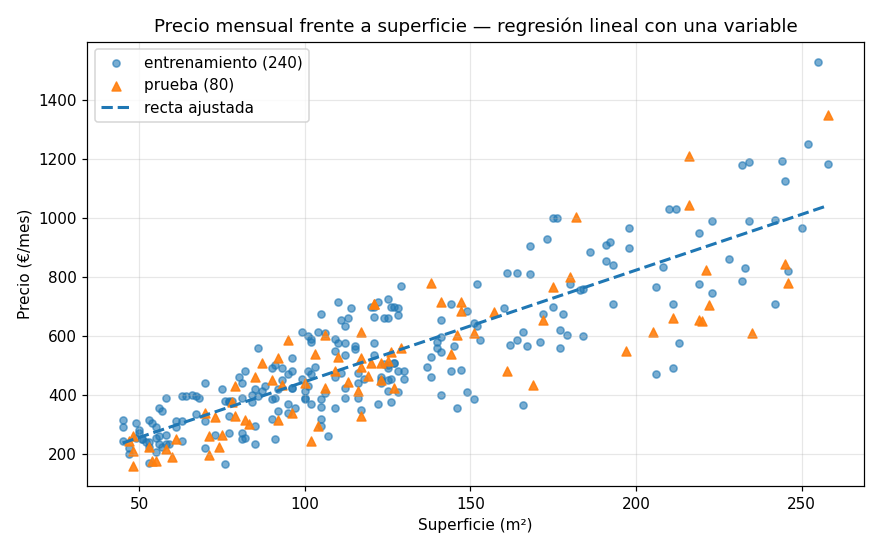
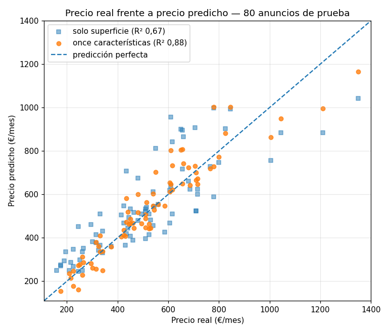
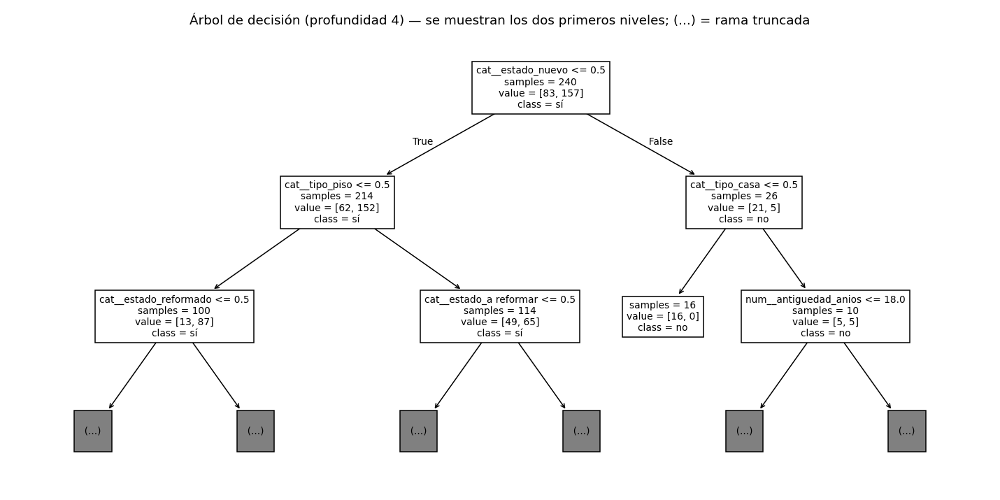
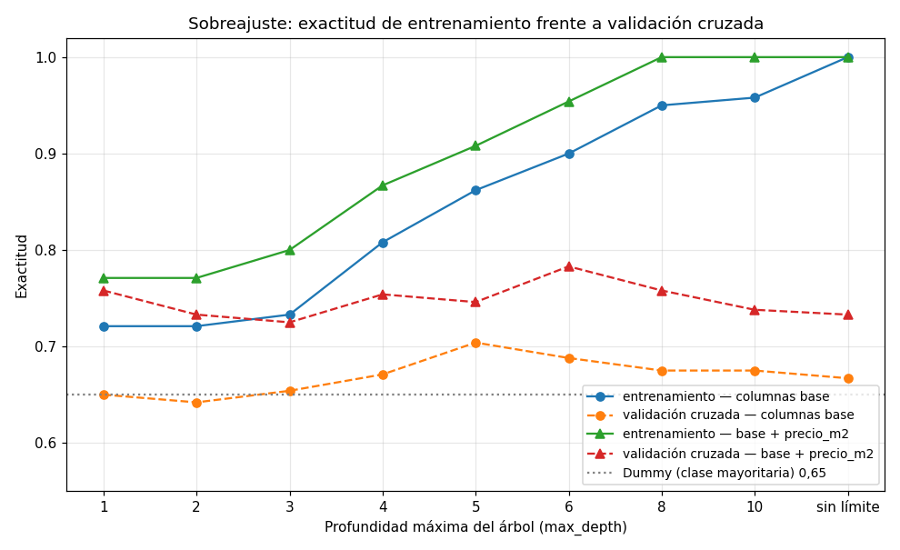
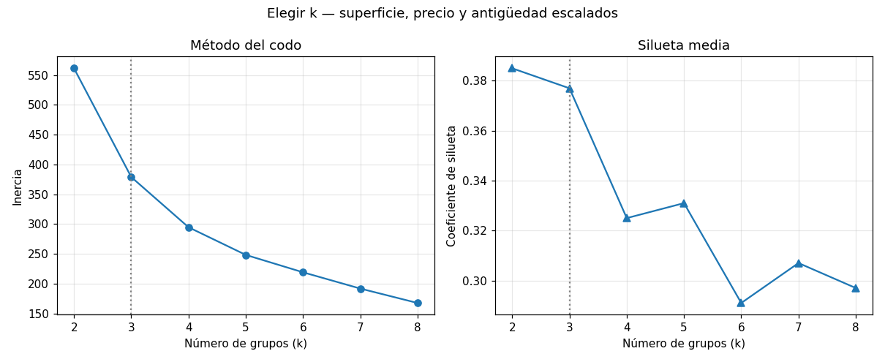
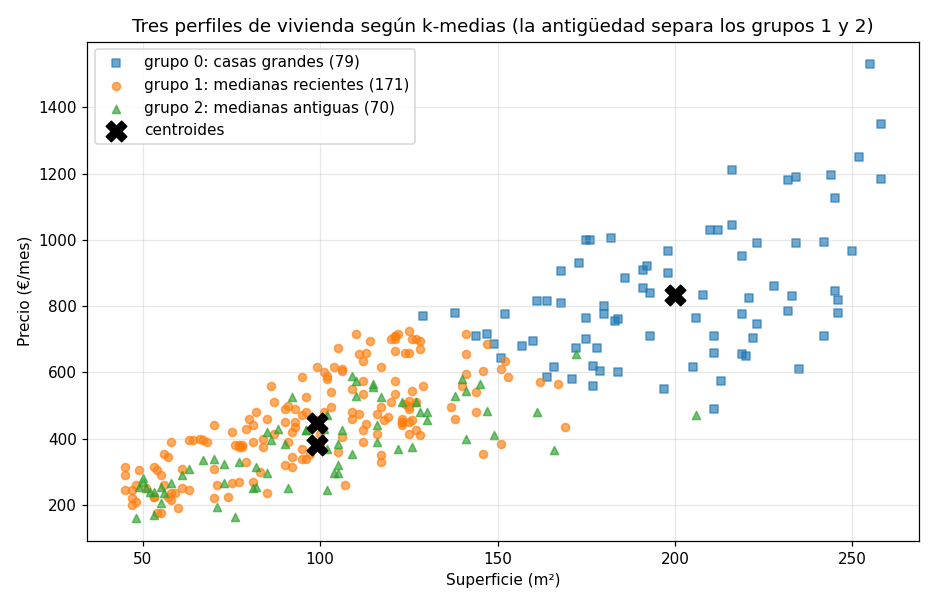

# UD3. Aprendizaje automático: enfoques, modelos, ajuste y validación

**Módulo optativo AOP1089 — Big Data e Inteligencia Artificial · 2.º DAW · IES Río Arba · Curso 2026-27 · 14 horas · 1.ª–2.ª evaluación**

**Vinculación con el resultado de aprendizaje.** Esta unidad trabaja completo el **RA3**: *"Identifica, aplica y valida algoritmos de Big Data, utilizando datos preprocesados válidos"* (Resolución de 10 de julio de 2025, bloque IFC303). Es la unidad en la que, por primera vez, **el modelo lo entrenas tú**: en la UD1 usaste modelos que otros habían entrenado; aquí partes de una tabla y sales con un programa que predice. El RA3 empieza exactamente donde acabó el RA2 — *utilizando datos preprocesados válidos* —: los ficheros de esta unidad llegan limpios porque limpiarlos ya fue la UD2, y lo que aprendiste allí (tipos correctos, decisiones registradas, contrastar antes de creer) se da por hecho.

| CE | Qué exige (resumen) | Apartado donde se trabaja |
|---|---|---|
| RA3.a | Identificar los distintos enfoques de aprendizaje | Apartado 1 (y el apartado 6 para el no supervisado) |
| RA3.b | Implementar aplicaciones que generen distintos modelos con librerías especializadas | Apartados 2, 3, 4 y 6 |
| RA3.c | Ajustar parámetros para controlar y optimizar el rendimiento de los modelos | Apartado 5 (y el apartado 2.4, donde el preprocesado entra en el modelo) |
| RA3.d | Obtener resultados a partir del modelo generado | Apartados 3.4, 4.3 y 6.3 |
| RA3.e | Verificar la calidad del modelo | Apartados 3.3, 4.2 y 7 |
| RA3.f | Documentar el proceso de entrenamiento, ajuste y obtención de resultados | Apartado 8 |

**Sobre los criterios mínimos.** La programación declara **mínimos** los criterios **RA3.b, RA3.d y RA3.e** — generar modelos, obtener resultados con ellos y verificar su calidad —: sin evidencia positiva en los tres no se alcanza la suficiencia del RA3. Los otros tres (identificar los enfoques, ajustar parámetros y documentar) gradúan la calificación por encima de ella. Traducido: un modelo que entrena, predice y se ha medido con honestidad es la base; un modelo ajustado y bien documentado es la nota alta.

**Sobre el calendario.** La unidad se imparte entre el final de la 1.ª evaluación y el principio de la 2.ª; su actividad evaluativa y la parte del examen que le corresponde computan en la **2.ª evaluación**. La prueba individual de la 1.ª evaluación (UD1 y UD2) ocupa una de las catorce horas de la unidad.

**Al terminar esta unidad sabrás:** distinguir cuándo un problema es de regresión, de clasificación o de agrupamiento, y cuándo no es de ninguno de los tres; escribir con scikit-learn el pipeline completo —cargar, dividir, preprocesar, entrenar, predecir— de forma que el preprocesado se aprenda solo del entrenamiento; entrenar una regresión lineal y leer sus coeficientes en euros; medir con el coeficiente de determinación y con errores en unidades reales; entrenar un árbol de decisión, leerlo y juzgarlo con una matriz de confusión sin caer en la exactitud tramposa; ajustar hiperparámetros con validación cruzada sin tocar el conjunto de prueba hasta el final; agrupar sin etiqueta con k-medias y decidir cuántos grupos; verificar un modelo más allá de su métrica (línea base, fuga de datos, sesgo, estabilidad); y documentarlo en una ficha que otra persona pueda reproducir.

**Entorno de trabajo de la unidad.** El mismo taller de las dos unidades anteriores — Python, entorno virtual, cuadernos, el editor configurado como explica el recurso *Entorno de trabajo: VS Code para Python* — con una librería nueva, **scikit-learn**, que trae dentro todo lo que esta unidad usa: los algoritmos, la división de datos, el preprocesado, las métricas y `joblib` para guardar modelos. Se instala en el entorno de la carpeta `ud3/` de tu repositorio, junto con las dos que ya conoces:

```
pip install scikit-learn pandas matplotlib jupyterlab
pip freeze > requirements.txt
```

Los materiales no fijan números de versión: trabajamos con la **versión soportada actual** de cada pieza. En esta unidad el aviso de variabilidad importa más que en las anteriores: no solo el formato de una tabla impresa puede cambiar entre versiones, sino también **las cifras de las métricas** — un coeficiente de determinación en el tercer decimal, una exactitud en el segundo y, sobre todo, la inercia y la silueta del agrupamiento del apartado 6, que dependen de detalles internos del algoritmo y bailan en el segundo decimal de una versión a otra. Los apuntes reproducen las cifras obtenidas al escribirlos; lo que cuenta es la conclusión que sostienen, y en la actividad evaluativa se corrige la lectura, no el decimal. Por eso el apartado 8 te pedirá anotar en la ficha de cada modelo con qué versiones lo entrenaste.

**Los datos de la unidad.** El caso hilo de la teoría es un **portal comarcal de vivienda** de las Cinco Villas: 320 anuncios de alquiler ya alquilados, con las características de cada vivienda, el precio mensual al que se publicó y los días que tardó en alquilarse. Son **datos ficticios de aula** — localidades reales, viviendas, anuncios y contactos inventados — y, a diferencia de la UD2, llegan **limpios**: una aclaración del vocabulario del portal, porque te lo encontrarás: la columna `estado` clasifica la vivienda como «a reformar», «bueno», «reformado» o «nuevo», y **«nuevo» significa a estrenar**, sea porque el edificio es reciente o porque se ha rehabilitado por completo — por eso convive con cualquier antigüedad. Y llegan limpios en el sentido de la UD2: sin ausentes, sin duplicados, con los tipos que corresponden. Los dos ficheros del hilo (`viviendas.csv` y `viviendas_nuevas.csv`, los anuncios recién publicados que hay que predecir) y los dos de la actividad evaluativa (`parcelas.csv`, `parcelas_2026.csv`) están en el repositorio de la unidad del aula de código, con un `README.md` que los describe. Trabajarás sobre todo en **cuadernos** y entregarás un **script** de entrenamiento cuando el enunciado lo pida; los modelos se guardan en `ud3/modelos/`, las figuras en `ud3/figuras/` y tu `DECISIONES.md` recoge desde el primer commit qué probaste y con qué te quedaste (apartado 8).

<div style="page-break-before: always;"></div>

## Apartado 1. Aprender de los datos: los enfoques

Hasta ahora, cuando querías que un programa calculara algo, escribías la regla. Para estimar el alquiler de una vivienda escribirías `precio = 4 * superficie`, y si te decían que en Ejea es más caro, añadirías un `if`. Aprendizaje automático es darle la vuelta a eso: **no escribes la regla, escribes el programa que la encuentra en los datos**. El resultado de ese programa — la regla encontrada — es el **modelo**.

### Apartado 1.1. Qué es un modelo

Un modelo es una función con **parámetros** que se ajustan a los datos. La función la eliges tú (una recta, un árbol de preguntas, unos centros de grupo); los parámetros (la pendiente de la recta, las preguntas del árbol, dónde están los centros) los calcula el algoritmo a partir de ejemplos. **Entrenar** es ese cálculo; **predecir** es aplicar la función ya ajustada a datos nuevos. Y la brújula de todo el proceso es el **error**: cuánto se aleja lo que el modelo dice de lo que ocurrió de verdad.

Mira cómo cambia el error con tres versiones de la misma idea sobre los 320 anuncios del portal. La regla escrita a mano — 4 € por metro cuadrado —, la misma regla pero con el número **aprendido de los datos** (la media real de euros por metro cuadrado), y una recta con dos parámetros aprendidos (pendiente y término independiente):

```python
import pandas as pd
from sklearn.linear_model import LinearRegression

v = pd.read_csv("viviendas.csv", usecols=lambda c: c != "contacto_anunciante")

regla_mano = 4 * v["superficie_m2"]
error_mano = (v["precio_mes"] - regla_mano).abs().mean()

eur_m2 = (v["precio_mes"] / v["superficie_m2"]).mean()
regla_datos = eur_m2 * v["superficie_m2"]
error_datos = (v["precio_mes"] - regla_datos).abs().mean()

recta = LinearRegression().fit(v[["superficie_m2"]], v["precio_mes"])
error_recta = (v["precio_mes"] - recta.predict(v[["superficie_m2"]])).abs().mean()

print(f"euros/m2 medios en los datos: {eur_m2:.2f}")
print(f"error medio regla a mano (4 €/m2): {error_mano:.1f} €")
print(f"error medio regla aprendida ({eur_m2:.2f} €/m2): {error_datos:.1f} €")
print(f"error medio recta ajustada ({recta.coef_[0]:.2f} €/m2 + {recta.intercept_:.0f} €): {error_recta:.1f} €")
```

```
euros/m2 medios en los datos: 4.38
error medio regla a mano (4 €/m2): 101.8 €
error medio regla aprendida (4.38 €/m2): 101.2 €
error medio recta ajustada (3.71 €/m2 + 68 €): 97.2 €
```

Tres lecciones en cuatro líneas. Primera: aprender **un** número de los datos casi no mejora la regla a mano (101,8 → 101,2 €): la superficie sola no explica el precio. Segunda: dar al modelo **un parámetro más** (el término independiente) ayuda un poco (97,2 €). Tercera, la que importa: con las mismas 320 filas, el modelo del apartado 3 que use también la localidad, el estado y el tipo bajará ese error medio a unos 59 € — no porque el algoritmo sea más listo, sino porque **le has dado la información que faltaba**. Lo que se aprende de los datos nunca es mejor que los datos.

Fíjate también en lo que **no** ha pasado: no has escrito ningún `if`. La recta la calculó `fit` a partir de los ejemplos; tú elegiste la forma (una recta) y los datos. Esa división del trabajo — la persona elige la pregunta, la forma del modelo y los datos; el algoritmo calcula los parámetros — es la que rige toda la unidad.

### Apartado 1.2. Los enfoques de aprendizaje

Los algoritmos se agrupan por **qué información tienen para aprender**. La pregunta que decide el enfoque no es "qué algoritmo uso" sino "¿tengo la respuesta correcta para los ejemplos con los que entreno?".

**Aprendizaje supervisado.** Cada ejemplo lleva su **respuesta** conocida — la etiqueta —: el precio al que se alquiló la vivienda, si se alquiló rápido o no. El modelo aprende la relación entre las características (`X`, la tabla de entrada) y la respuesta (`y`, la columna objetivo), y luego predice la respuesta de ejemplos nuevos que no la tienen. Dentro del supervisado hay dos familias según el tipo de respuesta:

- **Regresión**: la respuesta es un **número** continuo. ¿A cuánto alquilar este piso? ¿Cuántos kilos por hectárea dará esta parcela? Algoritmo de la unidad: la **regresión lineal** (apartado 3). Métrica principal: el **coeficiente de determinación**.
- **Clasificación**: la respuesta es una **categoría** de un conjunto cerrado. ¿Se alquilará en menos de un mes, sí o no? ¿Qué tipo de incidencia es este aviso? Algoritmo de la unidad: el **árbol de decisión** (apartado 4). Métrica principal: la **matriz de confusión** y lo que se calcula a partir de ella.

**Aprendizaje no supervisado.** No hay etiqueta: nadie ha dicho cuál es la respuesta correcta porque no existe una. El modelo busca **estructura** en `X` sola: qué ejemplos se parecen entre sí, qué combinaciones de columnas resumen la tabla. La familia de la unidad es el **agrupamiento** (*clustering*): ¿qué perfiles de vivienda hay en el portal? Algoritmo: **k-medias** (apartado 6). Aquí la calidad no se mide contra una respuesta correcta, porque no la hay; se mide por la coherencia interna de los grupos y, sobre todo, por si tienen sentido para quien los va a usar. La otra familia no supervisada, la **reducción de dimensiones** (resumir muchas columnas en pocas), se menciona para que sepas que existe; no se trabaja en la unidad.

**Aprendizaje semisupervisado.** El caso real más frecuente: tienes muchísimos ejemplos y solo unos pocos con etiqueta, porque etiquetar cuesta (una persona tiene que leer cada aviso y clasificarlo). Los algoritmos semisupervisados usan las pocas etiquetas para aprender lo básico y los muchos ejemplos sin etiqueta para afinar dónde están las fronteras entre clases: si un aviso sin etiqueta se parece mucho a treinta etiquetados como "humo", probablemente sea humo. No se programa en esta unidad; se te pedirá **reconocer** cuándo un problema lo es.

**Aprendizaje por refuerzo.** No hay tabla de ejemplos: hay un **agente** que actúa en un entorno, recibe una **recompensa** o un castigo por cada acción y aprende, por ensayo y error, la secuencia de acciones que maximiza la recompensa acumulada. Es el enfoque de los programas que juegan, de los robots que aprenden a caminar y, en el mundo de las aplicaciones web, de los sistemas que deciden qué versión de una página mostrar a cada visitante y aprenden de si compra o no. Tampoco se programa aquí; tampoco se confunde con los otros tres.

Una tabla vale más que cuatro párrafos cuando hay que decidir. Las cuatro preguntas del portal, cada una con su enfoque:

| Pregunta del portal | ¿Hay respuesta conocida en los datos? | Enfoque | Algoritmo de la unidad | Métrica |
|---|---|---|---|---|
| ¿A qué precio publicar este anuncio nuevo? | Sí, `precio_mes` (un número) | Supervisado — regresión | Regresión lineal | Coeficiente de determinación, error medio en euros |
| ¿Este anuncio se alquilará en menos de 30 días? | Sí, `alquilada_rapido` (sí/no) | Supervisado — clasificación | Árbol de decisión | Matriz de confusión: exactitud, precisión, sensibilidad |
| ¿Qué perfiles de vivienda se anuncian en el portal? | No: nadie ha definido los perfiles | No supervisado — agrupamiento | k-medias | Inercia, silueta y sentido para el portal |
| ¿Qué foto poner primero en cada anuncio para que reciba más contactos? | No como tabla: se aprende probando | Por refuerzo | (fuera de la unidad) | Recompensa acumulada |

Observa que la **misma tabla** de datos sirve para tres preguntas distintas: lo que cambia el enfoque no son los datos, es la pregunta y qué columna se toma como respuesta. Por eso el primer paso de cualquier proyecto de esta unidad — y el primer ejercicio de la actividad evaluativa — es escribir la pregunta y decidir el enfoque **antes** de importar nada.

### Apartado 1.3. El ciclo de trabajo

Todo modelo supervisado de la unidad recorre el mismo camino, y conviene tenerlo dibujado antes de escribir la primera línea:

```
  datos preprocesados válidos (UD2)
             │
             ▼
  1. PREPARAR   elegir X (características) e y (objetivo); apartar lo que no debe entrar
             │
             ▼
  2. DIVIDIR    entrenamiento / prueba  ──── el conjunto de prueba se guarda y NO se mira
             │
             ▼
  3. ENTRENAR   fit(X_entrenamiento, y_entrenamiento)
             │
             ▼
  4. PREDECIR   predict(X_prueba)  →  respuestas del modelo para datos que no ha visto
             │
             ▼
  5. MEDIR      comparar predicción con y_prueba: R², matriz de confusión, error en unidades
             │
             ├──── ¿mejorable? ──▶ 6. AJUSTAR  cambiar hiperparámetros, características, algoritmo
             │                                 (con validación cruzada sobre ENTRENAMIENTO) ──▶ volver a 3
             ▼
  7. DOCUMENTAR ficha del modelo, DECISIONES.md, modelo guardado, script que lo reentrena
```

El paso 2 es el que distingue a quien sabe de quien copia código. Si mides el modelo con los mismos datos con los que lo entrenaste, estás preguntando a un alumno las mismas preguntas del examen que ya vio con las respuestas: sacará nota alta y no sabrás nada. El conjunto de prueba se separa **antes** de mirar los datos, se guarda y se usa **una vez**, al final. Todo el trabajo de ajuste del paso 6 se hace dentro del conjunto de entrenamiento, con la validación cruzada del apartado 5. El día que el resultado en prueba te parezca demasiado bueno, sospecha del paso 2 o del paso 1 (apartado 7).

### Apartado 1.4. Datos preprocesados válidos: qué hereda esta unidad de la anterior

El enunciado del RA3 lo dice en cuatro palabras: los algoritmos se aplican *utilizando datos preprocesados válidos*. Un modelo entrenado sobre una tabla con un −999 dentro aprende que existen viviendas de −999 metros; uno entrenado con doce grafías de "Ejea" cree que hay doce localidades. Nada de lo que aprendas aquí arregla eso: se arregla antes, con la UD2. Lo que esta unidad **da por hecho** de cada fichero: tipos correctos (`dtypes` dice lo que cada columna es), sin duplicados, ausentes decididos (imputados o marcados, nunca ignorados), categorías normalizadas, y una sección de protección de datos en `DECISIONES.md` que diga qué columnas no entraron y por qué. Lo que esta unidad **añade** al preprocesado — codificar categorías como números, escalar, imputar dentro del modelo — no es limpieza: es transformar datos ya válidos a la forma que el algoritmo necesita, y se aprende en el apartado 2.4.

Los ficheros del hilo llegan limpios. Los de la actividad evaluativa llegan *casi* limpios — con dos cosas que verás en un minuto si aplicas el reflejo de la UD2 — y el enunciado lo declara: la actividad no es una UD2 encubierta, pero tampoco premia a quien no mira.

**Ejercicios del apartado.**

- **E1.** Para cada una de estas seis preguntas, di si es de regresión, de clasificación, de agrupamiento, semisupervisada o por refuerzo, cuál sería la columna objetivo si la hay y qué información haría falta que no está en `viviendas.csv`: (a) cuántas visitas recibirá un anuncio en su primera semana; (b) si un anuncio es fraudulento; (c) en qué tres zonas de precio se divide la comarca; (d) clasificar 5.000 fotos de anuncios como "cocina", "salón" o "exterior" habiendo etiquetado 200 a mano; (e) decidir en qué orden mostrar los anuncios a cada visitante para que contacte con alguno; (f) si el precio de un anuncio está por encima o por debajo del mercado.
- **E2.** Escribe una regla a mano para estimar `precio_mes` que use la superficie **y** la localidad (una tabla de euros por metro cuadrado por localidad que tú inventes con criterio) y calcula su error medio absoluto sobre `viviendas.csv` como en el apartado 1.1. Después calcula la misma tabla **aprendida de los datos** (media de precio entre superficie por localidad con `groupby`) y su error. Compara los tres errores (a mano, aprendida por localidad, recta del apartado 1.1) y explica en tres frases qué ha aportado la localidad y por qué la regla aprendida por localidad sigue sin ser un modelo entrenado en el sentido del apartado 1.3.
- **E3.** Un compañero entrena un modelo con las 320 filas, lo mide con esas mismas 320 filas y obtiene un error medio de 3 €. Explica con el ciclo del apartado 1.3 qué ha hecho mal, qué cifra sí sería creíble y qué le pasará al modelo cuando el portal lo use con los anuncios de la semana que viene. Redacta la respuesta como se la dirías a él, sin tecnicismos que no estén en este apartado.

<div style="page-break-before: always;"></div>

## Apartado 2. La librería: scikit-learn y su gramática

scikit-learn es la librería de aprendizaje automático clásico de Python: regresión, árboles, agrupamiento, preprocesado, métricas y división de datos, todo con la **misma interfaz**. Aprender esa interfaz una vez es aprenderla para todos los algoritmos de la unidad — y para los que no caben en ella.

### Apartado 2.1. Cargar con la ley delante

El reflejo de la UD2 no cambia porque ahora vayas a entrenar: antes de cargar, la lista de comprobación. `viviendas.csv` tiene una columna de dato personal, `contacto_anunciante`; la pregunta del portal no la necesita, así que **no se carga**. Y tiene dos columnas que no son dato personal pero tampoco pueden ser entrada del modelo: `dias_hasta_alquiler` y `alquilada_rapido` son la **respuesta** — lo que ocurrió después de publicar el anuncio —, y `visitas_anuncio` es un dato que **tampoco existe** cuando se publica. Se cargan, porque las dos primeras son los objetivos de los apartados 3 y 4, pero se apartan de `X`; la tercera vuelve en el apartado 7 con nombre propio.

```python
import pandas as pd

v = pd.read_csv("viviendas.csv", usecols=lambda c: c != "contacto_anunciante")
print(v.shape)
print(v[["id", "localidad", "tipo", "superficie_m2", "estado", "precio_mes", "alquilada_rapido"]].head())
print(v.dtypes)
```

```
(320, 16)
        id localidad     tipo  superficie_m2     estado  precio_mes alquilada_rapido
0  VIV-001    Tauste     piso             50      bueno         270               no
1  VIV-002    Tauste     casa            147  reformado         685               sí
2  VIV-003    Sádaba     casa            211      bueno         710               sí
3  VIV-004    Sádaba  adosado            149  reformado         685               no
4  VIV-005    Sádaba    piso             52      bueno         240               sí
id                           str
localidad                    str
tipo                         str
superficie_m2              int64
habitaciones               int64
banos                      int64
antiguedad_anios           int64
planta                     int64
ascensor                     str
estado                       str
calificacion_energetica      str
calefaccion                  str
visitas_anuncio            int64
precio_mes                 int64
dias_hasta_alquiler        int64
alquilada_rapido             str
dtype: object
```

Dieciséis columnas cargadas de diecisiete (la del correo nunca ha estado en memoria), tipos que dicen la verdad — números como `int64`, texto como `str` —, y el parte rápido que confirma que llega limpio: `v.isna().sum().sum()` da `0` y `v.duplicated().sum()` da `0`. La distribución del objetivo de regresión, para tener la escala en la cabeza cuando midas errores en euros:

```python
print(v["precio_mes"].describe().round(1))
print(v["alquilada_rapido"].value_counts())
```

```
count     320.0
mean      527.6
std       235.5
min       160.0
25%       363.8
50%       480.0
75%       660.0
max      1530.0
Name: precio_mes, dtype: float64
alquilada_rapido
sí    209
no    111
Name: count, dtype: int64
```

Media de `precio_mes` de 527,6 € con desviación típica de 235,5: un error de 100 € es grande, uno de 30 € es bueno. Y el objetivo de clasificación está **desequilibrado**: 209 «sí» frente a 111 «no», un 65 % frente a un 35 %. Guarda ese 65 %: en el apartado 4 será la exactitud que consigue un modelo que no ha aprendido nada.

Aquí, la cabecera y las cinco primeras filas del fichero tal como está en disco, con la columna que no cargamos incluida *(fichero íntegro en el repositorio de la unidad)*:

```
id,localidad,tipo,superficie_m2,habitaciones,banos,antiguedad_anios,planta,ascensor,estado,calificacion_energetica,calefaccion,visitas_anuncio,precio_mes,dias_hasta_alquiler,contacto_anunciante,alquilada_rapido
VIV-001,Tauste,piso,50,3,1,69,5,sí,bueno,F,sí,21,270,61,anuncio001@example.org,no
VIV-002,Tauste,casa,147,5,2,12,0,no,reformado,B,no,5,685,8,anuncio002@example.org,sí
VIV-003,Sádaba,casa,211,6,3,95,0,no,bueno,F,sí,7,710,3,anuncio003@example.org,sí
VIV-004,Sádaba,adosado,149,5,2,31,0,no,reformado,C,sí,10,685,41,anuncio004@example.org,no
VIV-005,Sádaba,piso,52,1,1,61,3,sí,bueno,E,sí,6,240,20,anuncio005@example.org,sí
```

### Apartado 2.2. El estimador: `fit`, `predict`, `score`

En scikit-learn todo modelo es un **estimador**: un objeto que se crea con sus opciones, se entrena con `fit(X, y)`, predice con `predict(X)` y se autoevalúa con `score(X, y)`. `X` es siempre una **tabla** de características — un `DataFrame` con una o más columnas, nunca una `Series` suelta — e `y` es la columna objetivo. Da igual que el estimador sea una regresión lineal, un árbol o una red neuronal: los tres métodos se llaman igual y hacen lo mismo.

Para verlo sin que el algoritmo distraiga, el estimador más simple que existe: `DummyRegressor`, que ignora `X` y predice siempre la media de `y`. Parece una broma y es una herramienta seria — es la **línea base** del apartado 7: si tu modelo no la supera, no has aprendido nada.

```python
from sklearn.dummy import DummyRegressor

X = v[["superficie_m2"]]      # tabla de características (aunque sea una sola columna)
y = v["precio_mes"]            # objetivo

modelo = DummyRegressor(strategy="mean")
modelo.fit(X, y)
print(modelo.predict(X.head(3)))
print(round(modelo.score(X, y), 4))
print(modelo.get_params())
```

```
[527.578125 527.578125 527.578125]
0.0
{'constant': None, 'quantile': None, 'strategy': 'mean'}
```

Tres cosas que valen para todos los estimadores. `predict` devuelve un *array* de NumPy, una predicción por fila de la tabla que le pasas, en el mismo orden. `score` devuelve la métrica por defecto del estimador — en los de regresión, el **coeficiente de determinación** R² del apartado 3.3, que para "predecir la media" vale exactamente 0,0: ese es el suelo contra el que se mide todo lo demás. Y `get_params` enseña los **hiperparámetros**: las opciones que tú fijas al crear el estimador y que el entrenamiento no cambia (aquí, la estrategia); en el apartado 5 los ajustarás. Los **parámetros aprendidos**, los que sí calcula `fit`, se guardan en atributos con guion bajo final — `coef_`, `intercept_`, `tree_`, `cluster_centers_` — y no existen hasta que llamas a `fit`: pedirlos antes es uno de los errores del apartado 9.

Fíjate en el doble corchete de `v[["superficie_m2"]]`: con uno solo obtendrías una `Series` y `fit` te diría que espera una tabla de dos dimensiones. Es el tropiezo más frecuente del primer día.

### Apartado 2.3. Dividir: entrenamiento y prueba

`train_test_split` reparte al azar las filas en dos conjuntos y devuelve cuatro objetos: las características y el objetivo de entrenamiento, y las de prueba. La proporción habitual es un 20-25 % para prueba.

```python
from sklearn.model_selection import train_test_split

caracteristicas = ["localidad", "tipo", "superficie_m2", "habitaciones", "banos",
                   "antiguedad_anios", "planta", "ascensor", "estado",
                   "calificacion_energetica", "calefaccion"]
X = v[caracteristicas]
y = v["precio_mes"]

X_ent, X_pru, y_ent, y_pru = train_test_split(X, y, test_size=0.25, random_state=26)
print(X_ent.shape, X_pru.shape, y_ent.shape, y_pru.shape)
print(X_ent.index[:5].tolist())
```

```
(240, 11) (80, 11) (240,) (80,)
[273, 45, 234, 40, 277]
```

240 filas para entrenar, 80 para probar, y los índices originales conservados: la fila 273 del fichero es la primera del entrenamiento. Dos detalles que no son de estilo, son de rigor:

**La semilla.** `random_state=26` fija el azar: cada vez que ejecutes la celda obtendrás **la misma división**, y también la obtendrá quien corrija tu entrega. Sin semilla, dos ejecuciones consecutivas de la misma llamada dan repartos distintos:

```python
a, _, _, _ = train_test_split(X, y, test_size=0.25)
b, _, _, _ = train_test_split(X, y, test_size=0.25)
print(a.index[:5].tolist(), b.index[:5].tolist())
```

```
[37, 299, 108, 5, 193] [152, 81, 150, 51, 204]
```

Y con repartos distintos, métricas distintas, y una cifra en tu `DECISIONES.md` que nadie puede reproducir — ni tú mañana. La semilla de esta unidad es **26**; en tus entregas puedes usar la que quieras, siempre la misma, siempre escrita. Todo lo que tenga azar en scikit-learn (la división, el árbol cuando empata, k-medias al elegir los centros iniciales) acepta `random_state`, y en esta unidad se pone **siempre**.

**La estratificación.** En clasificación, un reparto al azar puede dejar el conjunto de prueba con una proporción de clases distinta de la real, y con 80 filas eso pasa. `stratify=y` obliga a que las dos partes conserven la proporción:

```python
yc = v["alquilada_rapido"]
_, _, _, yc_pru = train_test_split(X, yc, test_size=0.25, random_state=26)
_, _, _, yc_pru_s = train_test_split(X, yc, test_size=0.25, random_state=26, stratify=yc)
print(yc.value_counts(normalize=True).round(3).to_dict())
print(yc_pru.value_counts(normalize=True).round(3).to_dict())
print(yc_pru_s.value_counts(normalize=True).round(3).to_dict())
```

```
{'sí': 0.653, 'no': 0.347}
{'sí': 0.7, 'no': 0.3}
{'sí': 0.65, 'no': 0.35}
```

Sin estratificar, la prueba tiene un 70 % de «sí» (24 filas de «no» en vez de 28); estratificando, el 65 % real. Cuatro filas parecen poco, pero en la matriz de confusión del apartado 4 cada «no» cuenta: en clasificación, `stratify` se pone siempre.

### Apartado 2.4. Preprocesar dentro del modelo: `ColumnTransformer` y `Pipeline`

Los algoritmos de scikit-learn trabajan con **números**. `localidad` y `estado` son texto, y si se lo das tal cual, el estimador te lo dice:

```python
from sklearn.linear_model import LinearRegression

numericas = ["superficie_m2", "habitaciones", "banos", "antiguedad_anios", "planta"]
categoricas = ["localidad", "tipo", "ascensor", "estado", "calificacion_energetica", "calefaccion"]
X = v[numericas + categoricas]
y = v["precio_mes"]
X_ent, X_pru, y_ent, y_pru = train_test_split(X, y, test_size=0.25, random_state=26)

LinearRegression().fit(X_ent, y_ent)
```

```
ValueError: could not convert string to float: 'Erla'
```

La solución **no** es convertir las categorías a mano en el `DataFrame` antes de dividir. Es declarar, dentro del modelo, qué transformación recibe cada columna, de modo que la transformación **se aprenda con el entrenamiento y se aplique igual a la prueba y a los datos nuevos**. Dos piezas:

`ColumnTransformer` asigna a cada grupo de columnas su transformador. Las numéricas pasan tal cual (`passthrough`); las categóricas se codifican con **`OneHotEncoder`**, que convierte cada categoría en una columna de ceros y unos (`localidad_Tauste` vale 1 en las viviendas de Tauste y 0 en el resto). `handle_unknown="ignore"` evita que una categoría que no estaba en el entrenamiento — un anuncio nuevo en una localidad sin ejemplos — rompa la predicción: se codifica como todo ceros en vez de lanzar `ValueError: Found unknown categories [...] in column 0 during transform`.

```python
from sklearn.preprocessing import OneHotEncoder
from sklearn.compose import ColumnTransformer

preprocesado = ColumnTransformer([
    ("num", "passthrough", numericas),
    ("cat", OneHotEncoder(handle_unknown="ignore"), categoricas),
])
preprocesado.fit(X_ent)
print(preprocesado.transform(X_ent).shape)
print(list(preprocesado.get_feature_names_out()[:8]))
print(len(preprocesado.get_feature_names_out()))
```

```
(240, 31)
['num__superficie_m2', 'num__habitaciones', 'num__banos', 'num__antiguedad_anios', 'num__planta', 'cat__localidad_Biota', 'cat__localidad_Ejea de los Caballeros', 'cat__localidad_Erla']
31
```

De once columnas a treinta y una: las cinco numéricas intactas y las seis categóricas desplegadas en veintiséis indicadores (ocho localidades, tres tipos, dos valores de ascensor, cuatro estados, siete letras energéticas, dos de calefacción). `get_feature_names_out` te da el nombre de cada una, que necesitarás en el apartado 3 para leer coeficientes.

`Pipeline` encadena el preprocesado y el estimador en **un solo objeto** que se entrena, predice y se guarda como cualquier estimador. Es la forma correcta — la única que evita que el preprocesado vea el conjunto de prueba — y la que se exige en toda entrega de la unidad:

```python
from sklearn.pipeline import Pipeline

modelo = Pipeline([
    ("pre", preprocesado),
    ("reg", LinearRegression()),
])
modelo.fit(X_ent, y_ent)
print(modelo.named_steps["reg"].coef_.shape)
print(round(modelo.score(X_pru, y_pru), 3))
```

```
(31,)
0.884
```

`fit` sobre el pipeline ha hecho dos cosas en orden: ajustar el codificador con las categorías **del entrenamiento** y, con la tabla ya numérica, ajustar la recta; `score` sobre la prueba ha aplicado la misma codificación aprendida y ha medido. Treinta y un coeficientes (uno por columna transformada) y un coeficiente de determinación de 0,884 en datos que el modelo no había visto: es el modelo múltiple del apartado 3, adelantado. Allí aprenderás a leerlo; aquí solo importa la gramática: **crear → `fit` → `predict`/`score`**, con el preprocesado dentro.

Cuando falten valores, la pieza que se añade al `ColumnTransformer` es `SimpleImputer` (con la mediana o la moda del entrenamiento), y cuando el algoritmo mide distancias — k-medias en el apartado 6 —, `StandardScaler`, que pone todas las columnas numéricas en la misma escala. Siempre dentro del pipeline, nunca sobre el `DataFrame` completo: imputar o escalar con la media de **todas** las filas es contar al modelo algo del conjunto de prueba, y eso tiene nombre en el apartado 7.

**Ejercicios del apartado.**

- **E4.** Reproduce el error `could not convert string to float` con tu propio código y después escribe el `ColumnTransformer` para `viviendas.csv` **sin** las columnas `planta` y `calificacion_energetica`. Comprueba cuántas columnas produce (razona el número antes de ejecutar y compáralo con `get_feature_names_out`), entrena el pipeline con `LinearRegression` con la semilla 26 y anota el `score` en prueba junto al 0,884 del apartado. Explica en dos frases si la diferencia te parece relevante y por qué no puedes decidirlo con una sola división.
- **E5.** Entrena un `DummyRegressor` con estrategia `"median"` dentro de un pipeline sobre las mismas `X_ent`, `y_ent` del apartado 2.4 y obtén su `score` en `X_pru`. Explica por qué no da exactamente 0,0 como el de la media (pista: R² se define contra la media, no contra la mediana) y qué significa un R² negativo. Después escribe una aserción que compruebe que el modelo del apartado 2.4 supera a este `Dummy` en prueba.
- **E6.** Divide `viviendas.csv` para clasificación (`alquilada_rapido`) con tres semillas distintas, con y sin `stratify`, y construye una tabla de seis filas con la proporción de «no» en el conjunto de prueba en cada caso. Escribe qué rango de variación has observado sin estratificar y una frase, dirigida al portal, sobre por qué un modelo evaluado sobre 24 «no» y otro sobre 32 «no» no son comparables aunque su exactitud coincida.

<div style="page-break-before: always;"></div>

## Apartado 3. Regresión: predecir el precio del alquiler

La primera pregunta del portal es de regresión: dado un anuncio nuevo, ¿a qué precio mensual publicarlo? La respuesta es un número, los ejemplos con respuesta son los 320 anuncios ya alquilados, y el algoritmo más simple que la aborda es la **regresión lineal**: encontrar la recta — o, con varias características, el plano — que menos se equivoca. Es el modelo que ya viste calcular en el apartado 1.1; aquí lo entrenas como manda el ciclo, lo lees, lo mides y lo usas.

### Apartado 3.1. Una variable: la recta y sus dos parámetros

Con una sola característica, la regresión lineal ajusta `precio = pendiente × superficie + término independiente`. Dos parámetros aprendidos, `coef_` e `intercept_`, que se leen en unidades reales:

```python
import pandas as pd
from sklearn.model_selection import train_test_split
from sklearn.linear_model import LinearRegression

v = pd.read_csv("viviendas.csv", usecols=lambda c: c != "contacto_anunciante")
X = v[["superficie_m2"]]
y = v["precio_mes"]
X_ent, X_pru, y_ent, y_pru = train_test_split(X, y, test_size=0.25, random_state=26)

recta = LinearRegression().fit(X_ent, y_ent)
print(round(recta.coef_[0], 2), round(recta.intercept_, 1))
print(round(recta.score(X_ent, y_ent), 3), round(recta.score(X_pru, y_pru), 3))

nuevo = pd.DataFrame({"superficie_m2": [60, 120]})
print(recta.predict(nuevo).round(0))
```

```
3.78 66.6
0.73 0.67
[294. 521.]
```

Cada metro cuadrado añade **3,78 €** al mes, y una vivienda de cero metros costaría 66,6 € — el término independiente no describe una vivienda real, ajusta la altura de la recta. Sesenta metros salen a 294 €; ciento veinte, a 521. Y el `score` ya trae la primera lección del apartado: **0,73 en entrenamiento, 0,67 en prueba**. La cifra que vale es la segunda, la que se obtuvo sobre ochenta anuncios que la recta no había visto; la primera solo dice cómo de bien se ajusta a lo que ya conocía. Fíjate en que la pendiente no es la del apartado 1.1 (3,71): allí se ajustó con las 320 filas, aquí con 240. Un modelo es de sus datos de entrenamiento.



La figura enseña lo que la métrica resume. Hasta los cien metros la nube es estrecha y la recta la sigue; a partir de ciento cincuenta se abre en abanico — casas de doscientos metros a 600 y a 1.200 € — y la recta pasa por en medio sin acertar a ninguna. La superficie no basta para explicar el precio de las casas grandes: falta la localidad, el estado, el tipo. Eso es lo que añade el modelo múltiple.

### Apartado 3.2. Varias variables: el pipeline completo y sus coeficientes

Es el modelo del apartado 2.4 — once características, treinta y una columnas tras codificar — y ahora toca leerlo. Con `get_feature_names_out` del preprocesador se pone nombre a cada coeficiente:

```python
from sklearn.preprocessing import OneHotEncoder
from sklearn.compose import ColumnTransformer
from sklearn.pipeline import Pipeline

numericas = ["superficie_m2", "habitaciones", "banos", "antiguedad_anios", "planta"]
categoricas = ["localidad", "tipo", "ascensor", "estado", "calificacion_energetica", "calefaccion"]
X = v[numericas + categoricas]
y = v["precio_mes"]
X_ent, X_pru, y_ent, y_pru = train_test_split(X, y, test_size=0.25, random_state=26)

modelo = Pipeline([
    ("pre", ColumnTransformer([("num", "passthrough", numericas),
                               ("cat", OneHotEncoder(handle_unknown="ignore"), categoricas)])),
    ("reg", LinearRegression()),
])
modelo.fit(X_ent, y_ent)

nombres = modelo.named_steps["pre"].get_feature_names_out()
coefs = pd.Series(modelo.named_steps["reg"].coef_, index=nombres).round(1)
print(coefs[[n for n in nombres if n.startswith("num__")]])
print(coefs[[n for n in nombres if "localidad" in n]].sort_values())
print(coefs[[n for n in nombres if "estado" in n]].sort_values())
```

```
num__superficie_m2       4.2
num__habitaciones       -0.2
num__banos              -7.7
num__antiguedad_anios   -1.2
num__planta              4.5
dtype: float64
cat__localidad_Erla                      -70.5
cat__localidad_Biota                     -52.6
cat__localidad_Uncastillo                -48.7
cat__localidad_Sos del Rey Católico      -39.6
cat__localidad_Luna                      -31.6
cat__localidad_Sádaba                     17.1
cat__localidad_Tauste                     91.0
cat__localidad_Ejea de los Caballeros    135.0
dtype: float64
cat__estado_a reformar   -121.8
cat__estado_bueno          -8.4
cat__estado_reformado      33.9
cat__estado_nuevo          96.4
dtype: float64
```

Un coeficiente se lee siempre con la coletilla **«a igualdad de todo lo demás»**. Cada metro cuadrado suma 4,2 € *si no cambia nada más*; cada año de antigüedad resta 1,2 €. Los coeficientes de una categoría se leen **entre sí**, no en valor absoluto: como el codificador crea una columna por cada localidad y el modelo tiene además su término independiente, los ocho valores están desplazados por una cantidad arbitraria; lo que sí es real es la **diferencia**. Entre Erla y Ejea de los Caballeros hay 205 € al mes para la misma vivienda; entre «a reformar» y «nuevo», 218 €. Esa lectura — ordenar las localidades por lo que aportan al precio — es exactamente lo que el portal quiere saber, y sale de una tabla de 320 filas.

Los dos coeficientes que parecen absurdos también enseñan. Un baño más *resta* 7,7 € y una habitación más no cambia nada. No es que los baños abaraten: es que `banos` y `habitaciones` van pegados a `superficie_m2` (una vivienda con tres baños es grande), y cuando varias características cuentan lo mismo, el modelo reparte el efecto entre ellas de forma inestable. Regla: **un coeficiente de una característica correlacionada con otras no se interpreta solo**. En el apartado 5 verás cómo la regularización estabiliza esto.

### Apartado 3.3. Medir: el coeficiente de determinación y los errores en euros

El **coeficiente de determinación**, R², es la métrica de referencia de la regresión y la que `score` devuelve. Se define comparando dos errores: el del modelo y el de la predicción más tonta posible, la media de `y`:

```
R² = 1 − (suma de errores al cuadrado del modelo) / (suma de errores al cuadrado de predecir la media)
```

Calcularlo a mano una vez quita todo el misterio:

```python
from sklearn.metrics import r2_score, mean_absolute_error, root_mean_squared_error

pred_pru = modelo.predict(X_pru)
sc_res = ((y_pru - pred_pru) ** 2).sum()          # error del modelo
sc_tot = ((y_pru - y_pru.mean()) ** 2).sum()      # error de predecir la media
print(round(1 - sc_res / sc_tot, 3))
print(round(r2_score(y_pru, pred_pru), 3))
print(round(modelo.score(X_ent, y_ent), 3), round(modelo.score(X_pru, y_pru), 3))
print(round(mean_absolute_error(y_pru, pred_pru), 1), round(root_mean_squared_error(y_pru, pred_pru), 1))
```

```
0.884
0.884
0.946 0.884
59.0 79.2
```

Léelo así: el modelo elimina el **88,4 %** del error que cometerías prediciendo siempre la media. R² vale **1** si el modelo acierta todo, **0** si no mejora a la media (el `DummyRegressor` del apartado 2.2) y es **negativo** si lo hace peor que la media — sí, es posible, y en el apartado 7 lo verás con un modelo aplicado a datos que no son los suyos. Es una proporción sin unidades, así que sirve para comparar modelos sobre el mismo problema; no sirve para saber cuántos euros te equivocas. Para eso están los errores en unidades: el **error absoluto medio** (MAE), 59 € — el modelo se equivoca, de media, 59 € al mes —, y la **raíz del error cuadrático medio** (RMSE), 79,2 €, que castiga más los errores grandes y por eso sale mayor. Cuando las dos cifras se separan mucho, hay unos pocos anuncios muy mal predichos tirando de la segunda.

Otra vez la pareja **0,946 / 0,884**: seis centésimas de brecha entre entrenamiento y prueba. En un modelo lineal con 31 columnas y 240 filas es una brecha razonable; si fuera 0,99 frente a 0,70 tendrías un modelo que ha memorizado (apartado 5). Y para cerrar la comparación con la recta del apartado 3.1, medida en las **mismas** ochenta filas: R² 0,67 y MAE 103,4 €. Añadir diez características ha bajado el error medio de 103 a 59 €. Es la tercera lección del apartado 1.1 cumplida.

Las métricas resumen; los **residuos** — la diferencia entre lo real y lo predicho, anuncio por anuncio — cuentan dónde falla el modelo:

```python
res = pd.DataFrame({"real": y_pru, "prediccion": pred_pru.round(0), "residuo": (y_pru - pred_pru).round(0)})
res = res.join(v[["id", "localidad", "tipo", "superficie_m2", "estado"]])
print(res.reindex(res["residuo"].abs().sort_values(ascending=False).index).head(5).to_string(index=False))
print(round(res["residuo"].mean(), 1), round(res["residuo"].std(), 1))
```

```
 real  prediccion  residuo      id              localidad tipo  superficie_m2    estado
  780      1003.0   -223.0 VIV-276                 Tauste casa            246     bueno
 1210       996.0    214.0 VIV-067 Ejea de los Caballeros casa            216 reformado
  610       802.0    -192.0 VIV-255                   Erla casa            235     bueno
 1350       1166.0    184.0 VIV-256 Ejea de los Caballeros casa            258 reformado
  845       1002.0    -157.0 VIV-155                 Sádaba casa            245 reformado
-2.2 79.8
```

Los cinco peores residuos son **casas de más de doscientos metros**, unas por encima y otras por debajo: el modelo no está sesgado (la media de los residuos, −2,2 €, es prácticamente cero) pero es **menos preciso cuanto más cara es la vivienda**. Es la misma nube en abanico de la figura 1, ahora con nombre y apellidos. Un residuo grande es siempre una pregunta: ¿le falta al modelo una característica (una terraza, un garaje) o es ruido del mercado? Con estos datos no se puede saber; sí se puede decir al portal que el precio orientativo de una casa grande viene con más incertidumbre que el de un piso.



El gráfico **real frente a predicho** es la figura estándar de cualquier regresión: un punto por anuncio de prueba, y la diagonal discontinua donde caerían si el modelo acertara siempre. Los círculos (once características) se pegan a la diagonal donde los cuadrados (solo superficie) se dispersan; en la esquina superior derecha, las casas caras, los dos modelos se alejan. Es la figura que va en la ficha de cada modelo de regresión que entregues.

### Apartado 3.4. Utilizar el modelo: los anuncios nuevos

Todo lo anterior sirve para esto: `viviendas_nuevas.csv` trae ocho anuncios recién publicados, con las mismas once características y **sin precio**. El pipeline los codifica con las categorías que aprendió y predice:

```python
import os
import joblib

os.makedirs("resultados", exist_ok=True)
os.makedirs("modelos", exist_ok=True)

nuevas = pd.read_csv("viviendas_nuevas.csv")
nuevas["precio_orientativo"] = modelo.predict(nuevas[numericas + categoricas]).round(0)
print(nuevas[["id", "localidad", "tipo", "superficie_m2", "estado", "precio_orientativo"]].to_string(index=False))
nuevas.to_csv("resultados/precios_orientativos.csv", index=False)

joblib.dump(modelo, "modelos/regresion_precio.joblib")
recuperado = joblib.load("modelos/regresion_precio.joblib")
assert (recuperado.predict(nuevas[numericas + categoricas]) == modelo.predict(nuevas[numericas + categoricas])).all()
print(type(recuperado).__name__, round(recuperado.score(X_pru, y_pru), 3))
```

```
    id              localidad tipo  superficie_m2    estado  precio_orientativo
NUE-01                 Sádaba casa            115 reformado               470.0
NUE-02                 Tauste piso            109     bueno               539.0
NUE-03                 Sádaba casa            238     bueno               869.0
NUE-04                  Biota piso             58 reformado               220.0
NUE-05 Ejea de los Caballeros casa            137     bueno               621.0
NUE-06   Sos del Rey Católico casa            111     bueno               371.0
NUE-07                  Biota piso             56 reformado               219.0
NUE-08 Ejea de los Caballeros casa            220     nuevo              1097.0
Pipeline 0.884
```

Tres cosas que son norma de la unidad. Primera: **la predicción se presenta como resultado, no como verdad** — la columna se llama `precio_orientativo`, se exporta a `resultados/` y quien la lea debe saber que lleva un error medio de 59 € y más en las casas grandes (NUE-03 y NUE-08 son las que menos fiables son, y sabes por qué). Segunda: **se guarda el pipeline entero** con `joblib`, preprocesado incluido — en `modelos/`, creada antes con `os.makedirs(..., exist_ok=True)` como toda carpeta de salida del módulo, porque `joblib.dump` no la crea y falla con `FileNotFoundError` si no existe; guardar solo la regresión sería guardar treinta y un coeficientes sin saber a qué columna corresponde cada uno. Tercera: **se comprueba que el modelo recuperado predice lo mismo** que el original — la aserción del código — antes de dar el fichero por bueno; ese fichero, con la ficha del apartado 8 al lado, es lo que otro programa (la aplicación web del proyecto de la UD6, por ejemplo) cargará para predecir sin volver a entrenar.

**Ejercicios del apartado.**

- **E7.** Entrena la regresión de una variable usando `antiguedad_anios` en vez de la superficie (semilla 26) y anota pendiente, término independiente y R² en prueba. Explica en dos frases qué significa el signo de la pendiente y por qué un R² tan bajo no significa que la antigüedad no importe (pista: mira el coeficiente de `antiguedad_anios` en el modelo múltiple). Dibuja la figura equivalente a la figura 1 y guárdala en `figuras/`.
- **E8.** A partir de los coeficientes del apartado 3.2, calcula a mano el precio que el modelo asignaría a un piso de 80 m², 3 habitaciones, 1 baño, 20 años, planta 2, con ascensor, estado bueno, calificación D y calefacción, en Tauste; después obtén la predicción con `modelo.predict` sobre un `DataFrame` de una fila y comprueba que coinciden (necesitarás el `intercept_` y todos los coeficientes que se activan). Escribe una función `predecir_precio(modelo, fila)` que devuelva el precio redondeado a cinco euros y úsala sobre `viviendas_nuevas.csv`.
- **E9.** Calcula el MAE del modelo múltiple por localidad y por tipo de vivienda en el conjunto de prueba (`groupby` sobre la tabla de residuos) y presenta las dos tablas ordenadas. Escribe una nota de cuatro frases para el portal diciendo en qué localidades y tipos el precio orientativo es más fiable, qué grupo tiene demasiadas pocas filas de prueba para afirmar nada, y qué cifra de error darías como aviso junto a cada precio publicado.
- **E10.** Escribe un script `entrenar_regresion.py` que cargue `viviendas.csv`, entrene el pipeline del apartado 3.2 con la semilla 26, imprima R², MAE y RMSE en prueba con f-strings, cree `modelos/` y `resultados/` si no existen, guarde el modelo en `modelos/` y compruebe con una aserción que el fichero recuperado reproduce las predicciones. Ejecútalo dos veces y confirma que las cifras son idénticas; después cámbiale la semilla y anota cuánto se mueve el R² en prueba. Registra en `DECISIONES.md` qué semilla dejas y por qué esa variación no te preocupa (o sí).

<div style="page-break-before: always;"></div>

## Apartado 4. Árboles de decisión: clasificar

La segunda pregunta del portal es de clasificación: ¿este anuncio se alquilará en menos de treinta días? La respuesta no es un número sino una de dos categorías, `alquilada_rapido` vale «sí» o «no», y el algoritmo con el que la abordas es el **árbol de decisión**: una cadena de preguntas sobre las columnas — ¿es un piso? ¿está nuevo? ¿tiene más de dieciocho años? — que termina en una clase. Es el modelo más fácil de leer que existe, y por eso es el mejor para aprender a **juzgar** un clasificador, que es lo que este apartado enseña de verdad.

### Apartado 4.1. Cómo decide un árbol y cómo se lee

El pipeline es el del apartado 2.4 con dos cambios: el objetivo es la categoría, el estimador es `DecisionTreeClassifier`, y entre las características entra `precio_mes` — el precio al que se publicó el anuncio existe cuando hay que predecir, así que es entrada legítima. `max_depth=4` limita a cuatro el número de preguntas encadenadas; en el apartado 5 verás por qué ese límite no es cosmético.

```python
import pandas as pd
from sklearn.model_selection import train_test_split
from sklearn.tree import DecisionTreeClassifier, export_text
from sklearn.preprocessing import OneHotEncoder
from sklearn.compose import ColumnTransformer
from sklearn.pipeline import Pipeline

v = pd.read_csv("viviendas.csv", usecols=lambda c: c != "contacto_anunciante")
numericas = ["superficie_m2", "habitaciones", "banos", "antiguedad_anios", "planta", "precio_mes"]
categoricas = ["localidad", "tipo", "ascensor", "estado", "calificacion_energetica", "calefaccion"]
X = v[numericas + categoricas]
y = v["alquilada_rapido"]
X_ent, X_pru, y_ent, y_pru = train_test_split(X, y, test_size=0.25, random_state=26, stratify=y)

arbol = Pipeline([
    ("pre", ColumnTransformer([("num", "passthrough", numericas),
                               ("cat", OneHotEncoder(handle_unknown="ignore"), categoricas)])),
    ("clf", DecisionTreeClassifier(max_depth=4, random_state=26)),
])
arbol.fit(X_ent, y_ent)
print(round(arbol.score(X_ent, y_ent), 3), round(arbol.score(X_pru, y_pru), 3))
nombres = list(arbol.named_steps["pre"].get_feature_names_out())
print(export_text(arbol.named_steps["clf"], feature_names=nombres, max_depth=2, decimals=0, show_weights=True))
print(arbol.named_steps["clf"].classes_)
```

```
0.808 0.775
|--- cat__estado_nuevo <= 0
|   |--- cat__tipo_piso <= 0
|   |   |--- cat__estado_reformado <= 0
|   |   |   |--- truncated branch of depth 2
|   |   |--- cat__estado_reformado >  0
|   |   |   |--- truncated branch of depth 2
|   |--- cat__tipo_piso >  0
|   |   |--- cat__estado_a reformar <= 0
|   |   |   |--- truncated branch of depth 2
|   |   |--- cat__estado_a reformar >  0
|   |   |   |--- weights: [0, 15] class: sí
|--- cat__estado_nuevo >  0
|   |--- cat__tipo_casa <= 0
|   |   |--- weights: [16, 0] class: no
|   |--- cat__tipo_casa >  0
|   |   |--- num__antiguedad_anios <= 18
|   |   |   |--- weights: [3, 0] class: no
|   |   |--- num__antiguedad_anios >  18
|   |   |   |--- truncated branch of depth 2

['no' 'sí']
```

`export_text` imprime el árbol como texto; con `max_depth=2` se ven los dos primeros niveles y las ramas más profundas aparecen truncadas, que es lo sensato con veintiún nodos. Se lee de arriba abajo, cada sangría es una pregunta más. La raíz pregunta por `estado_nuevo`: para las columnas codificadas, `<= 0` significa «no es de ese estado» y `> 0` «sí lo es». Los `weights` son las filas de entrenamiento de cada clase que llegan a la hoja, en el orden de `classes_` (primero «no», luego «sí»): la hoja `[16, 0]` dice que las dieciséis viviendas nuevas que no son casas se alquilaron **todas** despacio, y la hoja `[0, 15]` que los quince pisos a reformar se alquilaron **todos** rápido. Son las dos reglas limpias que el árbol ha encontrado — lo nuevo se publica caro y tarda; lo barato vuela —, y tienen sentido para el portal.



`plot_tree` dibuja lo mismo; en cada nodo, `value = [83, 157]` es el reparto de las 240 filas de entrenamiento antes de la primera pregunta. Y ahora la lectura crítica: las ramas de la izquierda, por donde pasan 214 de los 240 anuncios, reparten la clase casi a partes iguales (`[62, 152]`, luego `[49, 65]`) y se resuelven con preguntas que no dicen nada al portal — ¿reformado y más de 47 años? —. El árbol ha encontrado dos reglas buenas y el resto es ruido ajustado. Con las columnas tal cual, **no puede ver** lo que decide si un piso se alquila rápido: no es el precio ni la superficie, es el precio *en relación con* la superficie y la localidad, y un árbol solo pregunta por una columna cada vez. El apartado 5 lo resuelve.

### Apartado 4.2. La matriz de confusión y lo que se calcula con ella

Un 0,775 de exactitud no dice qué se ha equivocado. La **matriz de confusión** sí: cuenta, para cada clase real, cuántas veces el modelo predijo cada clase. Las etiquetas se pasan **explícitas** — sin `labels=`, scikit-learn las ordena alfabéticamente y un día te sorprenderá —, y se lee **fila = realidad, columna = predicción**:

```python
from sklearn.metrics import confusion_matrix, classification_report, accuracy_score
from sklearn.dummy import DummyClassifier

pred_pru = arbol.predict(X_pru)
print(confusion_matrix(y_pru, pred_pru, labels=["no", "sí"]))
print(round(accuracy_score(y_pru, pred_pru), 3))
print(classification_report(y_pru, pred_pru, labels=["no", "sí"], digits=2))
```

```
[[23  5]
 [13 39]]
0.775
              precision    recall  f1-score   support

          no       0.64      0.82      0.72        28
          sí       0.89      0.75      0.81        52

    accuracy                           0.78        80
   macro avg       0.76      0.79      0.77        80
weighted avg       0.80      0.78      0.78        80
```

Primera fila: de los 28 anuncios que **de verdad** se alquilaron despacio, el árbol acertó 23 y llamó «rápido» a 5. Segunda fila: de los 52 rápidos, acertó 39 y dio 13 por lentos. La diagonal (23 + 39 = 62) entre el total (80) es la **exactitud**, 0,775. Las otras dos cifras del informe se leen por clase:

- **Sensibilidad** (*recall*): de los que son de esa clase, ¿qué fracción detecta el modelo? Para «no», 23 de 28 = **0,82**. Es la métrica de «¿se me escapan?».
- **Precisión**: de los que el modelo dice que son de esa clase, ¿qué fracción lo es? Para «no», 23 de 36 = **0,64**: de cada tres anuncios que el árbol marca como lentos, uno era rápido. Es la métrica de «¿doy falsas alarmas?».
- **F1** es la media armónica de las dos, un resumen útil cuando no sabes cuál pesa más.

Y aquí la pregunta que ningún informe responde por ti: **¿qué le importa al portal?** Los anuncios que se alquilan solos no necesitan nada; los que van a tardar son los que hay que llamar, ajustar de precio, mover a la portada. La clase que importa es «no», y de ella importa **no dejar escapar** ninguno: sensibilidad de «no», 0,82. Que la precisión de «no» sea baja significa alguna llamada de más; que la sensibilidad fuera baja significaría anuncios estancados sin que nadie lo supiera. Cada problema tiene su métrica, y elegirla es una decisión de negocio que se escribe en `DECISIONES.md` antes de entrenar.

Ahora la trampa. El clasificador tonto que siempre dice «sí»:

```python
tonto = DummyClassifier(strategy="most_frequent").fit(X_ent, y_ent)
print(confusion_matrix(y_pru, tonto.predict(X_pru), labels=["no", "sí"]))
print(round(tonto.score(X_pru, y_pru), 3))
```

```
[[ 0 28]
 [ 0 52]]
0.65
```

**Un 65 % de exactitud sin mirar una sola columna**, porque el 65 % de los anuncios son rápidos. Es la **exactitud tramposa**: con clases desequilibradas, la exactitud sola no distingue un modelo de una moneda cargada. Su matriz lo delata — la primera columna está vacía, no detecta ni un lento — y por eso la matriz se enseña siempre junto a la cifra. El árbol sube la exactitud doce puntos y medio, pero lo que de verdad ha ganado el portal está en la primera fila: 23 lentos detectados donde el tonto detectaba cero.

### Apartado 4.3. Utilizar el modelo: predicción y probabilidad

El árbol no solo devuelve la clase: `predict_proba` devuelve, para cada fila, la proporción de cada clase en la hoja donde cae — una **probabilidad estimada**, en el orden de `classes_`. Los ocho anuncios nuevos no tienen precio publicado todavía; la pregunta natural del portal es «si los publicamos al precio orientativo del apartado 3, ¿se alquilarán rápido?», así que se toma ese precio como `precio_mes`:

```python
nuevas = pd.read_csv("resultados/precios_orientativos.csv").rename(columns={"precio_orientativo": "precio_mes"})
nuevas["prediccion"] = arbol.predict(nuevas[numericas + categoricas])
proba = arbol.predict_proba(nuevas[numericas + categoricas])
nuevas["p_rapido"] = proba[:, list(arbol.classes_).index("sí")].round(2)
print(nuevas[["id", "localidad", "tipo", "superficie_m2", "estado", "precio_mes", "prediccion", "p_rapido"]].to_string(index=False))
```

```
    id              localidad tipo  superficie_m2    estado  precio_mes prediccion  p_rapido
NUE-01                 Sádaba casa            115 reformado       470.0         no      0.47
NUE-02                 Tauste piso            109     bueno       539.0         no      0.39
NUE-03                 Sádaba casa            238     bueno       869.0         sí      0.98
NUE-04                  Biota piso             58 reformado       220.0         sí      0.81
NUE-05 Ejea de los Caballeros casa            137     bueno       621.0         sí      0.98
NUE-06   Sos del Rey Católico casa            111     bueno       371.0         sí      0.98
NUE-07                  Biota piso             56 reformado       219.0         no      0.39
NUE-08 Ejea de los Caballeros casa            220     nuevo      1097.0         no      0.00
```

La columna de probabilidad vale más que la de predicción, pero **una probabilidad se lee junto a cuántos ejemplos la sostienen**. Cada anuncio nuevo cae en una hoja del árbol, y `apply` dice en cuál; `tree_.n_node_samples` cuenta las filas de entrenamiento que llegaron a esa hoja, que son las que fabrican la probabilidad:

```python
clf = arbol.named_steps["clf"]
pre = arbol.named_steps["pre"]
hojas = clf.apply(pre.transform(nuevas[numericas + categoricas]))
nuevas["hoja"] = hojas
nuevas["n_ejemplos_hoja"] = clf.tree_.n_node_samples[hojas]
print(nuevas[["id", "estado", "antiguedad_anios", "prediccion", "p_rapido", "hoja", "n_ejemplos_hoja"]].to_string(index=False))
```

```
    id    estado  antiguedad_anios prediccion  p_rapido  hoja  n_ejemplos_hoja
NUE-01 reformado                20         no      0.47     7               19
NUE-02     bueno                44         no      0.39    11               72
NUE-03     bueno                42         sí      0.98     4               63
NUE-04 reformado                49         sí      0.81    12               27
NUE-05     bueno                34         sí      0.98     4               63
NUE-06     bueno                10         sí      0.98     4               63
NUE-07 reformado                34         no      0.39    11               72
NUE-08     nuevo                11         no      0.00    17                3
```

Mira NUE-08: casa nueva a 1.097 €, probabilidad de alquilarse rápido **0,00**. Parece la predicción más segura de la tabla y es la menos fiable: la hoja 17 la sostienen **tres** anuncios de entrenamiento — las casas nuevas de menos de dieciocho años que había en el portal —, y tres de tres es una casualidad, no una ley. Compáralo con NUE-03, NUE-05 y NUE-06, que caen en la hoja 4 con 63 ejemplos y un 0,98: ahí sí hay base. Un árbol sin restricciones en el tamaño de las hojas produce probabilidades extremas con dos o tres filas detrás, y `min_samples_leaf` — apartado 5 — existe precisamente para impedirlo. NUE-01, con 0,47 sobre 19 ejemplos, está en el filo: la predicción dice «no» porque 0,47 es menos de la mitad, pero decir «no lo sabemos» sería más honesto. El árbol ha decidido que un umbral del 50 % separa las clases; nada obliga a mantenerlo: un portal que prefiera no perderse ningún lento puede marcar como «no» todo lo que baje de 0,60. Con la probabilidad y el soporte en la mano, ese umbral es una decisión tuya, no del algoritmo. Y una cautela que viene del apartado 3: los precios de entrada son predicciones con 59 € de error medio, así que estas probabilidades heredan esa incertidumbre; un modelo que se alimenta de otro modelo no es más preciso que el peor de los dos.

### Apartado 4.4. El mismo algoritmo para regresión

Un árbol también puede predecir números: `DecisionTreeRegressor` hace las mismas preguntas y en cada hoja devuelve la media del objetivo de las filas que caen en ella. Sobre el precio del apartado 3, con las mismas divisiones:

```python
from sklearn.tree import DecisionTreeRegressor
from sklearn.linear_model import LinearRegression

num_reg = ["superficie_m2", "habitaciones", "banos", "antiguedad_anios", "planta"]
X = v[num_reg + categoricas]
y = v["precio_mes"]
X_ent, X_pru, y_ent, y_pru = train_test_split(X, y, test_size=0.25, random_state=26)
pre = ColumnTransformer([("num", "passthrough", num_reg), ("cat", OneHotEncoder(handle_unknown="ignore"), categoricas)])
for nombre, est in [("lineal", LinearRegression()),
                    ("árbol prof. 5", DecisionTreeRegressor(max_depth=5, random_state=26)),
                    ("árbol sin límite", DecisionTreeRegressor(random_state=26))]:
    m = Pipeline([("pre", pre), ("reg", est)]).fit(X_ent, y_ent)
    print(f"{nombre:18} entrenamiento {m.score(X_ent, y_ent):.3f}  prueba {m.score(X_pru, y_pru):.3f}")
```

```
lineal             entrenamiento 0.946  prueba 0.884
árbol prof. 5      entrenamiento 0.911  prueba 0.784
árbol sin límite   entrenamiento 1.000  prueba 0.789
```

Aquí el árbol pierde, y conviene saber por qué: el precio crece con la superficie de forma continua, y un árbol solo puede devolver **escalones** (la media de cada hoja); para imitar una pendiente necesita muchas hojas, y con muchas hojas memoriza (1,000 en entrenamiento, 0,789 en prueba). La regresión lineal tiene la forma correcta para este problema. Regla que vale para toda la unidad: **el algoritmo se elige por la forma de la relación, no por la moda**, y se compara siempre contra el más simple que funcione.

**Ejercicios del apartado.**

- **E11.** Imprime el árbol completo de profundidad 4 con `export_text` (sin `max_depth`, con `show_weights=True`) y localiza las dos hojas más pobladas. Escribe la regla de cada una en una frase en castellano que el portal pueda entender, con el reparto de clases que la respalda, y di cuál de las dos te fías menos y por qué (pista: cuenta las filas que llegan y lo mezcladas que están). Después usa `apply` y `tree_.n_node_samples` sobre el conjunto de prueba para listar cuántos anuncios de prueba caen en hojas sostenidas por menos de cinco ejemplos de entrenamiento.
- **E12.** A partir de la matriz `[[23, 5], [13, 39]]`, calcula a mano exactitud, precisión y sensibilidad de las dos clases y F1 de «no», y comprueba los ocho valores con el informe. Después inventa una matriz de confusión con la **misma exactitud** (62 aciertos de 80) pero con sensibilidad de «no» por debajo de 0,5, y explica en tres frases por qué el portal preferiría el árbol del apartado a ese modelo inventado.
- **E13.** Cambia el umbral de decisión: con `predict_proba` sobre el conjunto de prueba, marca como «no» todo anuncio cuya probabilidad de «sí» sea menor de 0,60 y calcula la nueva matriz de confusión. Construye una tabla con los umbrales 0,40, 0,50, 0,60 y 0,70 y, para cada uno, sensibilidad y precisión de «no». Escribe qué umbral recomendarías al portal si cada llamada de más cuesta poco y cada anuncio estancado cuesta mucho.
- **E14.** Entrena un `DecisionTreeRegressor` con `max_depth` 2, 3, 5 y 8 sobre el precio y calcula para cada uno R² y MAE en prueba. Dibuja, para el de profundidad 2, la predicción frente a la superficie (los escalones) sobre la nube de puntos de prueba, y explica con la figura por qué un árbol de regresión no puede reproducir una pendiente.

<div style="page-break-before: always;"></div>

## Apartado 5. Ajustar parámetros y optimizar el rendimiento

En el apartado 4 el árbol tenía `max_depth=4` porque lo decía el código. Este apartado trata de **decidirlo con datos**: qué opciones tiene un modelo, qué pasa cuando se le da demasiada libertad, cómo se compara honestamente y cómo se automatiza la búsqueda. Es el criterio RA3.c, y es donde un modelo que funciona se convierte en un modelo del que puedes fiarte.

### Apartado 5.1. Hiperparámetros y parámetros

Un modelo tiene dos clases de números. Los **parámetros** los aprende `fit` — los coeficientes de la recta, las preguntas del árbol — y no los tocas. Los **hiperparámetros** los fijas tú al crear el estimador — `get_params` los enseña — y `fit` no los cambia: la profundidad máxima de un árbol (`max_depth`), el mínimo de filas que debe tener una hoja (`min_samples_leaf`), si las clases deben pesar igual o compensar el desequilibrio (`class_weight`), la fuerza de la regularización en una regresión (`alpha` en `Ridge`). Cada uno controla **cuánta libertad** tiene el modelo para ajustarse a los datos, y esa libertad tiene un precio.

### Apartado 5.2. Sobreajuste e infraajuste

Deja crecer el árbol sin límite y mira lo que pasa con dos exactitudes: la de entrenamiento y la de **validación cruzada**, que se explica en el apartado siguiente y que por ahora puedes leer como «la exactitud esperable en datos nuevos, estimada sin usar la prueba». La función `curva` entrena un árbol por profundidad y anota las dos, para las columnas del apartado 4 y para esas columnas más una **característica derivada**: el precio por metro cuadrado, que se calcula a partir de dos columnas que ya existen cuando se publica el anuncio.

```python
from sklearn.model_selection import cross_val_score

v["precio_m2"] = (v["precio_mes"] / v["superficie_m2"]).round(2)
base = ["superficie_m2", "habitaciones", "banos", "antiguedad_anios", "planta", "precio_mes"]
y = v["alquilada_rapido"]

def curva(numericas, profundidades):
    X = v[numericas + categoricas]
    X_ent, X_pru, y_ent, y_pru = train_test_split(X, y, test_size=0.25, random_state=26, stratify=y)
    filas = []
    for p in profundidades:
        m = Pipeline([("pre", ColumnTransformer([("num", "passthrough", numericas),
                                                 ("cat", OneHotEncoder(handle_unknown="ignore"), categoricas)])),
                      ("clf", DecisionTreeClassifier(max_depth=p, random_state=26))])
        vc = cross_val_score(m, X_ent, y_ent, cv=5).mean()
        m.fit(X_ent, y_ent)
        filas.append({"profundidad": p, "entrenamiento": m.score(X_ent, y_ent),
                      "validacion_cruzada": vc, "prueba": m.score(X_pru, y_pru)})
    return pd.DataFrame(filas).round(3)

profundidades = [1, 2, 3, 4, 5, 6, 8, 10, None]
tabla_base = curva(base, profundidades)
tabla_m2 = curva(base + ["precio_m2"], profundidades)
print(tabla_base.to_string(index=False))
print(tabla_m2.to_string(index=False))
```

```
 profundidad  entrenamiento  validacion_cruzada  prueba
         1.0          0.721               0.650   0.662
         2.0          0.721               0.642   0.662
         3.0          0.733               0.654   0.662
         4.0          0.808               0.671   0.775
         5.0          0.862               0.704   0.762
         6.0          0.900               0.688   0.750
         8.0          0.950               0.675   0.775
        10.0          0.958               0.675   0.775
         NaN          1.000               0.667   0.762
 profundidad  entrenamiento  validacion_cruzada  prueba
         1.0          0.771               0.758   0.838
         2.0          0.771               0.733   0.838
         3.0          0.800               0.725   0.675
         4.0          0.867               0.754   0.712
         5.0          0.908               0.746   0.738
         6.0          0.954               0.783   0.812
         8.0          1.000               0.758   0.712
        10.0          1.000               0.738   0.712
         NaN          1.000               0.733   0.712
```



La figura resume tres ideas que valen para cualquier algoritmo.

**Sobreajuste.** Con las columnas base, la exactitud de entrenamiento sube sin parar hasta 1,000 — el árbol sin límite se sabe las 240 filas de memoria — mientras la validación cruzada se queda plana entre 0,65 y 0,70, pegada a la línea del clasificador tonto. Un modelo que mejora en entrenamiento y no en validación **está memorizando, no aprendiendo**: ajusta el ruido de sus datos y ese ruido no se repite en los nuevos. La distancia entre las dos curvas es la medida del sobreajuste, y es lo que hay que mirar; la columna `prueba` de la tabla, con 80 filas, sube y baja sin lógica (0,775 a profundidad 4, 0,750 a 6, 0,775 a 8) y por eso no sirve para decidir.

**Infraajuste.** En el otro extremo, el árbol de profundidad 1 o 2 con columnas base no llega a 0,72 ni en entrenamiento: le falta libertad para representar lo que hay. Ni tan simple que no aprenda ni tan libre que memorice; el punto bueno está en medio y **se busca**, no se adivina.

**La característica manda.** Con `precio_m2`, la curva de validación cruzada entera sube en torno a ocho puntos, y lo hace ya con **profundidad 1**: un árbol de una sola pregunta — ¿cuánto cuesta el metro cuadrado? — alcanza 0,758, más que cualquier árbol sobre columnas crudas a cualquier profundidad. Es la lección que el apartado 4.1 dejó pendiente: el árbol no podía combinar precio y superficie, y en cuanto alguien lo hace por él, aprende. Antes de subir la profundidad o cambiar de algoritmo, pregúntate qué columna le falta al modelo. Esa columna la construyes en el `DataFrame`, con lo que sabes del problema, y es la parte del oficio que ningún hiperparámetro sustituye.

### Apartado 5.3. Validación cruzada: por qué la prueba es una lotería

La **validación cruzada** de *k* pliegues divide el conjunto de **entrenamiento** en *k* partes, entrena *k* veces dejando fuera una parte distinta cada vez y la usa para medir, y promedia las *k* medidas. Con cinco pliegues, cada modelo se ha evaluado sobre cinco conjuntos distintos de 48 filas, y el conjunto de prueba sigue intacto. `cross_val_score` lo hace en una línea y devuelve las cinco cifras:

```python
X = v[base + categoricas]
X_ent, X_pru, y_ent, y_pru = train_test_split(X, y, test_size=0.25, random_state=26, stratify=y)

def arbol(numericas, **opciones):
    return Pipeline([("pre", ColumnTransformer([("num", "passthrough", numericas),
                                                ("cat", OneHotEncoder(handle_unknown="ignore"), categoricas)])),
                     ("clf", DecisionTreeClassifier(random_state=26, **opciones))])

pliegues = cross_val_score(arbol(base, max_depth=4), X_ent, y_ent, cv=5)
print(pliegues.round(3), round(pliegues.mean(), 3), round(pliegues.std(), 3))

for semilla in [26, 7, 99]:
    Xe, Xp, ye, yp = train_test_split(X, y, test_size=0.25, random_state=semilla, stratify=y)
    m = arbol(base, max_depth=4).fit(Xe, ye)
    print(semilla, round(m.score(Xp, yp), 3))
```

```
[0.667 0.688 0.562 0.833 0.604] 0.671 0.093
26 0.775
7 0.7
99 0.775
```

Los cinco pliegues del árbol del apartado 4 van de **0,562 a 0,833**: el mismo modelo, según qué 48 filas le toque no ver, parece malo o parece bueno. La desviación típica, 0,093, es la incertidumbre real de la cifra 0,671. Y las tres semillas cuentan lo mismo desde el otro lado: el 0,775 del apartado 4.2 se convierte en 0,700 con otra división. Con ochenta filas de prueba, **una décima de exactitud es ruido**, y por eso las decisiones — qué profundidad, qué características, qué algoritmo — se toman con validación cruzada dentro del entrenamiento, y la prueba se reserva para **una única medida final** que no ha influido en nada. Esa cifra final es la que va a la ficha del modelo, y su valor está en que no la elegiste.

### Apartado 5.4. Búsqueda de hiperparámetros con `GridSearchCV`

Cuando hay varios hiperparámetros que ajustar a la vez, se prueban **todas las combinaciones** de una rejilla, cada una con validación cruzada, y se elige la mejor. `GridSearchCV` lo hace y devuelve el pipeline ganador ya entrenado. Las claves de la rejilla llevan el nombre del paso seguido de dos guiones bajos:

```python
from sklearn.model_selection import GridSearchCV
from sklearn.metrics import make_scorer, recall_score

con_m2 = base + ["precio_m2"]
X = v[con_m2 + categoricas]
X_ent, X_pru, y_ent, y_pru = train_test_split(X, y, test_size=0.25, random_state=26, stratify=y)
rejilla = {
    "clf__max_depth": [1, 2, 3, 4, 6, 8, None],
    "clf__min_samples_leaf": [1, 5, 10, 20],
    "clf__class_weight": [None, "balanced"],
}
busqueda = GridSearchCV(arbol(con_m2), rejilla, cv=5, scoring="accuracy")
busqueda.fit(X_ent, y_ent)
print(busqueda.best_params_)
print(round(busqueda.best_score_, 3), len(busqueda.cv_results_["mean_test_score"]))
mejor = busqueda.best_estimator_
print(round(mejor.score(X_pru, y_pru), 3))
print(confusion_matrix(y_pru, mejor.predict(X_pru), labels=["no", "sí"]))

busqueda_no = GridSearchCV(arbol(con_m2), rejilla, cv=5, scoring=make_scorer(recall_score, pos_label="no"))
busqueda_no.fit(X_ent, y_ent)
print(busqueda_no.best_params_, round(busqueda_no.best_score_, 3))
print(confusion_matrix(y_pru, busqueda_no.best_estimator_.predict(X_pru), labels=["no", "sí"]),
      round(busqueda_no.best_estimator_.score(X_pru, y_pru), 3))
```

```
{'clf__class_weight': None, 'clf__max_depth': 6, 'clf__min_samples_leaf': 1}
0.783 56
0.812
[[20  8]
 [ 7 45]]
{'clf__class_weight': 'balanced', 'clf__max_depth': 3, 'clf__min_samples_leaf': 20} 0.771
[[26  2]
 [20 32]] 0.725
```

Cincuenta y seis combinaciones evaluadas con cinco pliegues cada una — 280 entrenamientos — en unos segundos. La primera búsqueda optimiza la exactitud y elige profundidad 6 sin restricciones: 0,783 en validación cruzada y, medido **una vez** en la prueba, 0,812. La segunda búsqueda optimiza otra cosa, la sensibilidad de «no» que el apartado 4.2 identificó como la métrica del portal, y elige un modelo completamente distinto — más simple, con hojas de al menos veinte filas y las clases equilibradas —: detecta **26 de los 28** lentos, a cambio de veinte falsas alarmas y una exactitud de 0,725. Ninguno es «el mejor»: **se obtiene lo que se optimiza**, y la métrica que le das a `scoring` es la decisión de negocio traducida a código. Mira siempre las dos matrices antes de quedarte con una.

Dos advertencias de honestidad. `best_score_` es una estimación de validación cruzada, y el modelo ganador se eligió *por* esa estimación, así que está ligeramente inflada; la cifra de prueba, que nadie eligió, es la que se comunica. Y cada búsqueda es un experimento que se apunta en la tabla de `DECISIONES.md`: rejilla, métrica, ganador, cifras. Quien lea tu entrega debe poder ver qué probaste y no solo con qué te quedaste.

**La regularización en regresión.** Ajustar también se aplica a la recta del apartado 3. `Ridge` es una regresión lineal con un hiperparámetro, `alpha`, que penaliza los coeficientes grandes y reparte de otra forma el efecto entre características correlacionadas:

```python
from sklearn.linear_model import Ridge

num_reg = ["superficie_m2", "habitaciones", "banos", "antiguedad_anios", "planta"]
X = v[num_reg + categoricas]
y_precio = v["precio_mes"]
X_ent, X_pru, y_ent, y_pru = train_test_split(X, y_precio, test_size=0.25, random_state=26)
pre = ColumnTransformer([("num", "passthrough", num_reg), ("cat", OneHotEncoder(handle_unknown="ignore"), categoricas)])
for nombre, est in [("lineal", LinearRegression()), ("ridge alpha=1", Ridge(alpha=1)),
                    ("ridge alpha=10", Ridge(alpha=10)), ("ridge alpha=100", Ridge(alpha=100))]:
    m = Pipeline([("pre", pre), ("reg", est)]).fit(X_ent, y_ent)
    c = pd.Series(m.named_steps["reg"].coef_, index=m.named_steps["pre"].get_feature_names_out())
    print(f"{nombre:16} habitaciones {c['num__habitaciones']:6.1f}  banos {c['num__banos']:6.1f}"
          f"  superficie {c['num__superficie_m2']:5.2f}  R² prueba {m.score(X_pru, y_pru):.3f}")
```

```
lineal           habitaciones   -0.2  banos   -7.7  superficie  4.24  R² prueba 0.884
ridge alpha=1    habitaciones   -0.9  banos   -6.2  superficie  4.23  R² prueba 0.883
ridge alpha=10   habitaciones   -4.5  banos    0.2  superficie  4.24  R² prueba 0.867
ridge alpha=100  habitaciones   -6.9  banos    2.1  superficie  4.22  R² prueba 0.768
```

Con `alpha` creciente, el coeficiente de `banos` pasa de −7,7 a +2,1 y el de `habitaciones` de −0,2 a −6,9, mientras el de la superficie no se mueve: los dos coeficientes inestables del apartado 3.2 se intercambian el efecto, y eso confirma que ninguno de los dos significaba nada por separado. El R² en prueba **baja**: aquí la regularización no ayuda, porque con 240 filas y una relación tan lineal el modelo sin penalizar no está sobreajustando. Es un resultado tan válido como el contrario, y se anota: probar un hiperparámetro y descartarlo con cifras es ajustar. `alpha` se busca con `GridSearchCV` exactamente igual que la profundidad.

**Ejercicios del apartado.**

- **E15.** Repite la curva del apartado 5.2 variando `min_samples_leaf` (1, 5, 10, 20, 40) con `max_depth=None` y las columnas con `precio_m2`, y dibuja entrenamiento y validación cruzada frente al mínimo de filas por hoja. Explica con la figura por qué este hiperparámetro también controla el sobreajuste y en qué se diferencia su efecto del de la profundidad.
- **E16.** Calcula la validación cruzada de cinco pliegues del `DummyClassifier` sobre el entrenamiento y compárala con la del árbol base de profundidad 4 pliegue a pliegue (dos listas de cinco cifras). ¿En cuántos pliegues gana el árbol? Después repite con el árbol de profundidad 1 sobre las columnas con `precio_m2`. Escribe qué conclusión sacas sobre la frase «el árbol del apartado 4 funciona» y en qué te apoyas.
- **E17.** Amplía la rejilla del apartado 5.4 con `criterion` (`"gini"`, `"entropy"`) y ejecuta la búsqueda con `scoring="f1"` para la clase «no» (necesitarás `make_scorer(f1_score, pos_label="no")`). Presenta los cinco mejores resultados de `cv_results_` en una tabla (parámetros y media), mide el ganador **una sola vez** en prueba y redacta la entrada de `DECISIONES.md` de este experimento: rejilla, métrica, ganador, cifras y por qué elegiste F1 y no exactitud.
- **E18.** Busca `alpha` para `Ridge` en la rejilla `[0.01, 0.1, 1, 10, 100]` con `GridSearchCV` y `scoring="r2"` sobre el precio, y compara el mejor con la regresión lineal sin regularizar en prueba. Añade después un `StandardScaler` a las columnas numéricas del preprocesador y repite: explica por qué el resultado de `Ridge` cambia al escalar y el de `LinearRegression` no (pista: la penalización trata todos los coeficientes por igual, pero un coeficiente por metro cuadrado y uno por planta no están en la misma escala).

<div style="page-break-before: always;"></div>

## Apartado 6. Agrupamiento: cuando no hay etiqueta

La tercera pregunta del portal no tiene respuesta en los datos: «¿qué perfiles de vivienda se anuncian?». Nadie ha etiquetado cada anuncio con un perfil, porque los perfiles no existen todavía — son lo que se quiere descubrir. Es el enfoque **no supervisado** del apartado 1.2: sin `y`, el algoritmo busca estructura en `X` sola. El algoritmo de la unidad es **k-medias** (`KMeans`): elige *k* centros, asigna cada fila al centro más cercano, mueve cada centro al promedio de sus filas, y repite hasta que nada cambia. El resultado son *k* grupos y sus *k* **centroides**, y la palabra clave es *cercano*: k-medias mide **distancias**, y eso cambia cómo se preparan los datos.

### Apartado 6.1. Escalar antes de medir distancias

Para agrupar viviendas se toman tres columnas numéricas — superficie, precio y antigüedad — y se prueba primero sin preparar nada:

```python
from sklearn.cluster import KMeans
from sklearn.preprocessing import StandardScaler

columnas = ["superficie_m2", "precio_mes", "antiguedad_anios"]
Z = v[columnas]

sin_escalar = KMeans(n_clusters=3, n_init=10, random_state=26).fit(Z)
v["grupo_sin_escalar"] = sin_escalar.labels_
print(v.groupby("grupo_sin_escalar")[columnas].agg(["min", "max"]).to_string())
```

```
                  superficie_m2      precio_mes       antiguedad_anios    
                            min  max        min   max              min max
grupo_sin_escalar                                                         
0                            86  246        490   815                4  95
1                            45  206        160   500                1  95
2                            168  258        820  1530                2  65
```

Los tres grupos son **tramos de precio** — hasta 500 €, de 490 a 815, más de 820 — y nada más: la superficie se solapa entre grupos y la antigüedad va de 1 a 95 en dos de ellos. La razón es aritmética. El precio va de 160 a 1.530, la antigüedad de 0 a 95: una diferencia de 400 € pesa en la distancia cuatro veces más que la mayor diferencia de antigüedad posible, y el algoritmo solo ve precios. **Escalar** — restar la media y dividir por la desviación típica, con `StandardScaler` — pone las tres columnas en la misma unidad, y se hace dentro de un pipeline por la misma razón que en el apartado 2.4: para que la escala se aprenda una vez y se aplique igual a los anuncios nuevos.

```python
agrupador = Pipeline([("escala", StandardScaler()),
                      ("kmeans", KMeans(n_clusters=3, n_init=10, random_state=26))])
agrupador.fit(Z)
v["grupo"] = agrupador.named_steps["kmeans"].labels_
print(v["grupo"].value_counts().sort_index())
```

```
grupo
0     79
1    171
2     70
Name: count, dtype: int64
```

Dos opciones del estimador que no son cosméticas. `random_state` fija los centros iniciales, que se eligen al azar; sin ella, dos ejecuciones pueden dar grupos distintos. `n_init=10` repite el algoritmo diez veces desde centros distintos y se queda con la mejor solución, porque k-medias puede quedarse atascado en un reparto mediocre según dónde empiece. Las dos van siempre.

### Apartado 6.2. Elegir k

k-medias no decide cuántos grupos hay: *k* es un hiperparámetro y lo fijas tú. Sin etiqueta no hay exactitud que maximizar, así que se usan dos medidas internas. La **inercia** es la suma de las distancias al cuadrado de cada fila a su centroide: siempre baja al aumentar *k* (con 320 grupos sería cero), y lo que se busca es el **codo**, el punto a partir del cual añadir un grupo apenas la reduce. El **coeficiente de silueta** mide, para cada fila, cómo de cerca está de su propio grupo comparado con el grupo vecino: va de −1 a 1, y su media es mejor cuanto mayor.

```python
from sklearn.metrics import silhouette_score

escalado = StandardScaler().fit_transform(Z)
filas = []
for k in range(2, 9):
    km = KMeans(n_clusters=k, n_init=10, random_state=26).fit(escalado)
    filas.append({"k": k, "inercia": round(km.inertia_, 1), "silueta": round(silhouette_score(escalado, km.labels_), 3)})
tabla_k = pd.DataFrame(filas)
print(tabla_k.to_string(index=False))
```

```
 k  inercia  silueta
 2    561.4    0.385
 3    378.9    0.377
 4    294.7    0.325
 5    248.3    0.331
 6    219.1    0.291
 7    191.8    0.307
 8    167.6    0.297
```



Ninguna de las dos decide sola, y este es un caso típico. La inercia cae fuerte de 2 a 3 (561 → 379) y de 3 a 4 (→ 295), y después se aplana: el codo está entre 3 y 4, no *en* uno. La silueta prefiere 2 (0,385) por muy poco sobre 3 (0,377) y cae a partir de 4. Con dos grupos el portal tendría «caras» y «baratas», que ya lo sabía; con tres aparece algo que no sabía, como verás en un momento. **La decisión final es de negocio**: se elige el *k* más pequeño que dé grupos distinguibles, con sentido para quien los va a usar y que las medidas no desaconsejen. Aquí, tres. Y la elección se apunta en `DECISIONES.md` con la tabla al lado, porque otra persona podría defender dos. Estas cifras, inercia y silueta, son de las que bailan en el segundo decimal entre versiones de la librería: las conclusiones no.

### Apartado 6.3. Interpretar los grupos y utilizarlos

Un grupo no significa nada hasta que alguien lo describe. Los centroides están en la escala transformada; `inverse_transform` del escalador los devuelve a metros, euros y años:

```python
centros = agrupador.named_steps["escala"].inverse_transform(agrupador.named_steps["kmeans"].cluster_centers_)
perfiles = pd.DataFrame(centros, columns=columnas).round(0)
perfiles["anuncios"] = v["grupo"].value_counts().sort_index().values
print(perfiles)
print(pd.crosstab(v["grupo"], v["tipo"]))
print(pd.crosstab(v["grupo"], v["alquilada_rapido"], normalize="index").round(2))
```

```
   superficie_m2  precio_mes  antiguedad_anios  anuncios
0          200.0       833.0              35.0        79
1           99.0       447.0              23.0       171
2           99.0       380.0              68.0        70
tipo   adosado  casa  piso
grupo                     
0           11    67     1
1           17    28   126
2           9    13    48
alquilada_rapido    no    sí
grupo                       
0                 0.23  0.77
1                 0.47  0.53
2                 0.17  0.83
```

Ahora los grupos tienen nombre. El **grupo 0** son **casas grandes**: 200 m², 833 € de media, 67 casas de 79 anuncios. Los otros dos tienen la misma superficie (99 m²) y los separa la **antigüedad**: el **grupo 1**, **medianas recientes** (23 años, 447 €, sobre todo pisos), y el **grupo 2**, **medianas antiguas** (68 años, 380 €). Y la tercera tabla es el hallazgo que el portal no tenía: las medianas recientes son las que **peor se alquilan** — un 47 % tardan más de un mes, frente al 17 % de las antiguas y el 23 % de las casas —. Un grupo descubierto sin etiqueta acaba de explicar algo sobre la etiqueta de otro problema; ese cruce es lo que hace útil el agrupamiento.



En la figura los grupos 1 y 2 se pisan, y es correcto: en el plano superficie-precio son la misma nube, porque lo que los separa es la tercera columna, la antigüedad, que no está dibujada. Una figura de dos ejes nunca enseña un agrupamiento de tres columnas entero; enseña una proyección, y hay que decir cuál.

Utilizar el modelo es asignar cada anuncio nuevo al perfil más cercano — `predict` sobre el pipeline escala y busca el centroide —, y **verificar** un agrupamiento, sin etiqueta con la que comparar, tiene tres patas: la silueta (ya vista), la **estabilidad** (¿con otros centros iniciales salen los mismos grupos?) y el sentido para quien lo usa (los nombres de arriba se sostienen o no):

```python
nuevas = pd.read_csv("resultados/precios_orientativos.csv").rename(columns={"precio_orientativo": "precio_mes"})
nuevas["grupo"] = agrupador.predict(nuevas[columnas])
print(nuevas[["id", "superficie_m2", "precio_mes", "antiguedad_anios", "grupo"]].to_string(index=False))

otro = Pipeline([("escala", StandardScaler()),
                 ("kmeans", KMeans(n_clusters=3, n_init=10, random_state=7))]).fit(Z)
print(pd.crosstab(v["grupo"], otro.named_steps["kmeans"].labels_))
```

```
    id  superficie_m2  precio_mes  antiguedad_anios  grupo
NUE-01            115       470.0                20      1
NUE-02            109       539.0                44      1
NUE-03            238       869.0                42      0
NUE-04             58       220.0                49      2
NUE-05            137       621.0                34      1
NUE-06            111       371.0                10      1
NUE-07             56       219.0                34      1
NUE-08            220      1097.0                11      0
col_0   0    1   2
grupo             
0      79    0   0
1       0  171   0
2       0    0  70
```

Con otra semilla, los mismos 320 anuncios en los mismos tres grupos, fila a fila: la tabla cruzada es diagonal. Ese es el resultado de estabilidad que se busca; si con otra semilla la tabla se llenara fuera de la diagonal, los grupos serían un artefacto del azar inicial y no una estructura de los datos. Ten en cuenta que los números de grupo son **etiquetas arbitrarias**: con otra semilla el «grupo 0» puede llamarse «grupo 2», y por eso la comparación se hace con una tabla cruzada y no comparando las cifras una a una.

**Ejercicios del apartado.**

- **E19.** Añade `habitaciones` y `banos` a las tres columnas del agrupamiento, repite la tabla de inercia y silueta para k de 2 a 8 y decide un *k*. Describe los perfiles con `inverse_transform` y contrasta con los del apartado 6.3: ¿han cambiado los grupos o solo se han redistribuido unos pocos anuncios? Usa una tabla cruzada entre las dos asignaciones para responderlo con cifras.
- **E20.** Agrupa con k = 3 las viviendas **sin escalar** pero dividiendo antes cada columna por su máximo (todas quedarán entre 0 y 1). Compara los grupos con los del apartado 6.3 mediante una tabla cruzada y explica en tres frases por qué escalar de dos maneras distintas puede dar agrupamientos distintos aunque las dos «pongan las columnas en la misma escala».
- **E21.** Para cada uno de los tres perfiles del apartado 6.3, calcula el precio medio por metro cuadrado y el MAE que el modelo de regresión del apartado 3 comete en ese perfil (usa el conjunto de prueba). Redacta cinco frases para el portal que combinen las tres cosas que la unidad ha aprendido de sus datos: qué perfiles hay, cuál se alquila peor y en cuál el precio orientativo es menos fiable.

<div style="page-break-before: always;"></div>

## Apartado 7. Verificar la calidad del modelo: más allá de la métrica

Ya sabes medir: coeficiente de determinación, errores en euros, matriz de confusión, validación cruzada, silueta. Este apartado va de lo que una métrica **no** te dice, y de las cuatro comprobaciones que hay que hacer antes de dar un modelo por bueno. Es el criterio RA3.e en su versión adulta: no «¿qué cifra tiene?», sino «¿me puedo fiar de esta cifra?».

### Apartado 7.1. La línea base: un modelo se juzga contra no tener modelo

Toda métrica es relativa. Un R² de 0,884 o una exactitud de 0,775 solo significan algo comparados con lo que se conseguiría **sin aprender nada**: predecir la media, o la clase más frecuente. Ya conoces los dos estimadores tontos; aquí se formaliza la costumbre de ponerlos siempre en la misma tabla que el modelo:

```python
from sklearn.dummy import DummyRegressor, DummyClassifier
from sklearn.metrics import mean_absolute_error

def pipeline(numericas, estimador):
    return Pipeline([("pre", ColumnTransformer([("num", "passthrough", numericas),
                                                ("cat", OneHotEncoder(handle_unknown="ignore"), categoricas)])),
                     ("modelo", estimador)])

X = v[num_reg + categoricas]
y = v["precio_mes"]
X_ent, X_pru, y_ent, y_pru = train_test_split(X, y, test_size=0.25, random_state=26)
for nombre, est in [("línea base (media)", DummyRegressor()), ("regresión lineal", LinearRegression())]:
    m = pipeline(num_reg, est).fit(X_ent, y_ent)
    print(f"{nombre:20} R² {m.score(X_pru, y_pru):6.3f}   MAE {mean_absolute_error(y_pru, m.predict(X_pru)):6.1f} €")
```

```
línea base (media)   R² -0.010   MAE  180.9 €
regresión lineal     R²  0.884   MAE   59.0 €
```

El error medio de no tener modelo es 181 €; el del modelo, 59: la regresión ahorra 122 € de error por anuncio. Esa es la frase que va en la ficha y la que entiende el portal — un R² de 0,884 no se lo dice —. Fíjate en el R² de la línea base: −0,010 y no 0,0, porque la media que aprendió es la del entrenamiento y la prueba tiene otra; es la prueba de que un R² ligeramente negativo no es un error de cálculo. Regla: **ningún modelo se presenta sin su línea base al lado**, y un modelo que no la supera claramente no ha aprendido, tenga la métrica que tenga.

### Apartado 7.2. La fuga de datos

La **fuga de datos** (*data leakage*) es que el modelo vea, al entrenar, información que **no existirá cuando tenga que predecir**. Produce métricas magníficas en el aula y modelos inútiles en producción, y es el error más grave de la unidad porque no da ningún mensaje de error: todo funciona, y funciona demasiado bien. `viviendas.csv` trae dos fugas a propósito, una evidente y una sutil:

```python
yc = v["alquilada_rapido"]
base = num_reg + ["precio_mes"]
for nombre, numericas in [("columnas honestas", base),
                          ("+ visitas_anuncio", base + ["visitas_anuncio"]),
                          ("+ dias_hasta_alquiler", base + ["dias_hasta_alquiler"])]:
    X = v[numericas + categoricas]
    X_ent, X_pru, y_ent, y_pru = train_test_split(X, yc, test_size=0.25, random_state=26, stratify=yc)
    m = pipeline(numericas, DecisionTreeClassifier(max_depth=4, random_state=26))
    vc = cross_val_score(m, X_ent, y_ent, cv=5).mean()
    m.fit(X_ent, y_ent)
    print(f"{nombre:24} validación cruzada {vc:.3f}   prueba {m.score(X_pru, y_pru):.3f}")
```

```
columnas honestas        validación cruzada 0.671   prueba 0.775
+ visitas_anuncio        validación cruzada 0.758   prueba 0.812
+ dias_hasta_alquiler    validación cruzada 0.996   prueba 1.000
```

La evidente: `dias_hasta_alquiler` es la etiqueta disfrazada — `alquilada_rapido` se calculó a partir de ella —, y con esa columna el árbol acierta el 100 %. Nadie la incluiría a propósito; se cuela cuando se hace `X = v.drop(columns=["alquilada_rapido"])` sin pensar qué queda dentro. La sutil: `visitas_anuncio` sube la validación cruzada de 0,671 a 0,758 y **también es fuga**, porque las visitas se acumulan *después* de publicar, y la pregunta del portal se hace *al* publicar. Un modelo con esa columna funcionaría de maravilla evaluado sobre anuncios ya cerrados y no serviría para uno nuevo, donde las visitas valen cero. La pregunta que detecta toda fuga es una sola, y se hace columna a columna: **«¿este dato existe en el momento en que hay que predecir?»**. Si la respuesta es no, fuera, aunque duela la métrica.

Hay una tercera fuga, más silenciosa, que la unidad lleva evitando desde el apartado 2.4: hacer cualquier preprocesado — imputar, escalar, codificar — sobre la tabla **entera** antes de dividir. La media con la que imputas, o la desviación con la que escalas, se ha calculado con filas de prueba; el modelo no ha visto sus etiquetas, pero sí su distribución. El pipeline lo impide por construcción, y por eso es obligatorio. Señal de alarma general: **cuando una métrica sube mucho de golpe, sospecha antes de celebrar**.

### Apartado 7.3. Sesgo: el error no se reparte igual

Una métrica global es una media, y una media esconde. El modelo de regresión se equivoca 59 € de media, pero no en todas partes por igual:

```python
X = v[num_reg + categoricas]
y = v["precio_mes"]
X_ent, X_pru, y_ent, y_pru = train_test_split(X, y, test_size=0.25, random_state=26)
modelo = pipeline(num_reg, LinearRegression()).fit(X_ent, y_ent)
res = X_pru[["localidad", "tipo"]].copy()
res["error_abs"] = (y_pru - modelo.predict(X_pru)).abs()
print(res.groupby("localidad")["error_abs"].agg(["mean", "count"]).round(1).sort_values("mean"))
print(res.groupby("tipo")["error_abs"].agg(["mean", "count"]).round(1))
```

```
                        mean  count
localidad                          
Biota                   36.0      8
Tauste                  41.4     22
Sádaba                  48.1     11
Luna                    59.8      5
Ejea de los Caballeros  74.3     20
Erla                    84.9      6
Uncastillo              86.2      6
Sos del Rey Católico    88.4      2
         mean  count
tipo                
adosado  51.6      9
casa     93.0     28
piso     38.4     43
```

El precio orientativo de un **piso** falla 38 € de media; el de una **casa**, 93: más del doble, y ya sabías por qué desde los residuos del apartado 3.3. Por localidad el error va de 36 € (Biota) a 88 (Sos del Rey Católico), pero mira la columna `count` antes de creer la primera: dos anuncios de prueba no dicen nada de Sos, y cinco poco de Luna. El error por subgrupo se calcula **con el tamaño del subgrupo al lado**, y las conclusiones se limitan a los grupos con filas suficientes: Tauste (22) y Ejea (20) sí son comparables, y el modelo es casi el doble de preciso en el primero.

Esto conecta con algo que va más allá de la métrica. Un modelo que es peor en las localidades pequeñas — porque tiene menos ejemplos de ellas — y que se despliega igual para todas **trata peor a quien menos datos aporta**, sin que nadie lo haya decidido. Trasladado a un modelo que puntúa personas en vez de viviendas, ese mecanismo es la definición de un sesgo algorítmico, y la comprobación es la misma que acabas de hacer: la métrica **por grupo**, con el tamaño al lado, antes de dar el modelo por bueno. Con el signo del residuo (no su valor absoluto) se ve además si un grupo va sistemáticamente sobrevalorado o infravalorado; en E23 lo harás.

### Apartado 7.4. Estabilidad y plausibilidad

**Estabilidad.** Una cifra de una sola división es una tirada de dados, se dijo en el apartado 5.3 con el árbol; con la regresión pasa igual, y la forma barata de medirlo es repetir la división con varias semillas:

```python
r2 = []
for semilla in [26, 7, 99, 2026, 314]:
    Xe, Xp, ye, yp = train_test_split(X, y, test_size=0.25, random_state=semilla)
    r2.append(round(pipeline(num_reg, LinearRegression()).fit(Xe, ye).score(Xp, yp), 3))
print(r2, round(pd.Series(r2).mean(), 3), round(pd.Series(r2).std(), 3))
```

```
[0.884, 0.92, 0.932, 0.936, 0.943] 0.923 0.023
```

El 0,884 de toda la unidad resulta ser la **peor** de cinco divisiones; la media es 0,923 con una desviación de 0,023. Ninguna de las dos cifras es «la verdadera»: lo honesto es comunicar un rango — «R² entre 0,88 y 0,94 según la división» —, y que la semilla 26 caiga en el extremo bajo es una advertencia de que el modelo depende un poco de qué casas grandes le toquen en prueba. Un modelo cuyas cifras bailaran entre 0,6 y 0,9 no estaría diciendo nada.

**Plausibilidad.** La comprobación final no es estadística: es mirar la predicción y preguntarse si tiene sentido. Dos formas de que no lo tenga. La primera, **predecir fuera del dominio** de los datos de entrenamiento:

```python
modelo = pipeline(num_reg, LinearRegression()).fit(X, y)
raro = pd.DataFrame([{"superficie_m2": 400, "habitaciones": 2, "banos": 1, "antiguedad_anios": 120, "planta": 0,
                      "localidad": "Erla", "tipo": "piso", "ascensor": "no", "estado": "a reformar",
                      "calificacion_energetica": "G", "calefaccion": "no"}])
print(round(modelo.predict(raro)[0]))
print(v[["superficie_m2", "antiguedad_anios"]].max().to_dict())
```

```
1259
{'superficie_m2': 258, 'antiguedad_anios': 95}
```

Un piso de 400 m² y 120 años a reformar en Erla, sin ascensor ni calefacción: 1.259 € al mes, dice el modelo, sin protestar. No ha visto nunca una vivienda de más de 258 m² ni de más de 95 años; la recta se prolonga sin límite y la predicción es una **extrapolación** sin base. Un modelo no avisa cuando le preguntas algo que no sabe: eso lo tienes que comprobar tú, comparando cada entrada con los rangos de los datos de entrenamiento — es la comprobación que la aplicación web de la UD6 tendrá que hacer antes de llamar a `predict`.

La segunda forma es **aplicar un modelo a datos que no son los suyos**, y es donde aparece el R² negativo que el apartado 3.3 prometió:

```python
recientes = v[v["antiguedad_anios"] <= 10]
antiguas = v[v["antiguedad_anios"] >= 60]
solo_recientes = pipeline(num_reg, LinearRegression()).fit(recientes[num_reg + categoricas], recientes["precio_mes"])
print(len(recientes), len(antiguas))
print(round(solo_recientes.score(antiguas[num_reg + categoricas], antiguas["precio_mes"]), 3))
```

```
30 51
-2.785
```

Un modelo entrenado solo con las 30 viviendas de menos de diez años, aplicado a las 51 de más de sesenta: R² de **−2,785**, casi cuatro veces peor que predecir la media. No es que el algoritmo falle; es que aprendió sobre un mundo (pisos recientes, con treinta ejemplos para decenas de columnas) y se le pregunta por otro. Es exactamente lo que pasaría con el modelo del portal aplicado a otra comarca, o el año que viene si el mercado cambia: **un modelo vale para los datos que se parecen a los suyos**, y la ficha del apartado 8 tiene una casilla para decir cuáles son.

**Ejercicios del apartado.**

- **E22.** Construye la tabla de línea base completa de la unidad: para la regresión (media), la clasificación (clase mayoritaria) y el agrupamiento (una asignación aleatoria de los 320 anuncios a tres grupos, con `random_state`), la métrica de la línea base y la del modelo, y la diferencia. Para el agrupamiento usa la silueta. Escribe una frase por modelo, dirigida al portal, que exprese la mejora en unidades que entienda (euros, anuncios lentos detectados, y lo que se te ocurra para los grupos).
- **E23.** Calcula el residuo medio **con signo** del modelo de regresión por localidad y por tipo en el conjunto de prueba, con el recuento al lado. Identifica qué grupos (con al menos ocho anuncios de prueba) van sistemáticamente sobrevalorados o infravalorados y cuantifícalo. Explica en cuatro frases qué pasaría si el portal publicara esos precios orientativos durante un año sin corregirlos y qué comprobación periódica propondrías.
- **E24.** Escribe una función `dentro_del_dominio(fila, datos)` que devuelva `True` si cada columna numérica de la fila está entre el mínimo y el máximo de esa columna en los datos de entrenamiento, y `False` con la lista de columnas que se salen. Úsala sobre los ocho anuncios nuevos y sobre la vivienda `raro` del apartado 7.4. Después entrena el modelo con las viviendas de Ejea y Tauste solamente y mídelo sobre el resto de localidades: anota el R², compáralo con el 0,884, y redacta la casilla «datos para los que vale este modelo» de su ficha.

<div style="page-break-before: always;"></div>

## Apartado 8. Documentar el entrenamiento, el ajuste y los resultados

Un modelo sin documentación es un fichero binario que predice cosas y del que nadie sabe con qué datos se entrenó, qué columnas espera ni cuánto se equivoca. El criterio RA3.f pide documentar el proceso de entrenamiento, ajuste y obtención de resultados, y en este módulo esa documentación tiene tres piezas que ya conoces en parte: el `DECISIONES.md` del repositorio, ahora con una **tabla de experimentos**; una pieza nueva, la **ficha del modelo**, que acompaña a cada modelo guardado; y el **script que lo reentrena desde cero**, que es la única prueba de que todo lo anterior es verdad.

### Apartado 8.1. La ficha del modelo

En la industria se llama *model card* y acompaña a cualquier modelo que se publica o se pone en producción. La versión de aula tiene diez casillas, y cada una responde a una pregunta que alguien hará tarde o temprano — el compañero que hereda el proyecto, el portal que lo usa, tú dentro de tres meses —. Se guarda como `FICHA_MODELO.md` junto al fichero `joblib`, una ficha por modelo. La del modelo de regresión del apartado 3, rellena con las cifras de la unidad:

```markdown
# Ficha del modelo — precio orientativo de alquiler (portal comarcal de vivienda)

## 1. Pregunta que responde
Precio mensual orientativo de un anuncio nuevo, a partir de las características de la vivienda.
Uso previsto: sugerir un precio al anunciante al publicar. NO es una tasación.

## 2. Datos de entrenamiento
`viviendas.csv`, 320 anuncios ya alquilados (datos ficticios de aula), sin ausentes ni duplicados.
Rango cubierto: 45-258 m², 0-95 años, ocho localidades de las Cinco Villas, 160-1.530 €/mes.

## 3. Columnas de entrada y por qué
superficie_m2, habitaciones, banos, antiguedad_anios, planta (numéricas, tal cual);
localidad, tipo, ascensor, estado, calificacion_energetica, calefaccion (categóricas, one-hot).
Todas existen en el momento de publicar el anuncio.

## 4. Columnas excluidas y por qué
- `contacto_anunciante`: dato personal, no se carga.
- `dias_hasta_alquiler`, `alquilada_rapido`: objetivos de otro problema; no existen al publicar.
- `visitas_anuncio`: no existe al publicar (fuga de datos, apartado 7.2).

## 5. División y semilla
75 % entrenamiento (240 filas) / 25 % prueba (80 filas), `random_state=26`. Sin estratificar (regresión).

## 6. Algoritmo e hiperparámetros finales
Pipeline: ColumnTransformer (passthrough + OneHotEncoder(handle_unknown="ignore")) + LinearRegression.
Sin hiperparámetros ajustables. Se probó Ridge (alpha 1, 10, 100): no mejora, descartado (tabla de experimentos).

## 7. Métricas
- Validación cruzada (5 pliegues, entrenamiento): R² 0,930.
- Prueba (una sola medida): R² 0,884 · MAE 59,0 € · RMSE 79,2 €.
- Estabilidad: R² entre 0,884 y 0,943 en cinco divisiones (media 0,923).
- Línea base (media): R² −0,010 · MAE 180,9 €.

## 8. Limitaciones conocidas
- Error casi el doble en casas (MAE 93 €) que en pisos (38 €); peor en localidades con pocos anuncios.
- Extrapola sin aviso fuera de los rangos de la casilla 2: comprobar la entrada antes de predecir.
- Un solo año de datos: no captura cambios del mercado. Reentrenar con cada campaña.

## 9. Entorno
Python, pandas y scikit-learn en las versiones anotadas en `regresion_precio.entorno.txt`
(generado por `entrenar_regresion.py`); dependencias completas en `requirements.txt`.

## 10. Reproducir
`python entrenar_regresion.py` regenera `modelos/regresion_precio.joblib` con estas mismas cifras.
```

Cada casilla está escrita para que **alguien que no ha visto el cuaderno** pueda usar el modelo bien y no usarlo mal. Las casillas 3 y 4 son la memoria de las decisiones de los apartados 2.1 y 7.2; la 7 es el resumen honesto — validación cruzada, prueba, estabilidad y línea base, las cuatro, porque cada una cuenta algo que las otras no —; la 8 es la más valiosa y la que más cuesta escribir, porque obliga a decir en qué falla lo que has hecho. Y la 9 es nueva en este módulo: los materiales no fijan versiones, pero **tu modelo sí las tiene** — el fichero `joblib` que guardaste se carga con garantías solo en el entorno en que se creó, y quien reproduzca tu entrega necesita saber cuál era. El script del apartado 8.3 las anota por ti.

### Apartado 8.2. `DECISIONES.md` con tabla de experimentos

El `DECISIONES.md` de esta unidad hereda la estructura del módulo — protección de datos, decisiones técnicas con sus cifras, herramientas de IA — y añade una sección que en aprendizaje automático es imprescindible: la **tabla de experimentos**. Ajustar un modelo es probar cosas, y la tabla registra **qué probaste, con qué resultado y con qué te quedaste**, incluidos los intentos que no salieron. El de la unidad, tal como debería quedar en tu repositorio:

```markdown
# DECISIONES — UD3, portal comarcal de vivienda

## Protección de datos (UD2, apartado 1.3)
- `viviendas.csv` y `viviendas_nuevas.csv`: `contacto_anunciante` es dato personal → NO se carga (`usecols`).
  Aserción en cada cuaderno: ninguna tabla contiene `@`. Resto de columnas: características de la vivienda, sin personas.

## Preguntas y enfoques (apartado 1)
- Precio orientativo → regresión (objetivo `precio_mes`) → regresión lineal → R², MAE.
- ¿Se alquila en 30 días? → clasificación (objetivo `alquilada_rapido`, 65 %/35 %) → árbol → matriz de confusión;
  métrica del portal: sensibilidad de «no» (no dejar escapar anuncios lentos).
- Perfiles de vivienda → agrupamiento (superficie, precio, antigüedad) → k-medias → inercia, silueta, sentido.

## Columnas apartadas (apartado 7.2)
- `dias_hasta_alquiler`: es la etiqueta (fuga evidente: exactitud 1,000 con ella).
- `visitas_anuncio`: no existe al publicar (fuga sutil: CV 0,671 → 0,758 con ella). Fuera de todos los modelos.

## Tabla de experimentos
| n.º | modelo / pregunta | cambio probado | validación cruzada | prueba | decisión |
|---|---|---|---|---|---|
| 1 | regresión precio | solo superficie_m2 | — | R² 0,67, MAE 103 € | referencia |
| 2 | regresión precio | 11 características, pipeline | R² 0,930 | R² 0,884, MAE 59 € | ELEGIDO |
| 3 | regresión precio | Ridge alpha 1 / 10 / 100 | — | R² 0,883 / 0,867 / 0,768 | descartado: no mejora |
| 4 | regresión precio | árbol de regresión prof. 5 / sin límite | — | R² 0,784 / 0,789 | descartado: escalones |
| 5 | clasificación | árbol prof. 4, columnas base | exactitud 0,671 | 0,775 | referencia (≈ Dummy 0,65) |
| 6 | clasificación | + precio_m2, prof. 1 | 0,758 | 0,838 | mejora por característica |
| 7 | clasificación | GridSearch (prof., hojas, peso), exactitud | 0,783 | 0,812 | candidato |
| 8 | clasificación | GridSearch, sensibilidad de «no» | 0,771 | 0,725 (26/28 «no») | ELEGIDO para el portal |
| 9 | agrupamiento | k = 2..8 escalado | silueta 0,385 (k=2) / 0,377 (k=3) | — | k = 3 por sentido de negocio |
| 10 | agrupamiento | semilla 7 frente a 26 | tabla cruzada diagonal | — | estable |

## Validación (apartado 7)
- Línea base al lado de cada modelo: regresión −0,010 / 180,9 € ; clasificación 0,65 ; agrupamiento asignación aleatoria.
- Error por subgrupo: casas 93 € frente a pisos 38 €; localidades con menos de 8 filas de prueba no se interpretan.
- Estabilidad: R² 0,884-0,943 en cinco semillas. Se comunica el rango.
- Dominio: entradas fuera de 45-258 m² o 0-95 años se marcan antes de predecir.

## Herramientas de IA
- Asistente usado para: (declarar aquí, o "no se ha usado").
```

Fíjate en las filas 3 y 4 de la tabla: dos experimentos **descartados**, con sus cifras. Un `DECISIONES.md` que solo recoge lo que funcionó parece más limpio y vale menos: quien lo lea no sabe si probaste Ridge y no mejoró o si no se te ocurrió, y esa diferencia es exactamente lo que se defiende. La fila 8 contiene la decisión de negocio de la unidad — el modelo elegido para el portal no es el de mayor exactitud —, y la tabla es lo que permite explicarla en treinta segundos.

### Apartado 8.3. Reproducibilidad: el script que reentrena desde cero

Un cuaderno es un documento; un modelo reproducible necesita además un **script** que, ejecutado en una carpeta limpia, produzca el mismo fichero `joblib` con las mismas cifras. El de la regresión del apartado 3, completo:

```python
"""Reentrena desde cero el modelo de precio orientativo del portal (UD3, apartado 3)."""
import os
import platform
import joblib
import pandas as pd
import sklearn
from sklearn.model_selection import train_test_split, cross_val_score
from sklearn.linear_model import LinearRegression
from sklearn.preprocessing import OneHotEncoder
from sklearn.compose import ColumnTransformer
from sklearn.pipeline import Pipeline
from sklearn.metrics import mean_absolute_error

SEMILLA = 26
NUMERICAS = ["superficie_m2", "habitaciones", "banos", "antiguedad_anios", "planta"]
CATEGORICAS = ["localidad", "tipo", "ascensor", "estado", "calificacion_energetica", "calefaccion"]


def cargar(ruta):
    return pd.read_csv(ruta, usecols=lambda c: c != "contacto_anunciante")


def construir():
    return Pipeline([
        ("pre", ColumnTransformer([("num", "passthrough", NUMERICAS),
                                   ("cat", OneHotEncoder(handle_unknown="ignore"), CATEGORICAS)])),
        ("reg", LinearRegression()),
    ])


def entrenar(v):
    X, y = v[NUMERICAS + CATEGORICAS], v["precio_mes"]
    X_ent, X_pru, y_ent, y_pru = train_test_split(X, y, test_size=0.25, random_state=SEMILLA)
    modelo = construir()
    vc = cross_val_score(modelo, X_ent, y_ent, cv=5, scoring="r2")
    modelo.fit(X_ent, y_ent)
    metricas = {"r2_validacion_cruzada": round(vc.mean(), 3), "r2_prueba": round(modelo.score(X_pru, y_pru), 3),
                "mae_prueba": round(mean_absolute_error(y_pru, modelo.predict(X_pru)), 1),
                "filas_entrenamiento": len(X_ent), "filas_prueba": len(X_pru)}
    return modelo, metricas, X_pru


if __name__ == "__main__":
    v = cargar("viviendas.csv")
    modelo, metricas, X_pru = entrenar(v)
    os.makedirs("modelos", exist_ok=True)
    joblib.dump(modelo, "modelos/regresion_precio.joblib")
    recuperado = joblib.load("modelos/regresion_precio.joblib")
    assert (recuperado.predict(X_pru) == modelo.predict(X_pru)).all(), "el modelo guardado no reproduce las predicciones"
    entorno = {"python": platform.python_version(), "pandas": pd.__version__, "scikit-learn": sklearn.__version__}
    with open("modelos/regresion_precio.entorno.txt", "w") as f:
        f.write("\n".join(f"{k}: {val}" for k, val in entorno.items()) + "\n")
    for clave, valor in metricas.items():
        print(f"{clave}: {valor}")
    print("modelo guardado y comprobado; versiones del entorno anotadas en modelos/regresion_precio.entorno.txt")
```

```
r2_validacion_cruzada: 0.93
r2_prueba: 0.884
mae_prueba: 59.0
filas_entrenamiento: 240
filas_prueba: 80
modelo guardado y comprobado; versiones del entorno anotadas en modelos/regresion_precio.entorno.txt
```

Ejecutado dos veces seguidas, imprime exactamente lo mismo — es la prueba de la semilla —, y las cinco cifras son las de la ficha. Lo que hace el script, y lo que se te exigirá en cada entrega: **constantes** arriba (semilla y columnas, para que nadie tenga que buscarlas), **funciones** separadas para cargar, construir y entrenar (las mismas que importa el cuaderno, así el cuaderno y el script no pueden divergir), la **aserción** de que el modelo recuperado del disco predice lo mismo que el recién entrenado, y el fichero de **entorno** con las versiones de Python, pandas y scikit-learn que se usaron, que es lo que la casilla 9 de la ficha referencia. `pip freeze > requirements.txt` completa el cuadro con todas las dependencias.

Dos avisos sobre el fichero `joblib`. Guarda el pipeline entero — preprocesado y modelo — y solo se garantiza que se carga bien **con las mismas versiones** con que se guardó; con otras puede cargar con un aviso, o no cargar. Por eso el script es la pieza principal y el `joblib` la secundaria: si el fichero deja de cargar, se reentrena. Y un fichero `joblib` es código serializado: **nunca cargues uno de origen desconocido**, porque cargarlo puede ejecutar lo que contenga. En el proyecto de la UD6, el modelo que la aplicación web cargue será el tuyo, generado por tu script, y así se documenta.

**Ejercicios del apartado.**

- **E25.** Escribe la `FICHA_MODELO.md` del clasificador elegido en el apartado 5.4 para el portal (búsqueda por sensibilidad de «no»), con las diez casillas. La casilla 7 debe incluir la matriz de confusión en prueba, sensibilidad y precisión de «no», la validación cruzada de la búsqueda y la línea base; la casilla 8, el soporte de las hojas (apartado 4.3) y qué pasa con la precisión al optimizar la sensibilidad; la casilla 1, para quién es la predicción y qué NO debe hacerse con ella.
- **E26.** Convierte el script del apartado 8.3 en `entrenar_clasificador.py` para ese mismo modelo: constantes, funciones, `GridSearchCV` dentro de `entrenar`, guardado en `modelos/`, aserción, fichero de entorno y salida por pantalla con las cifras de la ficha. Ejecútalo en una carpeta limpia (solo `viviendas.csv` y el script) y pega la salida en tu `DECISIONES.md` como evidencia; después borra `modelos/`, vuelve a ejecutarlo y comprueba con `md5sum` (o `Get-FileHash` en Windows) si el fichero `joblib` es idéntico byte a byte, y explica por qué podría no serlo aunque las predicciones sí lo sean.

<div style="page-break-before: always;"></div>

## Apartado 9. Errores frecuentes y depuración

Los mensajes de scikit-learn son largos pero precisos; la mayoría de los errores de la unidad se resuelven leyendo la primera línea. Los nueve que más se repiten, con el mensaje tal como aparece.

**`ValueError: Expected a 2-dimensional container but got <class 'pandas.Series'> instead.`** Has pasado `v["superficie_m2"]` (una `Series`, un corchete) donde el estimador espera una tabla. `X` es siempre un `DataFrame`: `v[["superficie_m2"]]`, dos corchetes, aunque sea una columna.

**`ValueError: could not convert string to float: 'Erla'`** Una columna de texto ha llegado al estimador sin codificar. Falta el `OneHotEncoder` para esa columna en el `ColumnTransformer`, o la columna no está en ninguna de las dos listas (numéricas o categóricas) y ha pasado por defecto. Comprueba las listas contra `v.dtypes`.

**`ValueError: Input X contains NaN.`** Hay ausentes y el estimador no los admite. Dos salidas correctas: un `SimpleImputer` dentro del pipeline para esa columna (mediana o moda del entrenamiento), o volver a la UD2 y decidir sobre esos ausentes con criterio. La salida incorrecta es `dropna()` sobre la tabla entera sin apuntar cuántas filas se pierden.

**`ValueError: Found input variables with inconsistent numbers of samples: [300, 320]`** `X` e `y` no tienen las mismas filas: has filtrado una (`.head(300)`, `dropna`, una condición) y la otra no. Filtra siempre el `DataFrame` **antes** de separar `X` e `y`, nunca después.

**`NotFittedError: This LinearRegression instance is not fitted yet. Call 'fit' with appropriate arguments before using this estimator.`** Has llamado a `predict`, `score` o a un atributo con guion bajo (`coef_`) antes de `fit`. En un pipeline, el mismo error aparece si usas `named_steps["pre"].transform` sin haber entrenado el pipeline completo.

**`KeyError: "['superficie'] not in index"`** Un nombre de columna que no existe, en la lista de características o en un `groupby`. pandas lo dice de dos formas: esta, cuando pides varias columnas y alguna no existe, y `KeyError: "None of [Index(['superficie'], dtype='str')] are in the [columns]"` cuando **ninguna** de las pedidas existe (por ejemplo, solo la mal escrita). `list(v.columns)` lo aclara en un segundo; el error suele ser una tilde, un guion bajo o una mayúscula.

**`ValueError: The feature names should match those that were passed during fit. Feature names seen at fit time, yet now missing: - planta`** Predices con una tabla que no tiene las mismas columnas — o no en el mismo orden — que la de entrenamiento. Usa siempre la **misma lista** de nombres para construir `X` en entrenamiento y en predicción (`nuevas[numericas + categoricas]`), y guarda esa lista como constante en el script.

**`ValueError: Found unknown categories ['Ejea de los Caballeros'] in column 0 during transform`** Una categoría que no estaba en el entrenamiento aparece al predecir, y el codificador no tiene `handle_unknown="ignore"`. Ponlo siempre; y si una categoría nueva aparece a menudo, el modelo necesita reentrenarse con datos que la incluyan.

**`ValueError: The least populated classes in y have only 1 member, which is too few.`** Has puesto `stratify=y` con un objetivo **numérico** (regresión): la estratificación es para clases, y cada precio distinto cuenta como una clase. En regresión, sin `stratify`.

Y tres errores **sin mensaje**, que son los peores. La **matriz de confusión leída al revés**: sin `labels=`, scikit-learn ordena las clases alfabéticamente (`no` antes que `sí`, `0` antes que `1`), y si además cambias el orden de `labels` la matriz se transpone entera — `[[23, 5], [13, 39]]` se convierte en `[[39, 13], [5, 23]]` — y una sensibilidad de «no» del 0,82 se lee como 0,75. Etiquetas explícitas, siempre, y la regla fila = realidad, columna = predicción. La **columna equivocada de `predict_proba`**: las columnas van en el orden de `classes_`, y suponer que la segunda es «sí» funciona hasta que un día las clases son otras; indexa con `list(clf.classes_).index("sí")`. Y la **métrica demasiado buena**: un 1,000 en clasificación, un R² de 0,99, una mejora de golpe de diez puntos. Antes de celebrarlo, apartado 7.2: ¿qué columna existe hoy que no existiría al predecir?

<div style="page-break-before: always;"></div>

## Apartado 10. La IA en esta unidad

Puedes usar un asistente de IA en esta unidad con la regla de todo el módulo: **el uso se declara en el `DECISIONES.md` de cada entrega** y lo entregado es tuyo — lo explicas y lo defiendes —. Con dos particularidades que son propias de esta unidad.

**Un asistente escribe pipelines muy bien y no ha visto tus datos.** Te escribirá un `ColumnTransformer` correcto en segundos, y en el mismo mensaje puede darte «una exactitud esperable en torno al 85 %» o «un R² típico de 0,9»: **esas cifras son inventadas**, porque el asistente no tiene tu `viviendas.csv`. Toda métrica que aparezca en tu entrega tiene que salir de una celda ejecutada por ti, y toda cifra de la ficha del modelo se señala con el dedo en una salida. Lo mismo con los hiperparámetros: `max_depth=5` «porque suele funcionar» no es una decisión; la decisión es la tabla de experimentos. Y la regla de la UD2 sigue viva: **un fichero con datos personales no se pega en un chat**; se pega la cabecera y dos filas inventadas, o se describe la estructura.

- **Lo que se te pedirá defender**: por qué esa métrica y no la exactitud; qué columna quitaste por fuga y cómo lo descubriste con cifras; cuántos ejemplos sostienen la probabilidad más extrema de tu tabla de predicciones; qué experimento descartaste y por qué; y qué cambiaría en la ficha del modelo si mañana llegaran datos de otra comarca. Si el código lo escribió un asistente y no sabes por qué el escalado va dentro del pipeline y no antes de dividir, la defensa lo revela en el primer minuto.

<div style="page-break-before: always;"></div>

## Apartado 11. Actividad evaluativa final

**Contexto — la cooperativa cerealista comarcal.** Una cooperativa agrícola de las Cinco Villas agrupa a socios de **ocho municipios** y guarda, de cada parcela y campaña, las condiciones del cultivo — superficie, cultivo, secano o regadío, suelo, lluvia, abonado, semana de siembra — junto con lo que pasó: si hubo **incidencia de plaga** y el **rendimiento** cosechado en kilos por hectárea. Hasta ahora esos datos solo se han usado para liquidar la campaña. Quieren tres cosas para la campaña de 2026: **estimar el rendimiento** de cada parcela antes de la cosecha para planificar el almacén; **anticipar qué parcelas tendrán plaga** para que el técnico las visite primero; y **agrupar las parcelas en perfiles** para diseñar planes de abonado por perfil en vez de uno por socio. Los ficheros están en el repositorio de la unidad. Aquí, la cabecera y las cinco primeras filas de cada uno *(ficheros íntegros en el repositorio de la unidad)*:

```
parcela_id,municipio,campania,superficie_ha,cultivo,regimen,textura_suelo,materia_organica_pct,ph,lluvia_mm,dosis_n_kg_ha,semana_siembra,tratamiento_fitosanitario,incidencia_plaga,rendimiento_kg_ha,contacto_socio
PAR-001,Luna,2025,5.7,trigo,regadío,franca,1.51,8.5,397,88,45,no,no,5715,socio08@example.org
PAR-002,Tauste,2025,13.2,trigo,secano,franca,1.52,8.3,262,129,48,no,no,2375,socio18@example.org
PAR-003,Ejea de los Caballeros,2025,12.3,trigo,regadío,arenosa,1.81,8.6,301,136,47,no,no,5914,socio55@example.org
PAR-004,Tauste,2025,6.8,cebada,secano,arcillosa,1.63,8.3,314,116,46,no,no,2724,socio39@example.org
PAR-005,Ejea de los Caballeros,2025,14.4,girasol,regadío,arcillosa,2.24,8.3,255,73,12,sí,sí,2875,socio46@example.org
```

```
parcela_id,municipio,campania,superficie_ha,cultivo,regimen,textura_suelo,materia_organica_pct,ph,lluvia_mm,dosis_n_kg_ha,semana_siembra
P26-01,Tauste,2026,10.5,maíz,regadío,arcillosa,1.36,8.5,220,212,15
P26-02,Sádaba,2026,10.4,trigo,secano,franca,0.88,8.7,451,124,44
P26-03,Tauste,2026,6.9,cebada,regadío,franca,1.81,8.8,320,70,49
P26-04,Tauste,2026,17.2,trigo,regadío,arcillosa,1.65,8.3,351,103,50
P26-05,Castejón de Valdejasa,2026,10.3,cebada,regadío,arcillosa,1.23,7.7,343,112,42
```

`parcelas.csv` son las parcelas de la campaña 2025 con sus resultados; `parcelas_2026.csv`, las diez parcelas de 2026 que la cooperativa quiere anticipar, sin rendimiento ni plaga porque aún no han ocurrido. Los datos llegan **casi limpios**, como se anunció en el apartado 1.4: hay exactamente dos cosas que el reflejo de la UD2 encuentra en un minuto, y una columna que existe en 2025 y no existirá nunca antes de la cosecha — encontrarla es parte de la actividad —.

**Instrucciones.** 10 ejercicios, 1 punto cada uno; el código se entrega **ejecutable** y las respuestas razonadas, sobre el contexto (código que no se ejecuta o respuestas sin justificar no puntúan completas). Todo modelo va dentro de un `Pipeline` con su preprocesado, con semilla fija y con su línea base al lado. **Tiempo estimado: 4 horas**, más la preparación del repositorio. **Entrega**: carpeta `ud3/ae/` en tu repositorio de la unidad del aula de código, con `modelos.py` (funciones de carga, construcción y entrenamiento), `entrenar.py` (reentrena desde cero los modelos elegidos), un cuaderno por bloque de ejercicios, `modelos/` (ficheros `joblib` y de entorno), `figuras/` y `resultados/` generados por código, `requirements.txt`, `FICHA_MODELO.md` y el `DECISIONES.md` actualizado con la tabla de experimentos; commits por bloques de ejercicios. **Defensa individual de 5 minutos** según el calendario publicado; una práctica sin defensa no puntúa. Los datos son ficticios de aula; el correo de cada socio es un **dato personal** a todos los efectos de esta actividad.

- **AE1** `[RA3.a]` Para cada una de las tres peticiones de la cooperativa, escribe en `DECISIONES.md`: el enfoque (supervisado o no; regresión, clasificación o agrupamiento), la columna objetivo si la hay, el algoritmo de la unidad que usarás y la métrica con la que juzgarás el resultado, justificados en cinco líneas cada una. Añade una cuarta pregunta que la cooperativa podría hacer y que sería **semisupervisada**, y otra que sería **por refuerzo**, y explica en dos frases cada una por qué no se resuelven con lo visto en la unidad.
- **AE2** `[RA3.b, RA3.c]` Prepara los datos: no cargues `contacto_socio` (`usecols`), retira el registro duplicado y anota cuántas filas quedan, aparta las columnas objetivo, divide con semilla fija (`stratify` para la plaga), y construye el preprocesador con `ColumnTransformer` — `SimpleImputer` para `materia_organica_pct`, `OneHotEncoder` con `handle_unknown="ignore"` para las categóricas, y escalado donde el algoritmo lo necesite —. Aserciones: ninguna tabla de tu análisis contiene `@`, y `X_ent` no contiene ninguna columna que no exista antes de la cosecha (la respuesta a cuál es esa columna va en AE9; aquí basta con que la aserción la excluya).
- **AE3** `[RA3.b, RA3.d]` Entrena la regresión lineal del rendimiento en un pipeline. Lee los coeficientes de `regimen` y de `cultivo` en kg/ha, con la regla «entre sí, a igualdad de todo lo demás», y escribe dos frases para la cooperativa con esas cifras. Predice el rendimiento de las diez parcelas de 2026 y exporta `resultados/rendimiento_2026.csv` con `parcela_id`, `cultivo`, `regimen`, `superficie_ha`, la predicción por hectárea y el total estimado por parcela.
- **AE4** `[RA3.e]` Calidad de la regresión: R², MAE y RMSE en prueba, y R² en validación cruzada de cinco pliegues; la línea base (`DummyRegressor`) en la misma tabla; los residuos por cultivo y por régimen con el recuento al lado (¿dónde falla más y con cuántas filas lo afirmas?); y la figura real frente a predicho con la diagonal, guardada en `figuras/`. Compara además con un `DecisionTreeRegressor` de profundidad 5 y explica por qué uno gana.
- **AE5** `[RA3.b, RA3.d]` Entrena un árbol de clasificación de la plaga (profundidad fijada por ti, justificada) e imprime el árbol con `export_text` y pesos. Lee en dos frases las dos hojas más pobladas. Predice clase y probabilidad de plaga para las diez parcelas de 2026, añade a cada una la hoja y los ejemplos que la sostienen (`apply`, `n_node_samples`), y exporta `resultados/visitas_2026.csv` ordenado por probabilidad descendente: es la lista de visitas del técnico.
- **AE6** `[RA3.e]` Matriz de confusión en prueba con etiquetas explícitas `["no", "sí"]`, exactitud, y precisión y sensibilidad de las dos clases; `DummyClassifier` al lado. Decide y justifica **qué métrica le importa a la cooperativa** (¿qué cuesta más, una visita innecesaria o una plaga sin detectar?) y explica con la matriz del `Dummy` por qué su exactitud engaña. Figura de la matriz (`ConfusionMatrixDisplay`) en `figuras/`.
- **AE7** `[RA3.c]` Ajuste del clasificador: curva de profundidad (1 a sin límite) con exactitud de entrenamiento y validación cruzada, en tabla y figura; después `GridSearchCV` sobre profundidad, hojas mínimas y `class_weight`, con `scoring` fijado a la métrica que elegiste en AE6. Mide el ganador **una sola vez** en prueba. Todo — rejilla, métrica, ganador, cifras, descartados — a la tabla de experimentos de `DECISIONES.md`.
- **AE8** `[RA3.b, RA3.d]` k-medias sobre las parcelas con al menos cuatro columnas numéricas escaladas en pipeline: tabla de inercia y silueta para k de 2 a 8, elección de *k* justificada, tabla de perfiles con los centroides en unidades originales (`inverse_transform`) y un **nombre** para cada perfil, tabla cruzada perfil × cultivo, y asignación de las diez parcelas de 2026 a un perfil. Comprueba la estabilidad con otra semilla mediante tabla cruzada.
- **AE9** `[RA3.e]` Verificación: (a) identifica la columna de `parcelas.csv` que **no existe antes de la cosecha** y demuestra con cifras, a igual profundidad, que incluirla es una fuga (validación cruzada y prueba con y sin ella); (b) error de la regresión por municipio con el recuento, y qué municipios no se interpretan; (c) R² de la regresión en prueba con tres semillas distintas, comunicado como rango; (d) una función que compruebe que cada parcela de 2026 está dentro del rango de entrenamiento en las columnas numéricas y qué parcelas, si alguna, se salen; (e) la predicción de 2026 que menos te crees y por qué.
- **AE10** `[RA3.f]` Documenta: `FICHA_MODELO.md` con las diez casillas para los dos modelos supervisados elegidos (métricas con validación cruzada, prueba, estabilidad y línea base; limitaciones; entorno); `DECISIONES.md` completo con la tabla de experimentos, incluidos los descartados; `entrenar.py` que reentrena ambos modelos desde cero, los guarda en `modelos/` con su fichero de entorno y comprueba con aserciones que los recuperados predicen igual; y un párrafo de **cinco frases interpretadas** para la cooperativa generado desde tus cifras con f-strings, que incluya la afirmación que **no** se puede hacer con una sola campaña de datos. Se defiende sin leer.

<div style="page-break-before: always;"></div>

## Apartado 12. Para ampliar

Documentación oficial de scikit-learn, verificada al escribir la unidad. Ninguna fija versión: la guía sigue a la versión soportada actual.

- [Guía de inicio](https://scikit-learn.org/stable/getting_started.html) — estimador, preprocesado, pipeline, validación cruzada y búsqueda de hiperparámetros en una sola página: la unidad entera en versión resumida, útil para repasar antes de la prueba.
- [Guía de usuario](https://scikit-learn.org/stable/user_guide.html), y de ella los capítulos que la unidad toca: [Árboles de decisión](https://scikit-learn.org/stable/modules/tree.html) (con sus consejos de uso práctico), [Agrupamiento](https://scikit-learn.org/stable/modules/clustering.html) (k-medias y la evaluación de un agrupamiento), [Métricas y puntuación](https://scikit-learn.org/stable/modules/model_evaluation.html) (R², matriz de confusión, estimadores *dummy*), [Validación cruzada](https://scikit-learn.org/stable/modules/cross_validation.html), [Ajuste de hiperparámetros](https://scikit-learn.org/stable/modules/grid_search.html) y [Pipelines y estimadores compuestos](https://scikit-learn.org/stable/modules/compose.html).
- [Ajuste del umbral de decisión](https://scikit-learn.org/stable/modules/classification_threshold.html) — lo que hiciste a mano en E13 (mover el 0,50), hecho con la herramienta de la librería.
- [Errores comunes y prácticas recomendadas](https://scikit-learn.org/stable/common_pitfalls.html) — la página oficial sobre preprocesado inconsistente, **fuga de datos** y control de la aleatoriedad: es el apartado 7 contado por los autores de la librería, con ejemplos de «mal» y «bien».
- [Persistencia de modelos](https://scikit-learn.org/stable/model_persistence.html) — `joblib` y sus alternativas, los límites de seguridad y por qué el entorno de entrenamiento se replica en producción (apartado 8.3).
