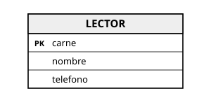
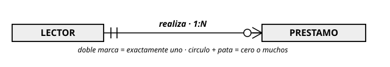
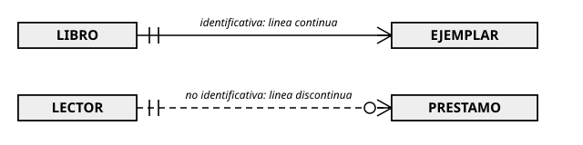
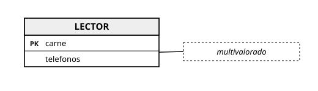
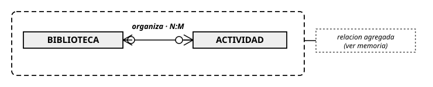

# Guía rápida de draw.io para las entregas de diagramas

**IES Río Arba · Departamento de Informática · Recursos del ciclo DAW**

Esta guía cubre lo mínimo para entregar diagramas correctos con draw.io. El criterio de qué dibujar en cada notación está en los apuntes de cada unidad (para el modelo E/R, la tabla de equivalencias del apartado 1.3 de la UD2 de Bases de Datos); aquí solo está el **cómo**.

## Apartado 1. Acceso: sin cuenta y guardando en local

1. Abre [app.diagrams.net](https://app.diagrams.net) en el navegador. **No necesitas cuenta**.
2. En el primer diálogo, elige **"Dispositivo"** (guardar en local) y después **"Crear diagrama nuevo"** con la plantilla en blanco.
3. El archivo se guarda como `.drawio` en tu equipo. Guarda con frecuencia (Ctrl+S): el navegador no guarda por ti.

[CAPTURA: diálogo inicial de app.diagrams.net con la opción "Dispositivo" señalada]

## Apartado 2. La biblioteca de formas para pata de gallo

En el panel izquierdo de formas, busca la sección **"Entity Relation"** (Entidad-Relación). Si no aparece: botón **"Más formas"** (abajo a la izquierda) → grupo **Software** → marca **Entity Relation** → Aplicar. De esa sección usarás las tablas de entidad con filas de atributos; las cardinalidades de pata de gallo se ponen en los **extremos de las líneas** (apartado 3, gesto 5).

[CAPTURA: diálogo "Más formas" con la casilla Entity Relation marcada dentro del grupo Software]

## Apartado 3. Los gestos esenciales

1. **Crear una entidad.** Arrastra al lienzo la forma de tabla de la sección Entity Relation. Haz doble clic sobre su título para renombrarla (mayúsculas y singular: `LECTOR`).
2. **Añadir atributos.** Selecciona una fila de la entidad y pulsa **Ctrl+D** (duplicar) para añadir filas; doble clic en cada una para escribir el nombre del atributo. La fila de la clave primaria, marcada con `PK` (la forma trae esa columna).
**Resultado esperado de los gestos 1-2** — así debe verse tu entidad:

3. **Crear una relación.** Acerca el puntero al borde de una entidad hasta que aparezcan las flechas azules direccionales; arrastra desde el borde hasta la otra entidad. Suelta cuando la entidad destino quede resaltada: la línea queda **anclada** (se mueve con las entidades).
4. **Etiquetar la relación.** Doble clic sobre la línea y escribe el verbo (`realiza`). Puedes añadir en la misma etiqueta el tipo (`1:N`), como recomiendan los apuntes de la UD2.
5. **Poner las cardinalidades de los extremos.** Selecciona la línea y, en el panel derecho, pestaña **Estilo**, despliega las opciones de **inicio y fin de línea**: elige el símbolo de pata de gallo que corresponda en cada extremo (muchos, uno, cero-o-uno…). Comprueba los dos extremos: el error clásico es dejar uno con la flecha por defecto.

    [CAPTURA: panel Estilo con los desplegables de inicio y fin de línea mostrando los terminadores de pata de gallo]

**Resultado esperado de los gestos 3-5** — línea anclada, etiqueta con verbo y tipo, terminadores correctos en los dos extremos:

6. **Línea identificativa o no identificativa.** Con la línea seleccionada, en Estilo cambia entre trazo **continuo** (identificativa) y **discontinuo** (no identificativa), conforme al puente de las figuras 3 y 4 de la UD2.
**Resultado esperado del gesto 6** — el par continua/discontinua:

7. **Anotación textual para lo que la notación no dibuja.** Doble clic en cualquier zona vacía del lienzo crea un cuadro de texto: úsalo para las anotaciones que manda la tabla de equivalencias ("multivalorado", "(parcial, exclusiva)", "relación agregada", roles de una reflexiva). Colócalo pegado al elemento al que se refiere.
**Resultado esperado del gesto 7** — la nota pegada a su elemento:

8. **Agrupar un fragmento (contenedores).** Para el recuadro de una agregación: arrastra la forma **contenedor** (o dibuja un rectángulo, clic derecho → Editar estilo, y úsalo como marco), mete dentro el fragmento y añade su nota. Los elementos dentro del contenedor se mueven con él.

**Resultado esperado del gesto 8** — el fragmento agregado dentro de su contenedor, con su nota:

## Apartado 4. Nombre del archivo

Convención de nombrado, siempre con tu **alias** (nunca tu nombre real):

> `<unidad>-<actividad>-<alias>.drawio` — por ejemplo, `ud2-ae10-A07.drawio`

La exportación lleva el mismo nombre con su extensión: `ud2-ae10-A07.pdf`.

## Apartado 5. Formato de entrega: siempre doble

Cada entrega de diagrama incluye **dos archivos**:

1. **El archivo fuente `.drawio`** (Archivo → Guardar como). Permite al docente abrir tu diagrama, moverlo y comentarlo sobre el original.
2. **La exportación en PDF o PNG** (Archivo → Exportar como → PDF o PNG; en PNG, marca un zoom del 150-200 % para que se lea bien). Garantiza la **vista fiel**: lo que tú ves es exactamente lo que se corrige, aunque cambien versiones o fuentes.

Entregar solo uno de los dos es entrega incompleta: sin el fuente no se puede comentar; sin la exportación no hay vista garantizada.

## Apartado 6. Lista de comprobación antes de entregar

| Comprobación | Hecho |
|---|---|
| Notación consistente en todo el diagrama (sin mezclar) | ☐ |
| Cardinalidades revisadas en los **dos** extremos de cada línea | ☐ |
| Anotaciones textuales de la tabla de equivalencias donde tocan | ☐ |
| Nombre de archivo con la convención y tu alias | ☐ |
| Doble entrega: `.drawio` + PDF/PNG legible | ☐ |
